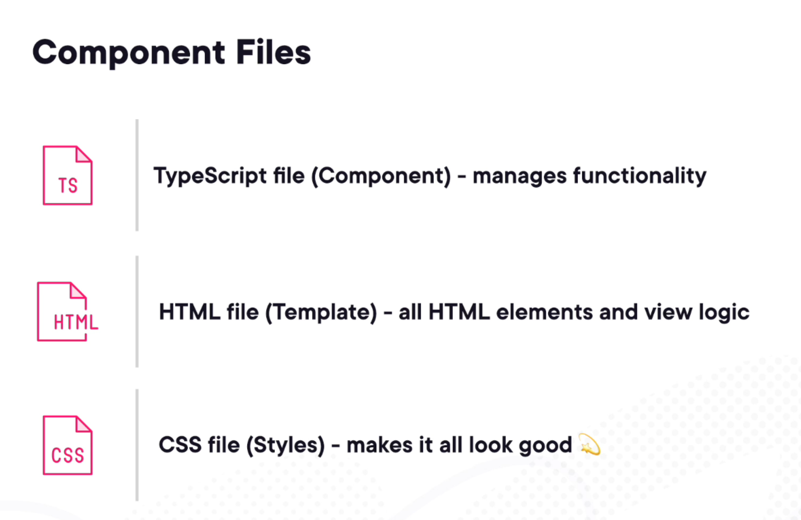

= What Is Angular? by Hampton Paulk
Lars Vogel(c) 2016 vogella GmbH
Version 0.3, 17.05.2021
:sectnums:
:toc:
:toclevels: 4

== First section

Some text

== ASCII Features

More test

icon:comment[] This is a comment icon

icon:file[] And a file icon

icon:battery-full[] And a battery icon

---

.Name of the menu
[%collapsible]
====
This is the content.
====

---

|===
| One | Two | One | Two

| Foo
a|
- Bar
- Baz
| Foo
a|
- Bar
- Baz
|===

== What Is Angular? by Hampton Paulk

=== Angular by Example

*What Is Angular?*

Okay, so let's start by answering the question, what is Angular, in really simple terms. Angular is a combination of prewritten code, useful tools, and some structured guidelines, all packaged together with a clear purpose, help you build web applications of any size. This combination is called a web framework, and Angular is one of the most popular. Web frameworks like Angular exist mostly to simplify the process of developing faster and more maintainable applications by doing a lot of the heavy lifting for you right out of the box. Let me give you a quick overview, but please, don't bother to memorize all this. I'm going to cover each of these in detail later in this course.

First up is Angular's use of a *component‑based architecture*, mainly helping to break down large projects into smaller parts. This makes code easier to manage, maintain, and reuse throughout the project. Each component manages what the user sees through the use of templates, allowing you to mix static HTML and data generated by your program all in one place. You can also style each component's template using CSS.

Angular also provides a way for you to use logic in your templates through the use of directives. This allows you to apply conditionals, loop through lists, set up forms, apply styles, and a lot more.

Components are self‑contained chunks of functionality managing how something shows up for the user and all of the logic for that piece of your application.

When you need to do some heavier work, something that'll be used all across the entire application, things like authentication, working with data, or maybe notifications, you'll use what *Angular calls services*. This can be anything really.

Think of an e‑commerce app. For this, you might use a service for the shopping cart, one for the order system and another for the products, where the main goal of a service is to provide functionality that's not tied to just one component. *You might hear Angular referred to as a JavaScript framework, but Angular apps are created using TypeScript, a programming language that's built on top of JavaScript*. People often refer to TypeScript as a superset of JavaScript, but you really don't need to know all the details around that. *Just know that code written in TypeScript when compiled becomes JavaScript, enabling it to run in the browser*. You can think of TypeScript as a language that fixes a lot of the issues that tend to come along with using JavaScript, and it gives us cleaner code and less errors at the same time. You won't need to know TypeScript for this course, but the more you know about the language, the easier it will be to understand Angular as you progress.

I think the best way to learn about Angular is by example, so I'm going to show you the main building blocks of Angular, giving you as much context as I can by using a simple web application that's already complete. Again, no expectation for you to write any code. That'll come later. First, we need to see how all the pieces fit together. So let me introduce you to Bethany's Pie Shop, a very simple e‑commerce application where you can browse and purchase delicious pies. But before we get to those pies, I want to clear something up. This could have been anything. Angular is not just for building online shops. I'm using a shop as an example because most of us have purchased something online, and we're really comfortable with how these sites should work. Okay, now, back to pies. From the main page of the shop, we can browse all the cakes and pies, then add what we want to our cart. Once we've made our selections, we can go to the cart, see our pies, and make any changes. When we're done reviewing, you can go to the checkout where you can select the shipping method, fill out our information, and then submit the order. Keep in mind, the functionality here is super minimal. It is not a fully fleshed out application that you would use in production, but it's just enough to see how Angular uses each of the items we went through without being too overwhelming. Now, let's get to our example.

*Introducing Components*

If there had to be one thing that was the foundation of any Angular app, it would be the component, giving us an easy way of breaking down larger projects into smaller more manageable pieces. Let's look at the pie shop and see how it's broken down into components. Angular apps and the components inside create somewhat of a nesting doll effect where our largest doll, the one that holds all the others, is the index file, this HTML file. Though it's not a component, it is the base. When the Angular app first loads, this is where the user starts. In our example app, which is intentionally small, there are only six components. The app component, which acts as a shell or a base for all our other components, and every Angular app has one of these. The top bar component, which handles our navigation and is shared across the app. The product list component, which displays all the pies and cakes, a shopping cart component, a checkout component, and a contact form component. Components serve a purpose somewhat similar to characters in a story. If you think how each character has their own personality, they're unique when compared to the other characters in the story and each have a specific role to play. They play that role by working with the other characters in the story, ultimately, driving the plot or story forward. Like those characters, components have their own personalities applied through CSS styles, and they also have a role to play with unique, contained functionality. Components are also meant to work with other components and other parts of the application to drive the story or project forward, and it's up to you to define each component's purpose, style, and how it interacts with the rest of the app. At this point, you may be wanting to know how do I decide what the component does? How do I define its purpose? Breaking up your project into components is easier if you keep one thing in mind, all components should be small and focused with one responsibility. That's important, so let me repeat that. *All components should be small and focused with one responsibility*. You want to have each of your components to have a specific task to perform within your application. This benefits you by keeping it simple to understand, easy to maintain, and easy to reuse throughout whatever project you're building. *For every component created, you get the following files, a TypeScript file, which is the main file of the component. It'll hold all the code needed for that component's functionality and act as a map to all the other files tied to it. There'll be an HTML file, which acts as your template for the component where you add elements, forms, and mix your app data with your components layout. There'll also be a CSS file, which holds all the styles for that component, helping to make the app look good*. Okay, let's take a closer look at the components inside our pie shop.

*Bethanys Components*

So looking at the application itself, let's inspect a couple of the components. We'll start with the app component, which is common to all Angular apps and acts as the foundation for our app and the inclusion of other components. So each component can be, in a way, divided into three sections that we should pay attention to, the class itself, the metadata of the component, and a place to define what we want to import into the class. The import section is the most straightforward and common to all classes. Here, we define what prewritten code or specific functionality we want to use inside our component. This can be either something internal to Angular like routing or we could bring in something custom that we created like other components. The class itself is where we define our core functionality of the component. In this case, it's called AppComponent, which should make sense. You may have noticed there's no functionality in this one. That's because in this case, the AppComponent has no custom functionality. Its main purpose here is to be a shell for our app. Right on top of the class inside of what is called a decorator, we have a place to add metadata or information that Angular needs to connect all the pieces and make things work. Now, lots of things could be added to this outside of what you see, but these here, these are the most common. The first one you see is the selector. This is how we identify the name of a custom HTML element that will be used inside a template. We're using this element to identify where this component will appear in our app. If you recall from earlier, the first file that a user would see when connecting to an Angular app is the index.html file, which lives at the root of the project. If we open this file, you'll see our selector app‑root as an element alongside other HTML. Everything that happens inside of the AppComponent will be dynamically generated in this exact location in the HTML code inside of this custom element. How the AppComponent is structured and how it looks are the next two pieces of metadata, the templateUrl and the styleUrls. The templateUrl will contain the location of your template or HTML code for this component. And the styleUrls will contain the location of one or more CSS files to define how this component will look. I'm going to ramble on about both of these files next, but let's stay focused on this for a bit longer. The metadata you see next is standalone: true. It tells you that this component is, you guessed it, standalone, which means we don't have to use Angular modules or NgModules to define the template dependencies. Okay, I bet you're thinking NgModules, dependencies, what? Let me explain. For a while now, Angular has used the concept of modules, another type of file in the Angular app where we would normally define what external functionality that templates for a component could use. But with newer versions of Angular, we can just skip that step altogether and just define what we need right inside the metadata of the component. This is not to say that NgModules are not useful. Many applications will benefit from them, but the size of our app doesn't require it, and it makes Angular a lot easier to understand when first starting out. That leaves us with the last bit of metadata, the dependencies or what we want to use inside of our templates. So the two dependencies of this component's template both have to do with how we navigate the site and how all the other components will show up in our app. We have the component that holds our app's navigation and how that looks. It's called the TopBarComponent. This will decide what components will show up on the page by giving the user links to click. Those links will connect directly to Angular's internal routing service. Now, for those components to actually show up, we need to specify a destination, a location in the template where we want those components to be displayed. For that, we want to include the RouterOutlet, which is how Angular defines that destination. A quick sidebar before we head into the templates and see how all this shows up, routing in Angular or the methods used to navigate our site is powerful, super powerful, and there are entire courses dedicated to how this works. It's not just for navigation and loading different components without fully reloading the page, but also updates the URL to reflect the location of the app. It allows you to pass parameters or extra information between routes. It provides ways to protect access to specific routes and allows for complex nested levels of navigation. All that said, just know that routing in Angular is super useful, saving developers a lot of time and effort. Okay, let's move on to the templates.

*Angular Templates*: Break

Templates are all about the user, what they see. This is where our HTML lives, our structure, our place to decide what the app looks like, but on a smaller scale. Here, each template is directly tied to the component. Since our first component is the AppComponent, let's look at that one. And here you go, that's it. A bit underwhelming, to be honest, but simple is okay. Remember, this nest, so to speak, inside the index.html file, so all we need here are the HTML elements that we want to show up inside the app‑root element that we defined earlier. There's no need for headers, footers, body tags, etc. That's already present in the containing file, in this case, the index.html file. Let's look at what is here. Right away, you may notice the router‑outlet element. This is the built‑in router destination we imported earlier in our app component. This is where all the components that are controlled by the navigation will be displayed, think product list, and shopping cart, check out, contact page components. The other custom element you see is called app‑top‑bar, which you may have already guessed is the selector for the component that holds the navigation for the app. If we look at the TopBarComponent, you can see a lot of the same stuff we saw in the AppComponent. But in this case, we're calling out some different files for the template and style and one new router‑related dependency RouterLink. Keep in mind, there will always be different template and style files between components since components are intentionally small and focused. We want them to have a single responsibility. This one is for navigation. Let's look at the top bar template file and see how it looks to a user side by side. You can see we have anchors or links in the top bar, the logo and the shop link, which both, in this case, take you to the list of products or the product list component. We also have a link to the site's contact form contained in the contact component and a way to get to the shopping cart or cart component. Everything you see here is vanilla HTML code except for one thing, routerLink. If router outlet is a placeholder in the template where the components will be shown or rotated in and out, routerLink is how we tell Angular which component we want to show up. We define these routes ahead of time, and all routes live in a file named app.routes.ts. A quick sidebar. There's a file in every Angular app called main.ts, and it can be considered the entry point into the application. As the app is first loaded in a user's browser, the main.ts file is the first to be run. It starts the application. From there, it loads a file called app.config.ts, which as you may have guessed, loads our configuration options for the app. And then finally, nested inside of that config file is a call to our app.routes.ts file that holds all of our routes, which you see here. There are a lot of ways to set this up, but this is an approach that you'll see often. Okay, there's so much to know about routes and how they're set up. This example is barely scratching the surface of what routes are capable of. Here, we're linking to a path, what you see in the URL to a component, and for our app, that's all that's needed. Okay, let's take a look at the first template that would render inside the router outlet, the template for our product list component, which is the main page of our shop. Here is another side by side. You might be wondering how does all of this, the page we see, come from so little code in the template file or this? It's all possible because of directives, pipes, and data binding.

