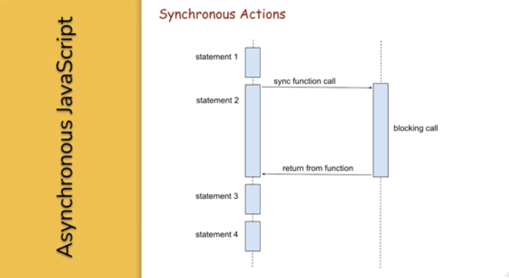
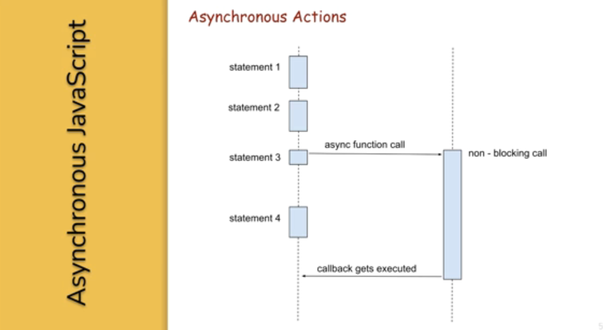

= JavaScript
:sectnums:
:toc: right
:toclevels: 4


=== var V/s let

In JavaScript, both `var` and `let` are used for variable declaration, but they have some differences in terms of scoping and hoisting.

1. **`var`:**
- Variables declared with `var` are function-scoped or globally scoped, meaning they are accessible anywhere within the function in which they are declared, or globally if declared outside of any function.
- `var` variables are hoisted to the top of their function or global scope, which means they are moved to the top of their scope during the compilation phase. However, their initialization remains in the same place.

Here's an example:

```javascript
function example() {
    if (true) {
        var x = 10;
    }
    console.log(x); // Outputs 10
}
example();
console.log(x); // Throws ReferenceError: x is not defined
```

In this example, even though `x` is declared inside the `if` block, it is accessible outside of it due to hoisting. This is because `var` declarations are hoisted to the top of the function.

2. **`let`:**
- Variables declared with `let` are block-scoped, meaning they are only accessible within the block (enclosed by curly braces) in which they are declared.
- `let` variables are hoisted to the top of their block scope (the block in which they are declared), but unlike `var`, they are not initialized until their actual declaration is evaluated.

Example:

```javascript
function example() {
    if (true) {
        let y = 20;
    }
    console.log(y); // Throws ReferenceError: y is not defined
}
example();
```

In this example, `y` is declared with `let` inside the `if` block, so it's only accessible within that block. Trying to access it outside the block results in a ReferenceError because `y` is not defined in that scope.

So, in summary:

- Use `var` for variables that need to have function or global scope and may be accessed before they are declared due to hoisting.
- Use `let` for variables that need block scope and should not be accessed before their declaration within the block. It's generally preferred over `var` due to its more predictable scoping behavior.

=== Infinity

Certainly! In JavaScript, `Infinity` represents the mathematical concept of positive infinity. It's a special numeric value that represents a number greater than any other number. Here's an example:

```javascript
let positiveInfinity = Infinity;
console.log(positiveInfinity); // Output: Infinity

console.log(10 / 0); // Output: Infinity
console.log(Number.POSITIVE_INFINITY); // Output: Infinity
```

In this example:

- `positiveInfinity` is assigned the value `Infinity`.
- Performing division by zero (`10 / 0`) in JavaScript results in `Infinity`.
- `Number.POSITIVE_INFINITY` is a predefined constant representing positive infinity.

=== Undefined

----
let x;
console.log(x); // Output: undefined

function example() {
    let y;
    console.log(y); // Output: undefined
}

example();
----

=== Data Types

----
// Number
let integer = 10;
let floatingPoint = 3.14;

// String
let message = "Hello, world!";

// Boolean
let isTrue = true;
let isFalse = false;

// Undefined
let undefinedVar;

// Null
let nullVar = null;


// Perform some operations
console.log("Sum of integer and floatingPoint:", integer + floatingPoint);
console.log("Concatenation of message and name:", message + " " + person.name);
----

=== JavaScript Engines


=== Script in <body/> tag

Yes, you can add `<script>` tags directly within the `<body>` tag of an HTML document. Placing scripts in the `<body>` tag is common, especially for scripts that are specific to the content of the page or that need to be executed after the page content has loaded.

Here's an example of how you can include a script within the `<body>` tag:

```html
<!DOCTYPE html>
<html lang="en">
<head>
    <meta charset="UTF-8">
    <meta name="viewport" content="width=device-width, initial-scale=1.0">
    <title>Script in Body Tag</title>
</head>
<body>
    <h1>Hello, world!</h1>

    <!-- JavaScript code placed within the body tag -->
    <script>
        console.log("This script is placed within the body tag.");
        // Your JavaScript code goes here
    </script>
</body>
</html>
```

Placing scripts at the end of the `<body>` tag can also improve the loading performance of your webpage because it allows the browser to render the HTML content first before loading and executing any scripts. This way, users can see the content of the page more quickly while scripts are being downloaded and processed in the background.

=== JS typeof

Certainly! The `typeof` operator in JavaScript is used to determine the data type of a variable or expression. It returns a string indicating the type of the operand. Here's an example demonstrating the use of `typeof` with different types of variables:

```javascript
// Example variables of different types
let num = 10;               // Number
let str = "Hello";          // String
let bool = true;            // Boolean
let arr = [1, 2, 3];        // Array
let obj = { key: "value" }; // Object
let func = function() {};   // Function
let undef;                  // Undefined
let nul = null;             // Null

// Using typeof to determine the type of each variable
console.log(typeof num);    // Output: "number"
console.log(typeof str);    // Output: "string"
console.log(typeof bool);   // Output: "boolean"
console.log(typeof arr);    // Output: "object" (Arrays are of type "object")
console.log(typeof obj);    // Output: "object"
console.log(typeof func);   // Output: "function"
console.log(typeof undef);  // Output: "undefined"
console.log(typeof nul);    // Output: "object" (Historical quirk in JavaScript)
```

Here are the results you would expect:

- `typeof num`: returns `"number"`
- `typeof str`: returns `"string"`
- `typeof bool`: returns `"boolean"`
- `typeof arr`: returns `"object"` (Arrays are technically objects in JavaScript)
- `typeof obj`: returns `"object"`
- `typeof func`: returns `"function"`
- `typeof undef`: returns `"undefined"`
- `typeof nul`: returns `"object"` (This is a historical quirk in JavaScript; `null` is considered an object)

Understanding the data types of variables in JavaScript is crucial for writing robust and error-free code, and `typeof` is a handy tool for such purposes.

=== Objects 1

NOTE: If you want to make object dynamic, you have to use `Factory Function`

Sure! Below is an example of creating an object representing a student in JavaScript and performing some operations on that object:

```javascript
// Define the student object
let student = {
    name: "John Doe",
    age: 20,
    grade: "A",
    courses: ["Math", "Science", "English"],
    // Method to display student information
    displayInfo: function() {
        console.log("Name: " + this.name);
        console.log("Age: " + this.age);
        console.log("Grade: " + this.grade);
        console.log("Courses: " + this.courses.join(", "));
    },
    // Method to add a new course
    addCourse: function(course) {
        this.courses.push(course);
        console.log(course + " has been added to the courses.");
    },
    // Method to change the grade
    changeGrade: function(newGrade) {
        this.grade = newGrade;
        console.log("Grade has been updated to " + newGrade);
    }
};

// Display student information
console.log("Initial student information:");
student.displayInfo();

// Add a new course
student.addCourse("History");

// Change the grade
student.changeGrade("B");

// Display updated student information
console.log("Updated student information:");
student.displayInfo();
```

In this example:

- The `student` object contains properties such as `name`, `age`, `grade`, and `courses`. It also contains methods like `displayInfo`, `addCourse`, and `changeGrade`.
- The `displayInfo` method displays the student's information.
- The `addCourse` method adds a new course to the `courses` array of the student.
- The `changeGrade` method updates the student's grade.
- We create an instance of the `student` object and then perform operations such as displaying information, adding a new course, and changing the grade.

This example demonstrates how objects in JavaScript can encapsulate both data (properties) and behavior (methods), allowing you to organize and manipulate related data and actions efficiently.

=== Objects 2

Certainly! Here's an example of handling object attributes without using methods:

```javascript
// Define the student object
let student = {
    name: "John Doe",
    age: 20,
    grade: "A",
    courses: ["Math", "Science", "English"]
};

// Display student information
console.log("Student information:");
console.log("Name: " + student.name);
console.log("Age: " + student.age);
console.log("Grade: " + student.grade);
console.log("Courses: " + student.courses.join(", "));

// Add a new course
student.courses.push("History");
console.log("Course added: History");

// Change the grade
student.grade = "B";
console.log("Grade changed to B");

// Display updated student information
console.log("Updated student information:");
console.log("Name: " + student.name);
console.log("Age: " + student.age);
console.log("Grade: " + student.grade);
console.log("Courses: " + student.courses.join(", "));
```

In this example:

- We define the `student` object with properties such as `name`, `age`, `grade`, and `courses`.
- We access and display the values of these properties directly using dot notation (`student.name`, `student.age`, etc.).
- We modify the `courses` array by using the `push` method to add a new course.
- We directly assign a new value to the `grade` property to change the student's grade.
- Finally, we display the updated information about the student.

This approach works well for simple operations on object attributes. However, as the complexity of the operations increases, using methods to encapsulate the behavior becomes more beneficial for code organization and reusability.


=== Array, Arrays

Sure! Here's an example of a JavaScript array:

```javascript
// Creating an array of numbers
let numbers = [1, 2, 3, 4, 5];

// Accessing elements of the array
console.log("First element:", numbers[0]); // Output: 1
console.log("Third element:", numbers[2]); // Output: 3

// Modifying elements of the array
numbers[1] = 10; // Changing the second element to 10
console.log("Modified array:", numbers); // Output: [1, 10, 3, 4, 5]

// Adding elements to the array
numbers.push(6); // Adding 6 to the end of the array
console.log("Array after adding element:", numbers); // Output: [1, 10, 3, 4, 5, 6]

// Removing elements from the array
let removedElement = numbers.pop(); // Removing the last element (6) from the array
console.log("Array after removing element:", numbers); // Output: [1, 10, 3, 4, 5]
console.log("Removed element:", removedElement); // Output: 6

// Iterating over the array
console.log("Array elements:");
for (let i = 0; i < numbers.length; i++) {
    console.log(numbers[i]);
}
```

In this example:

- We create an array called `numbers` containing integers from 1 to 5.
- We access elements of the array using square brackets notation (`numbers[0]`, `numbers[2]`).
- We modify elements of the array by assigning new values to specific indices (`numbers[1] = 10`).
- We add elements to the end of the array using the `push` method (`numbers.push(6)`).
- We remove elements from the end of the array using the `pop` method (`numbers.pop()`).
- We iterate over the array using a `for` loop, accessing each element using its index (`numbers[i]`).


==== Array Sort

----
let numbers = [5, 3, 9, 1, 7];

// Sort the number array
numbers.sort();

console.log("Sorted numbers:", numbers); // Output: [1, 3, 5, 7, 9]


let fruits = ["Banana", "Orange", "Apple", "Mango"];

// Sort the string array
fruits.sort();

console.log("Sorted fruits:", fruits); // Output: ["Apple", "Banana", "Mango", "Orange"]
----

################################################################################


==== Array Concat

----
let array1 = [1, 2, 3];
let array2 = [4, 5, 6];

// Concatenate array2 to array1
let newArray = array1.concat(array2);

console.log(newArray); // Output: [1, 2, 3, 4, 5, 6]


let array1 = [1, 2, 3];
let array2 = [4, 5, 6];
let array3 = [7, 8, 9];

// Concatenate array2 and array3 to array1
let newArray = array1.concat(array2, array3);

console.log(newArray); // Output: [1, 2, 3, 4, 5, 6, 7, 8, 9]
----

################################################################################

=== Spread Operator

The spread operator (`...`) is a feature introduced in ECMAScript 6 (ES6) that allows an iterable (like an array or string) to be expanded into individual elements.

Here's how the spread operator is used:

*1. Array Literals*:

```javascript
let arr1 = [1, 2, 3];
let arr2 = [...arr1, 4, 5, 6]; // Spread arr1 into individual elements

console.log(arr2); // Output: [1, 2, 3, 4, 5, 6]
```

*2. Function Arguments*:

```javascript
function sum(a, b, c) {
  return a + b + c;
}

let numbers = [1, 2, 3];

console.log(sum(...numbers)); // Spread numbers array into function arguments
```

*3. Concatenating Arrays*:

```javascript
let arr1 = [1, 2, 3];
let arr2 = [4, 5, 6];

let combinedArray = [...arr1, ...arr2]; // Spread both arrays into a new array

console.log(combinedArray); // Output: [1, 2, 3, 4, 5, 6]
```

*4. Copying Arrays*:

```javascript
let originalArray = [1, 2, 3];
let copyArray = [...originalArray]; // Spread original array into a new array

console.log(copyArray); // Output: [1, 2, 3]
console.log(originalArray === copyArray); // Output: false (different reference)
```


=== JS Function

Sure! Here's a JavaScript function that simulates the steps to make a cup of coffee:

```javascript
function makeCoffee() {
    // Step 1: Boil water
    console.log("Step 1: Boiling water...");

    // Step 2: Grind coffee beans
    console.log("Step 2: Grinding coffee beans...");

    // Step 3: Brew coffee
    console.log("Step 3: Brewing coffee...");

    // Step 4: Pour coffee into a cup
    console.log("Step 4: Pouring coffee into a cup...");

    // Step 5: Add sugar and milk (optional)
    console.log("Step 5: Adding sugar and milk (optional)...");

    // Step 6: Enjoy your coffee!
    console.log("Step 6: Your coffee is ready! Enjoy!");
}

// Call the function to make coffee
makeCoffee();
```

In this function:

- Step 1: Boiling water is simulated by logging a message to the console.
- Step 2: Grinding coffee beans is simulated similarly.
- Step 3: Brewing coffee is simulated.
- Step 4: Pouring coffee into a cup is simulated.
- Step 5: Adding sugar and milk (optional) is simulated.
- Step 6: A message is logged indicating that the coffee is ready to be enjoyed.

You can call `makeCoffee()` to execute these steps and simulate making a cup of coffee.

=== JS Function Default Values

----
// Function with default parameter values
function greet(name = "Guest", greeting = "Hello") {
    console.log(`${greeting}, ${name}!`);
}

// Calling the function without arguments
greet(); // Output: Hello, Guest!

// Calling the function with one argument
greet("Alice"); // Output: Hello, Alice!

// Calling the function with two arguments
greet("Bob", "Hi"); // Output: Hi, Bob!
----

=== JS Factory Function

Certainly! Factory functions in JavaScript are functions that return objects. They're called "factory" functions because they're used to create and return new instances of objects. Here's a very simple example:

```javascript
// Factory function to create person objects
function createPerson(name, age) {
    return {
        name: name,
        age: age,
        // Method to display person's information
        displayInfo: function() {
            console.log(`Name: ${this.name}, Age: ${this.age}`);
        }
    };
}

// Create a person using the factory function
let person1 = createPerson("Alice", 30);

// Display person's information
person1.displayInfo(); // Output: Name: Alice, Age: 30
```

In this example:

- The `createPerson` function is a factory function that takes `name` and `age` parameters and returns an object representing a person.
- Inside the factory function, we create and return an object literal with properties for `name` and `age`, along with a method `displayInfo` to display the person's information.
- We use the factory function to create a `person1` object with the name "Alice" and age 30.
- We then call the `displayInfo` method of the `person1` object to display its information.

Factory functions are commonly used in JavaScript to encapsulate object creation logic and provide a way to create multiple instances of objects with similar characteristics.

=== Object Enumeration

----
let car = {
    brand: "Toyota",
    model: "Camry",
    year: 2020,
    start: function() {
        console.log("Starting the " + this.brand + " " + this.model);
    },
    stop: function() {
        console.log("Stopping the " + this.brand + " " + this.model);
    }
};

// Enumerating properties of the car object
for (let key in car) {
    if (typeof car[key] !== "function") {
        console.log(key + ": " + car[key]);
    }
}
----

=== Object Cloning

In JavaScript, you can clone an object using various methods. One common approach is to use the spread operator (`...`) or `Object.assign()` method for shallow copying. Here's an example using the spread operator to clone a simple object:

```javascript
// Original object
let originalObject = {
    name: "John",
    age: 30,
    city: "New York"
};

// Cloning the object using the spread operator
let clonedObject = { ...originalObject };

// Modifying the cloned object
clonedObject.name = "Alice";

// Outputting the original and cloned objects
console.log("Original Object:", originalObject);
console.log("Cloned Object:", clonedObject);
```

This will output:

```
Original Object: { name: 'John', age: 30, city: 'New York' }
Cloned Object: { name: 'Alice', age: 30, city: 'New York' }
```

In this example, the `originalObject` is cloned into `clonedObject` using the spread operator (`...`). Any modifications made to `clonedObject` do not affect the `originalObject`, as they are separate instances.

=== Constructors

Sure! In JavaScript, you can use constructor functions to create objects with a common structure or blueprint. Constructor functions are similar to classes in other programming languages. Here's an example of a simple constructor function for creating person objects:

```javascript
// Constructor function for creating person objects
function Person(name, age, gender) {
    this.name = name;
    this.age = age;
    this.gender = gender;

    // Method to display person's information
    this.displayInfo = function() {
        console.log("Name: " + this.name);
        console.log("Age: " + this.age);
        console.log("Gender: " + this.gender);
    };
}

// Creating person objects using the constructor function
let person1 = new Person("John", 30, "male");
let person2 = new Person("Alice", 25, "female");

// Displaying information about the person objects
person1.displayInfo();
person2.displayInfo();
```

In this example:

- We define a constructor function `Person` that takes parameters `name`, `age`, and `gender`.
- Inside the constructor function, we use the `this` keyword to assign values to properties of the newly created object.
- We also define a method `displayInfo` within the constructor function to display the person's information.
- We create two person objects `person1` and `person2` using the `new` keyword followed by the constructor function, passing the necessary parameters.
- Finally, we call the `displayInfo` method on each person object to display their information.

Constructor functions are commonly used in JavaScript to create objects with a predefined structure and behavior. They allow you to create multiple instances of objects with similar characteristics.

=== Constructor V/s Factory

Both constructor functions and factory functions in JavaScript are used to create objects, but they differ in their approach to object creation and the way they handle object initialization.

1. **Constructor Function**:
- Constructor functions are defined using the `function` keyword and are invoked using the `new` keyword.
- They are used to create and initialize objects with a common structure or blueprint.
- Properties and methods are assigned to the object using `this` inside the constructor function.
- Each instance created with a constructor function has its own copy of methods, which can lead to memory inefficiency when creating multiple instances.
- Example:

    ```javascript
    function Person(name, age) {
        this.name = name;
        this.age = age;
        this.greet = function() {
            console.log("Hello, my name is " + this.name);
        };
    }

    let person1 = new Person("John", 30);
    ```

2. **Factory Function**:
- Factory functions are regular JavaScript functions that return objects.
- They are used to create and return new objects without using the `new` keyword.
- Properties and methods are defined within the factory function and added to the object before returning it.
- Example:

    ```javascript
    function createPerson(name, age) {
        return {
            name: name,
            age: age,
            greet: function() {
                console.log("Hello, my name is " + this.name);
            }
        };
    }

    let person2 = createPerson("Alice", 25);
    ```

The choice between them depends on the specific requirements of your application and coding style preferences.

=== IF-ELSE

----
// Example of if...else statement
let temperature = 25;

if (temperature > 30) {
    console.log("It's hot outside!");
} else if (temperature > 20) {
    console.log("It's warm outside.");
} else {
    console.log("It's cold outside.");
}
----

=== SWITCH-CASE

----
// Example of switch statement
let day = "Monday";

switch (day) {
    case "Monday":
        console.log("It's Monday!");
        break;
    case "Tuesday":
        console.log("It's Tuesday!");
        break;
    case "Wednesday":
        console.log("It's Wednesday!");
        break;
    case "Thursday":
        console.log("It's Thursday!");
        break;
    case "Friday":
        console.log("It's Friday!");
        break;
    case "Saturday":
    case "Sunday":_
        console.log("It's the weekend!");
        break;
    default:
        console.log("Invalid day!");
}
----

=== Difference: IF-ELSE V/s SWITCH-CASE

[cols="^,^,^"]
|=======================================================================
| Feature | if...else | switch...case
| Syntax | if (condition) { | switch (expression) {
| | // code block | case value1:
| | } else if (condition) { | // code block
| | // code block | case value2:
| | } else { | // code block
| | // code block | default:
| | } | // code block
| Expression | Supports arbitrary conditions and | Compares a single expression to
| | expressions using logical operators | multiple possible values
| Control Flow | Linear control flow with branching | Jump-based control flow with case
| | for each condition | labels and branching for matched cases
| Matching | Supports complex conditions and | Limited to simple value comparisons
| | expression evaluation | (equality comparisons only)
| Default Behavior | Executes the first matching condition | Executes the code block associated
| | or the `else` block if none match | with the first matching case label or
| | | the `default` block if no match found
| Efficiency | Suitable for evaluating conditions | More efficient for multiple
| | with few possible outcomes | conditions with fixed values
| Flexibility | More flexible for complex conditions | Less flexible due to limited syntax
| | and expressions | and comparison options
|=======================================================================

=== For Loop

----
// Using a for loop to iterate from 1 to 5
for (let i = 1; i <= 5; i++) {
    console.log("Iteration " + i);
}
----

=== While

----
// Initialize a counter variable
let counter = 0;

// Define the while loop
while (counter < 5) {
  console.log("Counter is: " + counter);
  counter++; // Increment the counter
}

console.log("Loop ended.");

----

=== Do While

----
// Initialize a counter variable
let counter = 0;

// Define the do-while loop
do {
  console.log("Counter is: " + counter);
  counter++; // Increment the counter
} while (counter < 5);

console.log("Loop ended.");
----

=== Break and Continue

----

// Example of using break
for (let i = 0; i < 10; i++) {
  console.log(i);
  if (i === 5) {
    console.log("Reached 5, breaking loop");
    break; // Exit the loop when i equals 5
  }
}

// Example of using continue
for (let i = 0; i < 10; i++) {
  if (i === 5) {
    console.log("Skipping 5");
    continue; // Skip the rest of the loop body when i equals 5
  }
  console.log(i);
}

----

=== For In

----
// Define an object
let person = {
    name: "John",
    age: 30,
    gender: "male"
};

// Iterate over the properties of the object
for (let key in person) {
    console.log(key + ": " + person[key]);
}
----

=== For Of

----
// Define an array
let fruits = ["Apple", "Banana", "Orange"];

// Iterate over the elements of the array
for (let fruit of fruits) {
    console.log(fruit);
}
----


=== For In V/s For Of

[cols="3,3,3"]
|===
| Feature | for...of | for...in
| Used for iterating over | Iterable objects (arrays, strings, maps, sets, etc.) | Enumerable properties of objects
| Iterates over | Values of the iterable | Keys of the object
| Order of iteration | Preserves the order of elements in the iterable | May not preserve the order of properties
| Used with | Arrays, strings, maps, sets, etc. | Objects (enumerable)
| Example | let arr = [1, 2, 3]; for (let val of arr) { console.log(val); } | let obj = { key1: 'value1', key2: 'value2', key3: 'value3' }; for (let key in obj) { console.log(key + ': ' + obj[key]); }
|===

=== Value V/s Reference Types

In JavaScript, variables can hold two types of values: primitive values and reference values. Understanding the difference between these two types is crucial for understanding how values are stored and manipulated in JavaScript.

Here's a summary of value vs reference types in JavaScript:

*Value Types (Primitive Types)*:

- Primitive types are immutable and stored directly in the variable's memory location.
- When you assign a primitive value to a variable, a copy of the value is made.
- Examples of primitive types include:
- `String`: Represents a sequence of characters.
- `Number`: Represents numeric data.
- `Boolean`: Represents a logical value (`true` or `false`).
- `Undefined`: Represents an uninitialized variable.
- `Null`: Represents the intentional absence of any object value.
- `Symbol` (introduced in ECMAScript 6): Represents a unique identifier.
- Operations on primitive types directly manipulate the value stored in the variable.
- Example:

  ```javascript
  let num1 = 10;
  let num2 = num1; // Copying the value of num1 to num2
  num2 = 20; // Changing the value of num2 does not affect num1
  console.log(num1); // Output: 10
  ```

*Reference Types (Objects)*:

- Reference types are mutable and are stored as a reference to the object's location in memory.
- When you assign a reference value to a variable, you are storing a reference to the object's memory location, not the actual object.
- Examples of reference types include:
- `Object`: Represents a collection of key-value pairs.
- `Array`: Represents a collection of elements.
- `Function`: Represents a reusable block of code.
- `Date`: Represents a date and time.
- User-defined objects.
- Operations on reference types manipulate the reference to the object, not the object itself.
- Example:

  ```javascript
  let obj1 = { name: 'John' };
  let obj2 = obj1; // Copying the reference of obj1 to obj2
  obj2.name = 'Alice'; // Modifying obj2 affects obj1 as well
  console.log(obj1.name); // Output: Alice
  ```

*Summary*:

- Value types are copied by value, meaning changes to one variable do not affect another.
- Reference types are copied by reference, meaning changes to one variable may affect others referencing the same object.

Understanding the distinction between value and reference types is essential for writing efficient and bug-free JavaScript code.

=== JavaScript Math

----
// Math.round(): Rounds a number to the nearest integer
let num1 = 4.7;
console.log(Math.round(num1)); // Output: 5

// Math.ceil(): Rounds a number up to the nearest integer
let num2 = 4.1;
console.log(Math.ceil(num2)); // Output: 5

// Math.floor(): Rounds a number down to the nearest integer
let num3 = 4.9;
console.log(Math.floor(num3)); // Output: 4

// Math.max(): Returns the highest value from a list of numbers
console.log(Math.max(10, 5, 20)); // Output: 20

// Math.min(): Returns the lowest value from a list of numbers
console.log(Math.min(10, 5, 20)); // Output: 5

// Math.random(): Generates a random floating-point number between 0 (inclusive) and 1 (exclusive)
console.log(Math.random()); // Output: A random number between 0 and 1

// Math.pow(): Returns the result of raising the first argument to the power of the second argument
console.log(Math.pow(2, 3)); // Output: 8 (2 raised to the power of 3)

// Math.sqrt(): Returns the square root of a number
console.log(Math.sqrt(16)); // Output: 4

// Math.abs(): Returns the absolute (positive) value of a number
console.log(Math.abs(-10)); // Output: 10
----

=== JS String

----
// String length
let str = "Hello, world!";
console.log("Length of string:", str.length); // Output: 13

// Convert to uppercase
console.log("Uppercase:", str.toUpperCase()); // Output: HELLO, WORLD!

// Convert to lowercase
console.log("Lowercase:", str.toLowerCase()); // Output: hello, world!

// Get a substring
console.log("Substring:", str.substring(7)); // Output: world!

// Get a substring with start and end index
console.log("Substring with indices:", str.substring(7, 12)); // Output: world

// Split a string into an array
console.log("Split into array:", str.split(", ")); // Output: ["Hello", "world!"]

// Replace a substring
console.log("Replace substring:", str.replace("world", "universe")); // Output: Hello, universe!

// Check if a string contains a substring
console.log("Contains 'world'?", str.includes("world")); // Output: true

// Trim leading and trailing whitespace
let str3 = "   Trimmed string   ";
console.log("Trimmed string:", str3.trim()); // Output: Trimmed string
----

=== JavaScript Operators

Certainly! Here are examples of some common JavaScript operators:

1. **Arithmetic Operators**:
```javascript
let x = 10;
let y = 5;

console.log("Addition:", x + y);       // Addition: 15
console.log("Subtraction:", x - y);    // Subtraction: 5
console.log("Multiplication:", x * y); // Multiplication: 50
console.log("Division:", x / y);       // Division: 2
console.log("Modulus:", x % y);        // Modulus: 0 (remainder of division)
console.log("Increment:", ++x);        // Increment: 11
console.log("Decrement:", --y);        // Decrement: 4
```

2. **Comparison Operators**:
```javascript
let a = 5;
let b = 10;

console.log("Equal to:", a === b);           // Equal to: false
console.log("Not equal to:", a !== b);       // Not equal to: true
console.log("Greater than:", a > b);         // Greater than: false
console.log("Less than:", a < b);            // Less than: true
console.log("Greater than or equal to:", a >= b); // Greater than or equal to: false
console.log("Less than or equal to:", a <= b);    // Less than or equal to: true
```

3. **Logical Operators**:
```javascript
let p = true;
let q = false;

console.log("Logical AND:", p && q);    // Logical AND: false
console.log("Logical OR:", p || q);     // Logical OR: true
console.log("Logical NOT:", !p);       // Logical NOT: false
```

4. **Assignment Operators**:
```javascript
let num = 10;

num += 5; // Equivalent to num = num + 5
console.log(num); // 15

num -= 3; // Equivalent to num = num - 3
console.log(num); // 12

num *= 2; // Equivalent to num = num * 2
console.log(num); // 24

num /= 4; // Equivalent to num = num / 4
console.log(num); // 6

num %= 5; // Equivalent to num = num % 5
console.log(num); // 1
```

These examples cover arithmetic, comparison, logical, and assignment operators in JavaScript.

=== Template Literal

Certainly! Template literals are a convenient way to create strings in JavaScript, especially when you need to include variables or expressions within the string. Here's an example:

```javascript
let name = "Alice";
let age = 30;

// Using template literals to create a string
let greeting = `Hello, my name is ${name} and I am ${age} years old.`;

console.log(greeting);
```

=== Asynchronous JavaScript: Promises, Callbacks, Async Await

==== Sync & Async

----
function print1() {
    const number1 = 1;
    console.log(number1);
}


function print2() {
    function getNumber2() {
        return 2;
    }
    const number2 = getNumber2();
    console.log(number2);
}


function print3() {
    const fs = require('fs');
    fs.readFile('./number3.txt', 'utf-8', function (err, number3) {
        console.log(number3);
    });
}


function print4() {
    const number4 = 4;
    console.log(number4);
}

print1();
print2();
print3();
print4();
----

---



---



---

==== Event Loop

==== Call Stack

==== Task Queue

=== Functions

==== Arrow Functions

*Arrow Functions / Anonymous Functions / Lambda Functions*

*A*

----
function helloWorld() {
  console.log("Hello, World!");
}

const helloWorld = () => {
  console.log("Hello, World!");
};
----

################################################################################

*B*

----
// Normal function with two integer arguments
function add(a, b) {
  return a + b;
}

// Call the add function with two integer arguments
let result = add(5, 3);
console.log("Result:", result); // Output: Result: 8

// Arrow function with two integer arguments
const add = (a, b) => {
  return a + b;
};

// Call the arrow function with two integer arguments
let result = add(5, 3);
console.log("Result:", result); // Output: Result: 8
----

==== Functions

*Named Function and Function Expression (Anonymous Function)*

----
// Named function definition
function greet(name) {
  console.log("Hello, " + name + "!");
}

// Call the named function
greet("Alice"); // Output: Hello, Alice!

// Function expression (anonymous function)
let greet = function(name) {
  console.log("Hello, " + name + "!");
};

// Call the function expression
greet("Bob"); // Output: Hello, Bob
----

==== Hoisting

JavaScript hoisting is a behavior where variable and function declarations are moved to the top of their containing scope during the compilation phase, before the code is executed. This means that regardless of where variables and functions are declared in the code, they are effectively "hoisted" to the top of their containing scope, making them accessible throughout the entire scope.

Here's an example to illustrate hoisting with function declarations and `let` variables:

```javascript
// Function declaration
greet(); // Output: Hello!

function greet() {
  console.log("Hello!");
}

// Variable declaration with let
console.log(x); // Error: Cannot access 'x' before initialization
let x = 5;
console.log(x); // Output: 5
```

In this example:

- The function `greet` is declared using the `function` keyword before it's called. Even though the function is called before its declaration in the code, JavaScript hoisting moves the function declaration to the top of its containing scope during the compilation phase. As a result, `greet` is accessible and can be called before its actual declaration.
- The variable `x` is declared with `let` but not initialized before it's used. Therefore, trying to access it before the declaration results in a `ReferenceError`. Once `x` is declared and initialized with `let x = 5;`, it can be accessed and used normally within its scope.

Hoisting applies to both function and variable declarations but behaves differently for variables declared with `let` and `const` compared to `var`. With `let` and `const`, the variable is hoisted to the top of its containing block but remains uninitialized (in a "temporal dead zone") until its actual declaration in the code.


