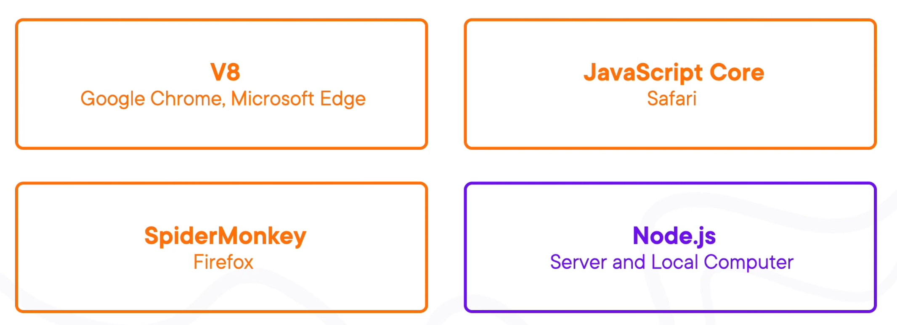
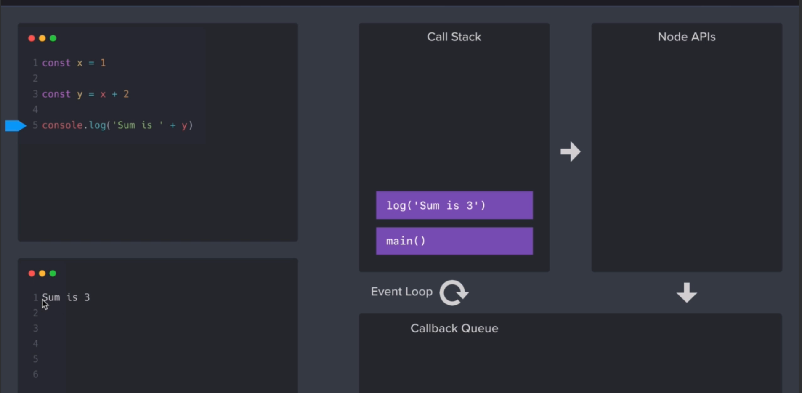

= JavaScript
:sectnums:
:toc: right
:toclevels: 4

################################################################################

=== How to Start

----
<!DOCTYPE html>
<html lang="en">
<head>
<script src="./first.js"></script>
</head>

<body>
Inspect and See Console
</body>
</html>

----

---

----
let count=1;
console.log(count);
----


=== var V/s let, var-let, let-var

In JavaScript, both `var` and `let` are used for variable declaration, but they have some differences in terms of scoping and hoisting.

*var*

- Variables declared with `var` are function-scoped or globally scoped, meaning they are accessible anywhere within the function in which they are declared, or globally if declared outside of any function.


Here's an example:

```javascript
function example() {
    if (true) {
        var x = 10;
    }
    console.log(x); // Outputs 10
}
example();
console.log(x); // Throws ReferenceError: x is not defined
```

In this example, even though `x` is declared inside the `if` block, it is accessible outside of it due to hoisting. This is because `var` declarations are hoisted to the top of the function.

*let*

- Variables declared with `let` are block-scoped, meaning they are only accessible within the block (enclosed by curly braces) in which they are declared.


Example:

```javascript
function example() {
    if (true) {
        let y = 20;
    }
    console.log(y); // Throws ReferenceError: y is not defined
}
example();
```

In this example, `y` is declared with `let` inside the `if` block, so it's only accessible within that block. Trying to access it outside the block results in a ReferenceError because `y` is not defined in that scope.

So, in summary:

- Use `var` for variables that need to have function or global scope and may be accessed before they are declared due to hoisting.
- Use `let` for variables that need block scope and should not be accessed before their declaration within the block. It's generally preferred over `var` due to its more predictable scoping behavior.

*Summary*: The introduction of let in ES6 (ECMAScript 2015) provided JavaScript developers with more predictable and manageable variable scoping behavior, addressing some of the pitfalls associated with var. let is generally preferred over var in modern JavaScript development due to its block scoping and improved handling of variable declarations. However, var is still widely used, especially in legacy codebases or for specific use cases where function-scoped behavior is desired

=== Infinity

Certainly! In JavaScript, `Infinity` represents the mathematical concept of positive infinity. It's a special numeric value that represents a number greater than any other number. Here's an example:

```javascript
let positiveInfinity = Infinity;
console.log(positiveInfinity); // Output: Infinity

console.log(10 / 0); // Output: Infinity
console.log(Number.POSITIVE_INFINITY); // Output: Infinity
```

In this example:

- `positiveInfinity` is assigned the value `Infinity`.
- Performing division by zero (`10 / 0`) in JavaScript results in `Infinity`.
- `Number.POSITIVE_INFINITY` is a predefined constant representing positive infinity.

=== Undefined

----
let x;
console.log(x); // Output: undefined

function example() {
    let y;
    console.log(y); // Output: undefined
}

example();
----

=== Data Types

----
// Number
let integer = 10;
let floatingPoint = 3.14;

// String
let message = "Hello, world!";

// Boolean
let isTrue = true;
let isFalse = false;

// Undefined
let undefinedVar;

// Null
let nullVar = null;


// Perform some operations
console.log("Sum of integer and floatingPoint:", integer + floatingPoint);
console.log("Concatenation of message and name:", message + " " + person.name);
----

=== JavaScript Engines



=== Script in <body/> tag

Yes, you can add `<script>` tags directly within the `<body>` tag of an HTML document. Placing scripts in the `<body>` tag is common, especially for scripts that are specific to the content of the page or that need to be executed after the page content has loaded.

Here's an example of how you can include a script within the `<body>` tag:

```html
<!DOCTYPE html>
<html lang="en">
<head>
    <meta charset="UTF-8">
    <meta name="viewport" content="width=device-width, initial-scale=1.0">
    <title>Script in Body Tag</title>
</head>
<body>
    <h1>Hello, world!</h1>

    <!-- JavaScript code placed within the body tag -->
    <script>
        console.log("This script is placed within the body tag.");
        // Your JavaScript code goes here
    </script>
</body>
</html>
```

Placing scripts at the end of the `<body>` tag can also improve the loading performance of your webpage because it allows the browser to render the HTML content first before loading and executing any scripts. This way, users can see the content of the page more quickly while scripts are being downloaded and processed in the background.

=== JS typeof

Certainly! The `typeof` operator in JavaScript is used to determine the data type of a variable or expression. It returns a string indicating the type of the operand. Here's an example demonstrating the use of `typeof` with different types of variables:

```javascript
// Example variables of different types
let num = 10;               // Number
let str = "Hello";          // String
let bool = true;            // Boolean
let arr = [1, 2, 3];        // Array
let obj = { key: "value" }; // Object
let func = function() {};   // Function
let undef;                  // Undefined
let nul = null;             // Null

// Using typeof to determine the type of each variable
console.log(typeof num);    // Output: "number"
console.log(typeof str);    // Output: "string"
console.log(typeof bool);   // Output: "boolean"
console.log(typeof arr);    // Output: "object" (Arrays are of type "object")
console.log(typeof obj);    // Output: "object"
console.log(typeof func);   // Output: "function"
console.log(typeof undef);  // Output: "undefined"
console.log(typeof nul);    // Output: "object" (Historical quirk in JavaScript)
```

Here are the results you would expect:

- `typeof num`: returns `"number"`
- `typeof str`: returns `"string"`
- `typeof bool`: returns `"boolean"`
- `typeof arr`: returns `"object"` (Arrays are technically objects in JavaScript)
- `typeof obj`: returns `"object"`
- `typeof func`: returns `"function"`
- `typeof undef`: returns `"undefined"`
- `typeof nul`: returns `"object"` (This is a historical quirk in JavaScript; `null` is considered an object)

Understanding the data types of variables in JavaScript is crucial for writing robust and error-free code, and `typeof` is a handy tool for such purposes.

=== Objects 1

NOTE: If you want to make object dynamic, you have to use `Factory Function`

Sure! Below is an example of creating an object representing a student in JavaScript and performing some operations on that object:

```javascript
// Define the student object
let student = {
    name: "John Doe",
    age: 20,
    grade: "A",
    courses: ["Math", "Science", "English"],
    // Method to display student information
    displayInfo: function() {
        console.log("Name: " + this.name);
        console.log("Age: " + this.age);
        console.log("Grade: " + this.grade);
        console.log("Courses: " + this.courses.join(", "));
    },
    // Method to add a new course
    addCourse: function(course) {
        this.courses.push(course);
        console.log(course + " has been added to the courses.");
    },
    // Method to change the grade
    changeGrade: function(newGrade) {
        this.grade = newGrade;
        console.log("Grade has been updated to " + newGrade);
    }
};

// Display student information
console.log("Initial student information:");
student.displayInfo();

// Add a new course
student.addCourse("History");

// Change the grade
student.changeGrade("B");

// Display updated student information
console.log("Updated student information:");
student.displayInfo();
```

In this example:

- The `student` object contains properties such as `name`, `age`, `grade`, and `courses`. It also contains methods like `displayInfo`, `addCourse`, and `changeGrade`.
- The `displayInfo` method displays the student's information.
- The `addCourse` method adds a new course to the `courses` array of the student.
- The `changeGrade` method updates the student's grade.
- We create an instance of the `student` object and then perform operations such as displaying information, adding a new course, and changing the grade.

This example demonstrates how objects in JavaScript can encapsulate both data (properties) and behavior (methods), allowing you to organize and manipulate related data and actions efficiently.

=== Objects 2

Certainly! Here's an example of handling object attributes without using methods:

```javascript
// Define the student object
let student = {
    name: "John Doe",
    age: 20,
    grade: "A",
    courses: ["Math", "Science", "English"]
};

// Display student information
console.log("Student information:");
console.log("Name: " + student.name);
console.log("Age: " + student.age);
console.log("Grade: " + student.grade);
console.log("Courses: " + student.courses.join(", "));

// Add a new course
student.courses.push("History");
console.log("Course added: History");

// Change the grade
student.grade = "B";
console.log("Grade changed to B");

// Display updated student information
console.log("Updated student information:");
console.log("Name: " + student.name);
console.log("Age: " + student.age);
console.log("Grade: " + student.grade);
console.log("Courses: " + student.courses.join(", "));
```

In this example:

- We define the `student` object with properties such as `name`, `age`, `grade`, and `courses`.
- We access and display the values of these properties directly using dot notation (`student.name`, `student.age`, etc.).
- We modify the `courses` array by using the `push` method to add a new course.
- We directly assign a new value to the `grade` property to change the student's grade.
- Finally, we display the updated information about the student.

This approach works well for simple operations on object attributes. However, as the complexity of the operations increases, using methods to encapsulate the behavior becomes more beneficial for code organization and reusability.


=== Array, Arrays

Sure! Here's an example of a JavaScript array:

```javascript
// Creating an array of numbers
let numbers = [1, 2, 3, 4, 5];

// Accessing elements of the array
console.log("First element:", numbers[0]); // Output: 1
console.log("Third element:", numbers[2]); // Output: 3

// Modifying elements of the array
numbers[1] = 10; // Changing the second element to 10
console.log("Modified array:", numbers); // Output: [1, 10, 3, 4, 5]

// Adding elements to the array
numbers.push(6); // Adding 6 to the end of the array
console.log("Array after adding element:", numbers); // Output: [1, 10, 3, 4, 5, 6]

// Removing elements from the array
let removedElement = numbers.pop(); // Removing the last element (6) from the array
console.log("Array after removing element:", numbers); // Output: [1, 10, 3, 4, 5]
console.log("Removed element:", removedElement); // Output: 6

// Iterating over the array
console.log("Array elements:");
for (let i = 0; i < numbers.length; i++) {
    console.log(numbers[i]);
}
```

In this example:

- We create an array called `numbers` containing integers from 1 to 5.
- We access elements of the array using square brackets notation (`numbers[0]`, `numbers[2]`).
- We modify elements of the array by assigning new values to specific indices (`numbers[1] = 10`).
- We add elements to the end of the array using the `push` method (`numbers.push(6)`).
- We remove elements from the end of the array using the `pop` method (`numbers.pop()`).
- We iterate over the array using a `for` loop, accessing each element using its index (`numbers[i]`).


==== Array Sort

----
let numbers = [5, 3, 9, 1, 7];

// Sort the number array
numbers.sort();

console.log("Sorted numbers:", numbers); // Output: [1, 3, 5, 7, 9]


let fruits = ["Banana", "Orange", "Apple", "Mango"];

// Sort the string array
fruits.sort();

console.log("Sorted fruits:", fruits); // Output: ["Apple", "Banana", "Mango", "Orange"]
----

################################################################################


==== Array Concat

----
let array1 = [1, 2, 3];
let array2 = [4, 5, 6];

// Concatenate array2 to array1
let newArray = array1.concat(array2);

console.log(newArray); // Output: [1, 2, 3, 4, 5, 6]


let array1 = [1, 2, 3];
let array2 = [4, 5, 6];
let array3 = [7, 8, 9];

// Concatenate array2 and array3 to array1
let newArray = array1.concat(array2, array3);

console.log(newArray); // Output: [1, 2, 3, 4, 5, 6, 7, 8, 9]
----


################################################################################

The `splice()` method in JavaScript is used to change the contents of an array by removing or replacing existing elements and/or adding new elements. It modifies the original array and returns an array containing the removed elements, if any.

Here's an example of using the `splice()` method:

```javascript
// Define an array
const fruits = ['apple', 'banana', 'cherry', 'date'];

// Remove elements starting from index 1 (banana) and add 'orange' and 'grape' in their place
const removedFruits = fruits.splice(1, 2, 'orange', 'grape');

// Output the modified array
console.log(fruits); // Output: ['apple', 'orange', 'grape', 'date']

// Output the removed elements
console.log(removedFruits); // Output: ['banana', 'cherry']
```

In this example:

- The `splice(1, 2, 'orange', 'grape')` call removes two elements starting from index 1 (inclusive) in the `fruits` array ('banana' and 'cherry') and replaces them with 'orange' and 'grape'. So, after the operation, the `fruits` array becomes `['apple', 'orange', 'grape', 'date']`.
- The `splice()` method returns an array containing the removed elements ('banana' and 'cherry' in this case), which is stored in the `removedFruits` variable.
- Both the modified array (`fruits`) and the array of removed elements (`removedFruits`) are logged to the console for demonstration.

################################################################################

To add elements at a specific location in an array in JavaScript, you can use the `splice()` method. The `splice()` method not only removes elements but also allows you to insert new elements at a specified index.

Here's an example of adding elements at a specific location in an array:

```javascript
// Define an array
let fruits = ['apple', 'banana', 'cherry', 'date'];

// Insert 'orange' and 'grape' between 'banana' and 'cherry'
fruits.splice(2, 0, 'orange', 'grape');

// Output the modified array
console.log(fruits); // Output: ['apple', 'banana', 'orange', 'grape', 'cherry', 'date']
```

In this example:

- The `splice(2, 0, 'orange', 'grape')` call inserts the elements 'orange' and 'grape' at index 2 (after 'banana') in the `fruits` array without removing any elements.
- After the operation, the `fruits` array becomes `['apple', 'banana', 'orange', 'grape', 'cherry', 'date']` with 'orange' and 'grape' inserted between 'banana' and 'cherry'.
- The modified array (`fruits`) is logged to the console for demonstration.

So, `splice()` allows you to add elements at a specific location in an array while optionally removing existing elements at the same time.

################################################################################

=== Spread Operator

The spread operator (`...`) is a feature introduced in ECMAScript 6 (ES6) that allows an iterable (like an array or string) to be expanded into individual elements.

Here's how the spread operator is used:

*1. Array Literals*:

```javascript
let arr1 = [1, 2, 3];
let arr2 = [...arr1, 4, 5, 6]; // Spread arr1 into individual elements

console.log(arr2); // Output: [1, 2, 3, 4, 5, 6]
```

*2. Function Arguments*:

```javascript
function sum(a, b, c) {
  return a + b + c;
}

let numbers = [1, 2, 3];

console.log(sum(...numbers)); // Spread numbers array into function arguments
```

*3. Concatenating Arrays*:

```javascript
let arr1 = [1, 2, 3];
let arr2 = [4, 5, 6];

let combinedArray = [...arr1, ...arr2]; // Spread both arrays into a new array

console.log(combinedArray); // Output: [1, 2, 3, 4, 5, 6]
```

*4. Copying Arrays*:

```javascript
let originalArray = [1, 2, 3];
let copyArray = [...originalArray]; // Spread original array into a new array

console.log(copyArray); // Output: [1, 2, 3]
console.log(originalArray === copyArray); // Output: false (different reference)
```


=== JS Function

Sure! Here's a JavaScript function that simulates the steps to make a cup of coffee:

```javascript
function makeCoffee() {
    // Step 1: Boil water
    console.log("Step 1: Boiling water...");

    // Step 2: Grind coffee beans
    console.log("Step 2: Grinding coffee beans...");

    // Step 3: Brew coffee
    console.log("Step 3: Brewing coffee...");

    // Step 4: Pour coffee into a cup
    console.log("Step 4: Pouring coffee into a cup...");

    // Step 5: Add sugar and milk (optional)
    console.log("Step 5: Adding sugar and milk (optional)...");

    // Step 6: Enjoy your coffee!
    console.log("Step 6: Your coffee is ready! Enjoy!");
}

// Call the function to make coffee
makeCoffee();
```

In this function:

- Step 1: Boiling water is simulated by logging a message to the console.
- Step 2: Grinding coffee beans is simulated similarly.
- Step 3: Brewing coffee is simulated.
- Step 4: Pouring coffee into a cup is simulated.
- Step 5: Adding sugar and milk (optional) is simulated.
- Step 6: A message is logged indicating that the coffee is ready to be enjoyed.

You can call `makeCoffee()` to execute these steps and simulate making a cup of coffee.

=== JS Function Default Values

----
// Function with default parameter values
function greet(name = "Guest", greeting = "Hello") {
    console.log(`${greeting}, ${name}!`);
}

// Calling the function without arguments
greet(); // Output: Hello, Guest!

// Calling the function with one argument
greet("Alice"); // Output: Hello, Alice!

// Calling the function with two arguments
greet("Bob", "Hi"); // Output: Hi, Bob!
----

=== JS Factory Function

Certainly! Factory functions in JavaScript are functions that return objects. They're called "factory" functions because they're used to create and return new instances of objects. Here's a very simple example:

```javascript
// Factory function to create person objects
function createPerson(name, age) {
    return {
        name: name,
        age: age,
        // Method to display person's information
        displayInfo: function() {
            console.log(`Name: ${this.name}, Age: ${this.age}`);
        }
    };
}

// Create a person using the factory function
let person1 = createPerson("Alice", 30);

// Display person's information
person1.displayInfo(); // Output: Name: Alice, Age: 30
```

In this example:

- The `createPerson` function is a factory function that takes `name` and `age` parameters and returns an object representing a person.
- Inside the factory function, we create and return an object literal with properties for `name` and `age`, along with a method `displayInfo` to display the person's information.
- We use the factory function to create a `person1` object with the name "Alice" and age 30.
- We then call the `displayInfo` method of the `person1` object to display its information.

Factory functions are commonly used in JavaScript to encapsulate object creation logic and provide a way to create multiple instances of objects with similar characteristics.

=== Object Enumeration

----
let car = {
    brand: "Toyota",
    model: "Camry",
    year: 2020,
    start: function() {
        console.log("Starting the " + this.brand + " " + this.model);
    },
    stop: function() {
        console.log("Stopping the " + this.brand + " " + this.model);
    }
};

// Enumerating properties of the car object
for (let key in car) {
    if (typeof car[key] !== "function") {
        console.log(key + ": " + car[key]);
    }
}
----

=== Object Cloning

In JavaScript, you can clone an object using various methods. One common approach is to use the spread operator (`...`) or `Object.assign()` method for shallow copying. Here's an example using the spread operator to clone a simple object:

```javascript
// Original object
let originalObject = {
    name: "John",
    age: 30,
    city: "New York"
};

// Cloning the object using the spread operator
let clonedObject = { ...originalObject };

// Modifying the cloned object
clonedObject.name = "Alice";

// Outputting the original and cloned objects
console.log("Original Object:", originalObject);
console.log("Cloned Object:", clonedObject);
```

This will output:

```
Original Object: { name: 'John', age: 30, city: 'New York' }
Cloned Object: { name: 'Alice', age: 30, city: 'New York' }
```

In this example, the `originalObject` is cloned into `clonedObject` using the spread operator (`...`). Any modifications made to `clonedObject` do not affect the `originalObject`, as they are separate instances.

=== Constructors

Sure! In JavaScript, you can use constructor functions to create objects with a common structure or blueprint. Constructor functions are similar to classes in other programming languages. Here's an example of a simple constructor function for creating person objects:

```javascript
// Constructor function for creating person objects
function Person(name, age, gender) {
    this.name = name;
    this.age = age;
    this.gender = gender;

    // Method to display person's information
    this.displayInfo = function() {
        console.log("Name: " + this.name);
        console.log("Age: " + this.age);
        console.log("Gender: " + this.gender);
    };
}

// Creating person objects using the constructor function
let person1 = new Person("John", 30, "male");
let person2 = new Person("Alice", 25, "female");

// Displaying information about the person objects
person1.displayInfo();
person2.displayInfo();
```

In this example:

- We define a constructor function `Person` that takes parameters `name`, `age`, and `gender`.
- Inside the constructor function, we use the `this` keyword to assign values to properties of the newly created object.
- We also define a method `displayInfo` within the constructor function to display the person's information.
- We create two person objects `person1` and `person2` using the `new` keyword followed by the constructor function, passing the necessary parameters.
- Finally, we call the `displayInfo` method on each person object to display their information.

Constructor functions are commonly used in JavaScript to create objects with a predefined structure and behavior. They allow you to create multiple instances of objects with similar characteristics.

=== Constructor V/s Factory

Both constructor functions and factory functions in JavaScript are used to create objects, but they differ in their approach to object creation and the way they handle object initialization.

1. **Constructor Function**:
- Constructor functions are defined using the `function` keyword and are invoked using the `new` keyword.
- They are used to create and initialize objects with a common structure or blueprint.
- Properties and methods are assigned to the object using `this` inside the constructor function.
- Each instance created with a constructor function has its own copy of methods, which can lead to memory inefficiency when creating multiple instances.
- Example:

```javascript
function Person(name, age) {
    this.name = name;
    this.age = age;
    this.greet = function() {
        console.log("Hello, my name is " + this.name);
    };
}

let person1 = new Person("John", 30);
```

2. **Factory Function**:

- Factory functions are regular JavaScript functions that return objects.
- They are used to create and return new objects without using the `new` keyword.
- Properties and methods are defined within the factory function and added to the object before returning it.
- Example:

```javascript
function createPerson(name, age) {
    return {
        name: name,
        age: age,
        greet: function() {
            console.log("Hello, my name is " + this.name);
        }
    };
}

let person2 = createPerson("Alice", 25);
```

The choice between them depends on the specific requirements of your application and coding style preferences.


|===
| Characteristic         | Constructor            | Factory Function

| Syntax                  | Defined using the `function` keyword and typically starts with a capital letter. | Defined using the `function` keyword, no specific naming convention.

| Usage of `new` keyword | Requires the `new` keyword to create new instances.                         | Does not require the `new` keyword.

| Return value            | Implicitly returns the newly created object.                                 | Returns the object explicitly using the `return` keyword.
|===


################################################################################

=== IF-ELSE

----
// Example of if...else statement
let temperature = 25;

if (temperature > 30) {
    console.log("It's hot outside!");
} else if (temperature > 20) {
    console.log("It's warm outside.");
} else {
    console.log("It's cold outside.");
}
----

=== SWITCH-CASE

----
// Example of switch statement
let day = "Monday";

switch (day) {
    case "Monday":
        console.log("It's Monday!");
        break;
    case "Tuesday":
        console.log("It's Tuesday!");
        break;
    case "Wednesday":
        console.log("It's Wednesday!");
        break;
    case "Thursday":
        console.log("It's Thursday!");
        break;
    case "Friday":
        console.log("It's Friday!");
        break;
    case "Saturday":
    case "Sunday":_
        console.log("It's the weekend!");
        break;
    default:
        console.log("Invalid day!");
}
----

=== Difference: IF-ELSE V/s SWITCH-CASE

[cols="^,^,^"]
|=======================================================================
| Feature | if...else | switch...case
| Syntax | if (condition) { | switch (expression) {
| | // code block | case value1:
| | } else if (condition) { | // code block
| | // code block | case value2:
| | } else { | // code block
| | // code block | default:
| | } | // code block
| Expression | Supports arbitrary conditions and | Compares a single expression to
| | expressions using logical operators | multiple possible values
| Control Flow | Linear control flow with branching | Jump-based control flow with case
| | for each condition | labels and branching for matched cases
| Matching | Supports complex conditions and | Limited to simple value comparisons
| | expression evaluation | (equality comparisons only)
| Default Behavior | Executes the first matching condition | Executes the code block associated
| | or the `else` block if none match | with the first matching case label or
| | | the `default` block if no match found
| Efficiency | Suitable for evaluating conditions | More efficient for multiple
| | with few possible outcomes | conditions with fixed values
| Flexibility | More flexible for complex conditions | Less flexible due to limited syntax
| | and expressions | and comparison options
|=======================================================================

=== For Loop

----
// Using a for loop to iterate from 1 to 5
for (let i = 1; i <= 5; i++) {
    console.log("Iteration " + i);
}
----

=== While

----
// Initialize a counter variable
let counter = 0;

// Define the while loop
while (counter < 5) {
  console.log("Counter is: " + counter);
  counter++; // Increment the counter
}

console.log("Loop ended.");

----

=== Do While

----
// Initialize a counter variable
let counter = 0;

// Define the do-while loop
do {
  console.log("Counter is: " + counter);
  counter++; // Increment the counter
} while (counter < 5);

console.log("Loop ended.");
----

################################################################################

=== Break and Continue

----

// Example of using break
for (let i = 0; i < 10; i++) {
  console.log(i);
  if (i === 5) {
    console.log("Reached 5, breaking loop");
    break; // Exit the loop when i equals 5
  }
}

// Example of using continue
for (let i = 0; i < 10; i++) {
  if (i === 5) {
    console.log("Skipping 5");
    continue; // Skip the rest of the loop body when i equals 5
  }
  console.log(i);
}

----

################################################################################

=== For In, For-In

----
// Define an object
let person = {
    name: "John",
    age: 30,
    gender: "male"
};

// Iterate over the properties of the object
for (let key in person) {
    console.log(key + ": " + person[key]);
}
----

=== For Of, For-Of

----
// Define an array
let fruits = ["Apple", "Banana", "Orange"];

// Iterate over the elements of the array
for (let fruit of fruits) {
    console.log(fruit);
}
----


=== For In V/s For Of

[cols="3,3,3"]
|===
| Feature | for...of | for...in
| Used for iterating over | Iterable objects (arrays, strings, maps, sets, etc.) | Enumerable properties of objects
| Iterates over | Values of the iterable | Keys of the object
| Order of iteration | Preserves the order of elements in the iterable | May not preserve the order of properties
| Used with | Arrays, strings, maps, sets, etc. | Objects (enumerable)
| Example | let arr = [1, 2, 3]; for (let val of arr) { console.log(val); } | let obj = { key1: 'value1', key2: 'value2', key3: 'value3' }; for (let key in obj) { console.log(key + ': ' + obj[key]); }
|===

################################################################################

=== Iterable


Imagine you have a basket full of fruits - apples, bananas, and oranges. Now, let's say you want to go through each fruit in the basket, one by one. You start with the first fruit, then move to the next one, and so on until you've checked them all.

In programming, we often deal with collections of things, like this basket of fruits. An iterable is like a collection that lets you go through its elements, just like you would go through the fruits in the basket.

For example, think of a book with chapters. Each chapter is like an element in the collection. An iterable book allows you to "read" through each chapter one after another.

So, when we say something is iterable in programming, it means you can go through its parts, like flipping through the pages of a book or picking fruits from a basket, one at a time.

In JavaScript, arrays are a common type of iterable. You can loop through each item in an array, just like going through each fruit in the basket. Other iterable things in JavaScript might be lists of items, like a list of tasks or a list of friends' names.

################################################################################

=== Value V/s Reference Types

In JavaScript, variables can hold two types of values: primitive values and reference values. Understanding the difference between these two types is crucial for understanding how values are stored and manipulated in JavaScript.

Here's a summary of value vs reference types in JavaScript:

*Value Types (Primitive Types)*:

- Primitive types are immutable and stored directly in the variable's memory location.
- When you assign a primitive value to a variable, a copy of the value is made.
- Examples of primitive types include:
- `String`: Represents a sequence of characters.
- `Number`: Represents numeric data.
- `Boolean`: Represents a logical value (`true` or `false`).
- `Undefined`: Represents an uninitialized variable.
- `Null`: Represents the intentional absence of any object value.
- `Symbol` (introduced in ECMAScript 6): Represents a unique identifier.
- Operations on primitive types directly manipulate the value stored in the variable.
- Example:

```javascript
let num1 = 10;
let num2 = num1; // Copying the value of num1 to num2
num2 = 20; // Changing the value of num2 does not affect num1
console.log(num1); // Output: 10
```

*Reference Types (Objects)*:

- Reference types are mutable and are stored as a reference to the object's location in memory.
- When you assign a reference value to a variable, you are storing a reference to the object's memory location, not the actual object.
- Examples of reference types include:
- `Object`: Represents a collection of key-value pairs.
- `Array`: Represents a collection of elements.
- `Function`: Represents a reusable block of code.
- `Date`: Represents a date and time.
- User-defined objects.
- Operations on reference types manipulate the reference to the object, not the object itself.
- Example:

```javascript
let obj1 = { name: 'John' };
let obj2 = obj1; // Copying the reference of obj1 to obj2
obj2.name = 'Alice'; // Modifying obj2 affects obj1 as well
console.log(obj1.name); // Output: Alice
```

*Summary*:

- Value types are copied by value, meaning changes to one variable do not affect another.
- Reference types are copied by reference, meaning changes to one variable may affect others referencing the same object.

Understanding the distinction between value and reference types is essential for writing efficient and bug-free JavaScript code.

=== JavaScript Math

----
// Math.round(): Rounds a number to the nearest integer
let num1 = 4.7;
console.log(Math.round(num1)); // Output: 5

// Math.ceil(): Rounds a number up to the nearest integer
let num2 = 4.1;
console.log(Math.ceil(num2)); // Output: 5

// Math.floor(): Rounds a number down to the nearest integer
let num3 = 4.9;
console.log(Math.floor(num3)); // Output: 4

// Math.max(): Returns the highest value from a list of numbers
console.log(Math.max(10, 5, 20)); // Output: 20

// Math.min(): Returns the lowest value from a list of numbers
console.log(Math.min(10, 5, 20)); // Output: 5

// Math.random(): Generates a random floating-point number between 0 (inclusive) and 1 (exclusive)
console.log(Math.random()); // Output: A random number between 0 and 1

// Math.pow(): Returns the result of raising the first argument to the power of the second argument
console.log(Math.pow(2, 3)); // Output: 8 (2 raised to the power of 3)

// Math.sqrt(): Returns the square root of a number
console.log(Math.sqrt(16)); // Output: 4

// Math.abs(): Returns the absolute (positive) value of a number
console.log(Math.abs(-10)); // Output: 10
----

=== JavaScript String

----
// String length
let str = "Hello, world!";
console.log("Length of string:", str.length); // Output: 13

// Convert to uppercase
console.log("Uppercase:", str.toUpperCase()); // Output: HELLO, WORLD!

// Convert to lowercase
console.log("Lowercase:", str.toLowerCase()); // Output: hello, world!

// Get a substring
console.log("Substring:", str.substring(7)); // Output: world!

// Get a substring with start and end index
console.log("Substring with indices:", str.substring(7, 12)); // Output: world

// Split a string into an array
console.log("Split into array:", str.split(", ")); // Output: ["Hello", "world!"]

// Replace a substring
console.log("Replace substring:", str.replace("world", "universe")); // Output: Hello, universe!

// Check if a string contains a substring
console.log("Contains 'world'?", str.includes("world")); // Output: true

// Trim leading and trailing whitespace
let str3 = "   Trimmed string   ";
console.log("Trimmed string:", str3.trim()); // Output: Trimmed string
----

=== JavaScript Operators

Certainly! Here are examples of some common JavaScript operators:

1. **Arithmetic Operators**:
```javascript
let x = 10;
let y = 5;

console.log("Addition:", x + y);       // Addition: 15
console.log("Subtraction:", x - y);    // Subtraction: 5
console.log("Multiplication:", x * y); // Multiplication: 50
console.log("Division:", x / y);       // Division: 2
console.log("Modulus:", x % y);        // Modulus: 0 (remainder of division)
console.log("Increment:", ++x);        // Increment: 11
console.log("Decrement:", --y);        // Decrement: 4
```

2. **Comparison Operators**:
```javascript
let a = 5;
let b = 10;

console.log("Equal to:", a === b);           // Equal to: false
console.log("Not equal to:", a !== b);       // Not equal to: true
console.log("Greater than:", a > b);         // Greater than: false
console.log("Less than:", a < b);            // Less than: true
console.log("Greater than or equal to:", a >= b); // Greater than or equal to: false
console.log("Less than or equal to:", a <= b);    // Less than or equal to: true
```

3. **Logical Operators**:
```javascript
let p = true;
let q = false;

console.log("Logical AND:", p && q);    // Logical AND: false
console.log("Logical OR:", p || q);     // Logical OR: true
console.log("Logical NOT:", !p);       // Logical NOT: false
```

4. **Assignment Operators**:
```javascript
let num = 10;

num += 5; // Equivalent to num = num + 5
console.log(num); // 15

num -= 3; // Equivalent to num = num - 3
console.log(num); // 12

num *= 2; // Equivalent to num = num * 2
console.log(num); // 24

num /= 4; // Equivalent to num = num / 4
console.log(num); // 6

num %= 5; // Equivalent to num = num % 5
console.log(num); // 1
```

These examples cover arithmetic, comparison, logical, and assignment operators in JavaScript.

=== Template Literal

Certainly! Template literals are a convenient way to create strings in JavaScript, especially when you need to include variables or expressions within the string. Here's an example:

```javascript
let name = "Alice";
let age = 30;

// Using template literals to create a string
let greeting = `Hello, my name is ${name} and I am ${age} years old.`;

console.log(greeting);
```

=== Asynchronous JavaScript: Promises, Callbacks, Async Await

==== Sync & Async

----
function print1() {
    const number1 = 1;
    console.log(number1);
}


function print2() {
    function getNumber2() {
        return 2;
    }
    const number2 = getNumber2();
    console.log(number2);
}


function print3() {
    const fs = require('fs');
    fs.readFile('./number3.txt', 'utf-8', function (err, number3) {
        console.log(number3);
    });
}


function print4() {
    const number4 = 4;
    console.log(number4);
}

print1();
print2();
print3();
print4();
----

################################################################################

---

==== Sync & Async

----
console.log('Output1')

const myFun = function() {
console.log("Output From Anonymouse call::Output2");
}

setTimeout(myFun, 2000);

console.log('Output3')
----


################################################################################

---


################################################################################

---


################################################################################

---

image::images/async2.png[]

################################################################################

---



The job of the call stack  is to track the execution of our program,  and it does that by keeping track  of all of the functions  that are currently running.

The first thing that's gonna happen is that  our script it's gonna get wrapped in that main function  that Node.js provides. That function was defined by Node,  and while it's an anonymous function  it's often referred to  as the main function for the program.

SetTimeout is clearly a function,  so something new gets pushed onto the call stack.  Now setTimeout,  is not a part of the JavaScript programming language.  You're not gonna find its definition  anywhere in the JavaScript spec,  and V8 has no implementation for it.  Instead, it is Node.js,  which creates an implementation of setTimeout using C++,  and provides it to your Node.js scripts to use.  As we saw, it is an asynchronous way  to wait a specific amount of time,  and then have a function run.  So when we call setTimeout,  it's really registering an event with Node.js APIs,  and that is an event callback pair  where the event in this case is simply to wait two seconds,  and the callback is the function to run.


Another event callback pair  might be to wait for a database request to complete,  then run the callback that does something with the data.  So right here,  when we call setTimeout,  a new event gets registered in Node APIs.  Here we have our setTimeout callback,  and we're waiting for two seconds.  Now at this point in the process  that two second clock starts ticking down.  While we're waiting for those two seconds to happen,  we can actually do other stuff inside of the call stack.

So JavaScript itself  is a single threaded programming language.  You can do one thing at a time,  and the call stack enforces that.  We can only have one function on the top of the call stack.  That is the thing we're doing.  There's no way to execute two things at the same time.

Now that doesn't mean Node.js is completely single threaded.  The code you run is indeed still single threaded,  but Node uses other threads in C++  behind the scenes to manage your events.  That's what allows us to continue running our application  while we're waiting those two seconds.  We don't have to completely wait,  and this is the non-blocking nature of Node.  This is not blocking the rest of the app from running.


So from here, what do we do?  We move on to another setTimeout call.  We go on to line 7, we call setTimeout again.  This is going to register  yet another event in the Node API's area,  a callback where the event is zero seconds.  And at that point, we now have two Node APIs  waiting in the background.  So, we can still continue to do other things  while both of those are waiting for the event to complete.  In the first case, two seconds,  in the second case, zero.  Now where do we go from here  while these zero seconds are up?  So this callback needs to get executed.  Now, how exactly does that happen?  Well, this is where the callback queue,  and the event loop down below come into play.  The job of the callback queue is simple.  Its job is to maintain  a list of all of the callback functions  that are ready to get executed.  So when a given event is done,  in this case, when the zero second timer is complete,  that callback function,  the function we defined right here,  that's gonna get added onto the callback queue,  which is just a standard line.  You get in at the end of the line,  and you work your way towards the front.  The front item is the one that will get executed first.  So right here, since there are no items in the list,  the callback gets added right up front.  So we have this callback,  and it's ready to get executed.  But before it can be executed,  it needs to be added onto the call stack.  That's where functions go to run.

Now this is where the #*event loop*# comes into play.  The event loop looks at two things.  It looks at the call stack,  and it looks at the callback queue.  *If the call stack is empty,  it's going to run items from the callback queue.  So at this point, the event loop says,  I know you got added to the callback queue,  #but the call stack is not empty, so I can't execute you#*.  And this is why our function doesn't run right away.  The event loop needs to wait for the call stack to be empty.  So at this point, main actually continues to run.  The next thing we see  is that line 11 of our program is going to run.  That is a call to log.  So the function gets added onto the call stack.  Our message prints down below.  The function gets popped off the call stack,  and at this point the main function is done.  So from here, main gets removed.  Now with our regular synchronous scripts,  this is when the program actually finished.  The end of main signified  the end the app of the application.  That is not the case with our asynchronous programs.  Right now, the event loop can start to do its job.  It can see that the call stack is empty,  and it can say, okay,  do I have anything in the callback queue? I do.  So it takes that item,  and it moves it up to the call stack  so the callback can run.  So at this point our callback function is running  that is going to execute the function, right here.  There's a single line inside of there.  It is a call to log  that gets added onto the call stack.  Our message prints, printing zero seconds,  it gets removed, and then the callback function is done.  So this is why  we were seeing zero seconds after finishing up.  None of our asynchronous callbacks are ever going to run  before the main function is done.  So at this point the program still isn't done.  The call stack is empty, the callback queue is empty  which means the event loop can't do anything.  The program just sits there for two seconds.  At that point, our other event is done.  Its callback gets pushed onto the callback queue.  The event loop detects that.  It notices the call stack is empty,  which means it's ready to run.  It takes that callback, bringing it up to the call stack,  and it executes it.  So that is defined on line 4.  We have our call to log.  We get our message to print, printing "Two seconds!",  that gets removed, the callback gets removed,  and at this point the program is complete.  The call stack is empty,  the callback queue is empty,  and there are no other events registered with Nodes APIs.  This means the process would be complete.  And over here, we have the exact same output  we got when we actually ran the application.  The only difference is that we now know why  we got the messages printing in the order we saw them.  Because Node uses other threads behind the scenes  for those Node APIs.  We could see why Node is nonblocking,  allowing finishing up to print  even though we're waiting two seconds  for our other message to print.  We also learned why we were seeing  "Finishing up" print before "Zero seconds!".  That's because the event loop  can't run any of our asynchronous callbacks  until the call stack is empty,  which means that main needs to finish first.  If you have any questions  about what was covered here,  just crack open a question in the Q&A.  And remember, this is not the end of our discussion  on asynchronous programming.  This is just the beginning.  The goal here was to give us a mental model  of what's happening.  Now, what we're gonna dive into the rest of this section,  and actually explore how we can get real data  from HTTP APIs into our application.  I'm excited to get to that.  So let's go ahead and jump right in to the next video.

################################################################################

---

==== Callback-Method, Callback-Example

In JavaScript, a callback is a function that is passed as an argument to another function and is executed after a particular task or event has been completed. Callbacks are commonly used in asynchronous programming to handle tasks that take some time to complete, such as fetching data from a server, reading files, or processing user input.

Here's a simple example of a callback:

[source,javascript]
----
javascript
// Example function with a callback
function fetchData(callback) {
    // Simulating an asynchronous operation (e.g., fetching data from a server)
    setTimeout(() => {
        const data = { id: 1, name: 'John' }; // Simulated data
        callback(null, data); // Call the callback function with the fetched data
    }, 2000); // Simulated delay of 2 seconds
}

// Callback function to handle the fetched data
function handleData(error, data) {
    if (error) {
        console.error("Error fetching data:", error);
    } else {
        console.log("Data fetched successfully:", data);
    }
}

// Calling the function with the callback
fetchData(handleData);
----


In this example:

- The `fetchData` function simulates an asynchronous operation by using `setTimeout`. It accepts a callback function as an argument.
- After the simulated operation is completed (after 2 seconds), `fetchData` calls the provided callback function with two arguments: `error` (if any) and `data`.
- The `handleData` function is defined separately and serves as the callback. It handles the fetched data and any potential errors.

Callbacks are a fundamental concept in JavaScript, especially in asynchronous programming. They enable you to write non-blocking code and handle asynchronous tasks in a more structured and manageable way. However, as code complexity grows, callback-based code can become hard to read and maintain, leading to the emergence of other asynchronous patterns like Promises and async/await.

################################################################################

---


==== Event Loop

==== Call Stack

==== Task Queue

=== Promise

==== State Of The Promise


* So what is a promise?  A promise, is a special JavaScript object that represents an eventual result of an asynchronous action.  A promise is kind of a proxy for a value that you don't have yet.

* Let's imagine that we have an asynchronous function that reads the contents of an external file.  The process of reading from file can take some time.  Let's say 3 seconds.  During those 3 seconds, we won't have any results from that function.  So how should we handle this?  Actually, we have at least two options in this case.  The first option is to pass a callback into the asynchronous function.  This callback will be invoked after 3 seconds with the results of the function as an argument.  Inside the callback, but we can do everything we want with the result.

* The second option is to return a promise immediately.  This promise will represent the result of the function.  It will not contain the specific value during those 3 seconds, but at least we will have something  that we can use as a substitute of that value.  The benefit of this approach is that we can use this value right away.  We can already pass this promise as an argument to other functions and assign it to variables.

* A promise object has two internal properties.  The first property is the promised status and the second property is the promise value.  If everything goes well, the value property will contain the real value of the promise.  Also, you need to know that any promise can be in one of three states pending, fulfilled and rejected.  Pending status means that the promise is neither fulfilled nor rejected.

* In our example, during those 3 seconds, a promise would be in pending state.  While the promise is independent state, the value property will be undefined.  Fulfilled state means that the action completed successfully.  In our example, if everything goes well during this 3 seconds and we get the contents of the file,  then the province will change its state from pending to full field.  When the promise changes, the state to fulfilled the value property will contain a real value that  we are interested in.  Rejected status means that this action has failed for some reason.  Rejected promise will contain the reason why it has failed inside of the value property.

################################################################################

---

==== How To Create Promise

.Chrome Developer Tool - A
[source, javascript]
----
const myPromise = new Promise(function(resolve,reject){
});
console.log(myPromise);
----

.Chrome Developer Tool - B
[source, javascript]
----
const myP2 = new Promise(function(resolve,reject){
    resolve('value');
});
console.log(myP2);
----

.Chrome Developer Tool - C
[source, javascript]
----
const myP2 = new Promise(function(resolve,reject){
    reject('reject');
});
console.log(myP2);
----


* There is a special class in JavaScript which is called promise.  If you want to create a promise, you simply need to create an instance of this class.  The Promise constructor takes only one argument, and that's a function.  This argument is required and you can't create a promise without it.  *This function is called executor function*, and it's invoked at that very moment when we are creating  a promise.

* *This function takes two arguments resolve and reject.  Both of them are functions as well*.  So here we are creating a variable called My Promise that will contain a promise.  Initially, my promise variable is in pending state.  In order to transfer this promise from dependent to the fulfilled state, you should invoke resolve  function or you can invoke reject function in order to transfer this promise to the rejected state.

* Let's explore this by example.  I'm going to add console.log statements to our code that will print the promise to the browser console.  Let's run our code and see what happens.  So it prints promise pending in the browser console.  If we expand the output, we can see two internal properties of the promise, promise status and promise  value promise.  Status is equal to binding and promise.  Value is equal to undefined.  I would like to mention that promises work both in the browser and inside Node.js.  We are using Google Chrome developer tools in this video because here we can see the internal properties  of the promise.  I mean promise status and promise value.  Let's change our promise and invoke resolve function inside.  Resolve function takes one argument, which is the value of the premise.  Let's run this code again.  Now you can see that promise status is resolved and parameter value is equal to string value.

* Let's change our promise one more time and this time invoke, reject, function instead of resolve.  Reject function also takes one argument, and this argument represents the reason why the premise was  rejected.  Let's run our code.  Now we can see that prime status is rejected and prime is value is equal to string.  Reason that we specify it here.  If you have a rejected promise that you would have an uncaught *error in the browser console*.

=== Final State of Promise

* In the previous video I have mentioned that promise can be in one of three states pending, fulfilled  or rejected.  Two of these states are final.  If the promise is in full field or in a rejected state, it can't change its state again.  Only if the promise is in pending state, then this state can be changed, either to fulfilled or to  reject it.

.Chrome Developer Tool - B
[source, javascript]
----
const myP2 = new Promise(function(resolve,reject){
    resolve('value1');
    resolve('value2');
    reject('reject');
});
console.log(myP2);
----

* Let's explore this by example.  Let's create a premise that tries to be resolved and rejected multiple times.  This promise tries to become resolved two times with different values, and then it tries to become  rejected with the reason.  If I run this code now, we will see that the status of this promise is resolved and the value is equal  to string value, which is taken from the first resolved function.  Even though we called resolve function two times and then also called reject function.  The promise became fulfilled after the first call to the resolve function, and then it never changed  its state again.

* And this illustrates that fulfilled state is the final state of the promise, and it cannot be changed.

.Chrome Developer Tool - B
[source, javascript]
----
const myP2 = new Promise(function(resolve,reject){
    reject('reject');
    resolve('value1');
    resolve('value2');
});
console.log(myP2);
----

* But what about the rejected state?  Let's create a premise similar to what we had before, but now it will first get rejected and only then  get resolved.  So I will put the reject function before this to resolve functions.  If I run this code now, we will see that the status of the promise is rejected.  And the value of this promise is a strong reason.  Even though we called a resolve function two times after we called reject function, the promise became  rejected after the first call to the reject function, and then it never changed its date and value  again.

* This illustrates that a rejected state is also the final state of the promise, and it cannot be changed  again.  Basically the only state of the promise that can be changed later is so called pending State.  pending State is not the final state, and it can be changed either to fulfilled or rejected.

=== How to Consume JavaScript Promises: Promise.then


* Let's take as an example, a simple premise that resolves with a string.  Hello world.  As soon as this problem becomes resolved, we would like to print Hello world to the browser console.  But how can we do it?  Promise, status and promise.  Value properties that we have seen in the browser are internal properties of the promise.  We cannot simply print the value of the promise to the browser console like shown here.  These properties are not exposed to the outside world, so we can't use them directly.  Instead, promise object has a couple of methods that can be used in order to access Promise value and Promise status.  One of these very useful methods is called Then.

* Then method takes to arguments onFullfilled and onRejected.  Both of these arguments should be functions on full field function will be invoked when premise is fulfilled.  It has only one argument the fulfillment value.  And on the rejected function will be invoked if the premise is rejected.  It also has only one argument the reason of rejection.

* If you're interested only in successful cases, you can provide only the first function which would  be onFulfilled.  Let's say you want to take the fulfillment value of our promise, which is Hello world and print it  to the browser console.  In order to do this, we are going to use then method of the promise object and provide only on full  field function to it.  You see here we are invoking then method on a promise and we are passing one function to it which is  on full field function.  This function takes only one argument and this is the value of the promise.  Now inside of this function, we can do anything we want.

[source, javascript]
----
const myP2 = new Promise(function(resolve,reject){
    resolve('value');
});
console.log(myP2);

myP2.then(function(value){
    console.log(value);
});
----

* Is this value?  If we apply this code to our promise and run this in the browser, we will see.  Hello World string in the browser console.  So I will write here the same code that we've just seen and run it here in the browser console.  Here we are providing only unfulfilled function.  We are going to have a look at an example which requires both functions in the next videos.  By means of providing on full field and on rejected functions.  We are kind of subscribing to the results of the promise.  *These functions will be invoked asynchronously after the premise becomes either fulfilled or rejected.  They are being added to the message queue and will be executed only after the call stack becomes empty*.


[source, javascript]
----
const myP2 = new Promise(function(resolve,reject){
    resolve('value');
});
console.log(myP2);

myP2.then(function(value){
    console.log(value);
});

console.log('This is console log');
----


Let's have a look at this in action.  I will use our Hello World promise and add to console dot log statements to.  The first console.log I will put inside on full field function.  All right here.  And I will write here.  This is inside on full field function.  And the second console.log statement I will put at the end of our code.  After we invoked then method.  Right here.  And I will write here.  This is written after my prime to then.  So let's see what happens if I run this code.  As you can see, first gets printed.  The message this is written after my promise Dot.  Then and only after this message, you can see another message saying this is inside on fulfilled function.  In other words, all then handlers, be it on full field or on rejected, will be invoked only after  all other code in the code stack gets executed.  So in this video, we have learned how we can use the value of the premise by utilizing then method.

################################################################################

---


=== JS-Functions, JavaScript-Functions

==== Arrow Functions

*Arrow Functions / Anonymous Functions / Lambda Functions*

*A*

----
function helloWorld() {
  console.log("Hello, World!");
}

const helloWorld = () => {
  console.log("Hello, World!");
};
----

################################################################################

---

*B*

----
// Normal function with two integer arguments
function add(a, b) {
  return a + b;
}

// Call the add function with two integer arguments
let result = add(5, 3);
console.log("Result:", result); // Output: Result: 8

// Arrow function with two integer arguments
const add = (a, b) => {
  return a + b;
};

// Call the arrow function with two integer arguments
let result = add(5, 3);
console.log("Result:", result); // Output: Result: 8
----

==== Functions

*Named Function and Function Expression (Anonymous Function)*

----
// Named function definition
function greet(name) {
  console.log("Hello, " + name + "!");
}

// Call the named function
greet("Alice"); // Output: Hello, Alice!

// Function expression (anonymous function)
let greet = function(name) {
  console.log("Hello, " + name + "!");
};

// Call the function expression
greet("Bob"); // Output: Hello, Bob
----

################################################################################

|===
| Characteristic         | Named Functions       | Function Expressions

| Clarity                | Provides a clear and descriptive name for the function. | Offers flexibility in defining functions without necessarily giving them a name.

| Recursion              | Suitable for recursion as they can refer to themselves by name. | Can also support recursion if assigned to a variable, but it's not as straightforward.

| Hoisting               | The entire function is hoisted to the top of its scope. | Only the variable declaration (if any) is hoisted, not the function definition.

| Flexibility            | Limited flexibility as the function must have a name. | Offers more flexibility, especially when creating functions dynamically or anonymously.

|===


################################################################################

==== Hoisting

JavaScript hoisting is a behavior where variable and function declarations are moved to the top of their containing scope during the compilation phase, before the code is executed. This means that regardless of where variables and functions are declared in the code, they are effectively "hoisted" to the top of their containing scope, making them accessible throughout the entire scope.

Here's an example to illustrate hoisting with function declarations and `let` variables:

```javascript
// Function declaration
greet(); // Output: Hello!

function greet() {
  console.log("Hello!");
}

// Variable declaration with let
console.log(x); // Error: Cannot access 'x' before initialization
let x = 5;
console.log(x); // Output: 5
```

In this example:

- The function `greet` is declared using the `function` keyword before it's called. Even though the function is called before its declaration in the code, JavaScript hoisting moves the function declaration to the top of its containing scope during the compilation phase. As a result, `greet` is accessible and can be called before its actual declaration.
- The variable `x` is declared with `let` but not initialized before it's used. Therefore, trying to access it before the declaration results in a `ReferenceError`. Once `x` is declared and initialized with `let x = 5;`, it can be accessed and used normally within its scope.

Hoisting applies to both function and variable declarations but behaves differently for variables declared with `let` and `const` compared to `var`. With `let` and `const`, the variable is hoisted to the top of its containing block but remains uninitialized (in a "temporal dead zone") until its actual declaration in the code.

=== Try, Catch, Finally

Certainly! Here's a simple example of using `try` and `catch` in JavaScript:

```javascript
try {
  // Code that might throw an error
  let result = 10 / 0; // This will throw a division by zero error
  console.log("Result:", result); // This line won't be executed
} catch (error) {
  // Code to handle the error
  console.log("An error occurred:", error.message);
} finally {
  // Code that will always execute, regardless of whether an error occurred or not
  console.log("Finally block executed.");
}
```

In this example:

- We have a `try` block containing the code that might throw an error. In this case, we attempt to divide `10` by `0`, which results in a division by zero error.
- If an error occurs within the `try` block, the control is transferred to the `catch` block. The `catch` block contains code to handle the error. In this example, we log the error message to the console.
- The `finally` block contains code that will always execute, regardless of whether an error occurred or not. In this example, we log a message indicating that the `finally` block is executed.
- If no error occurs within the `try` block, the `catch` block is skipped, and the control moves directly to the `finally` block.

This structure allows you to gracefully handle errors in your JavaScript code and execute cleanup tasks even if an error occurs.

################################################################################

---

==== Use of Finally

Sure! Let's consider a scenario where you're writing a function to read data from a file in a web application. The file might not exist, or there could be other issues while reading it. You want to ensure that regardless of whether the file is successfully read or not, certain cleanup tasks, like closing any open resources, are performed.

Here's how you could use `try...catch...finally` in this scenario:

```javascript
function readFile(fileName) {
    let fileData;
    try {
        // Attempt to read the file
        fileData = readFromFileSystem(fileName);
        console.log("File read successfully:", fileData);
    } catch (error) {
        // Handle any errors that occur during file reading
        console.log("Error reading file:", error);
    } finally {
        // Ensure cleanup tasks are performed, such as closing resources
        console.log("Cleanup: Closing any open resources...");
    }
}

// Simulated function to read from file system
function readFromFileSystem(fileName) {
    // Simulate an error by throwing an exception if the file doesn't exist
    if (!fileExists(fileName)) {
        throw new Error("File not found: " + fileName);
    }
    return "File content"; // Simulated file content
}

// Simulated function to check if file exists
function fileExists(fileName) {
    // Simulate file existence based on some condition
    return fileName === "example.txt";
}

// Example usage
readFile("example.txt"); // Existing file
readFile("nonexistent.txt"); // Non-existent file
```

In this example:

- The `readFile` function attempts to read data from a file specified by `fileName`.
- Inside the `try` block, the `readFromFileSystem` function is called to read the file. If an error occurs during file reading (e.g., file not found), it throws an exception.
- The `catch` block catches any exceptions that occur during file reading and handles them gracefully by logging an error message.
- The `finally` block contains cleanup code that will always execute, regardless of whether an exception occurred or not. This ensures that any open resources are properly closed, even if an error occurred during file reading.

This example demonstrates how `try...catch...finally` can be used to ensure proper cleanup in scenarios where resources need to be released, such as file handling, database connections, or network requests.

################################################################################

---

=== Local V/s Global

In JavaScript, variables can have either local scope or global scope, depending on where they are declared.

### Local Scope:
Variables declared inside a function have local scope. This means they can only be accessed within the function in which they are declared.

```javascript
function myFunction() {
  let localVar = "I'm a local variable";
  console.log(localVar); // Accessible within the function
}

myFunction(); // Output: I'm a local variable
console.log(localVar); // Error: localVar is not defined (outside the function)
```

In this example, `localVar` is a local variable defined inside the `myFunction` function. It can be accessed and used only within the `myFunction` function. Attempting to access it outside of the function results in a `ReferenceError`.

### Global Scope:
Variables declared outside of any function have global scope. This means they can be accessed from anywhere in the script.

```javascript
let globalVar = "I'm a global variable";

function myFunction() {
  console.log(globalVar); // Accessible within the function
}

myFunction(); // Output: I'm a global variable
console.log(globalVar); // Output: I'm a global variable
```

In this example, `globalVar` is a global variable declared outside of any function. It can be accessed from both inside and outside of the `myFunction` function.

It's important to be cautious when using global variables, as they can lead to naming conflicts and make it harder to debug and maintain your code. It's generally recommended to limit the use of global variables and prefer local variables whenever possible to encapsulate logic and prevent unintended side effects.


=== This Keyword, This-Keyword

In JavaScript, the `this` keyword refers to the context within which a function is executed, while an object is a collection of key-value pairs where each value can be accessed using its corresponding key.

To demonstrate that `this` can refer to an object, you can define a method within an object and access properties of that object using `this`. Here's an example:

```javascript
const myObject = {
  property1: 'value1',
  property2: 'value2',
  method: function() {
    console.log(this.property1); // accessing property1 using this
    console.log(this.property2); // accessing property2 using this
  }
};

myObject.method(); // calling the method
```

In this example:

- `myObject` is an object containing properties `property1` and `property2`, as well as a method `method`.
- Inside the `method`, `this` refers to the `myObject` itself.
- By using `this`, you can access properties (`property1` and `property2`) of the `myObject` from within the method.

When you call `myObject.method()`, it logs the values of `property1` and `property2` to the console, proving that `this` refers to the object itself.

This demonstrates that `this` can indeed refer to the object in which it is used.

################################################################################

---

Certainly! In the global context, `this` typically refers to the global object, which is `window` in browsers and `global` in Node.js. Here's an example in a browser environment:

```javascript
console.log(this === window); // true

function test() {
  console.log(this === window); // true
}

test();
```

In this example:

- Outside of any function or object, `this` refers to the global object (`window` in browsers).
- Inside the `test` function, which is called without an explicit context, `this` also refers to the global object (`window`).

When you run this code in a browser environment, both `console.log` statements will output `true`, indicating that `this` refers to the global object (`window`) in both cases.

################################################################################

---

In JavaScript, the `this` keyword refers to the context in which a function is executed. It does not directly represent an object itself; rather, it refers to the object that is currently executing the function.

If you want to compare the `this` keyword to an object to verify if they are equal, you would typically compare `this` to the object you expect it to refer to within a particular context. For example:

```javascript
let obj = {
    prop: 'value',
    method: function() {
        // Compare 'this' to the object 'obj'
        console.log(this === obj); // Output: true
    }
};

obj.method(); // Calling the method
```

In this example, when the `method` function is called using `obj.method()`, within the execution context of the `method` function, `this` refers to the `obj` object. Therefore, comparing `this` to `obj` returns `true`.

However, if you want to compare the `this` keyword in different contexts or within different functions, the comparison result will depend on the execution context in which those functions are called.

It's worth noting that comparing `this` to a specific object directly doesn't typically serve a practical purpose, as `this` dynamically refers to different objects based on the context of its execution. Comparing `this` to an expected object is more of a validation technique within the context of a specific function or method.


################################################################################

---

=== Garbage Collection

Sure! Let's imagine you have a big box (which represents your computer's memory) where you can store different things (like numbers, words, or lists) while you're working on your computer.

1. **Storing Things**: When you create something in JavaScript, like a variable or an object, it gets put into this big box in your computer's memory.

2. **Using Things**: As you work on your program, you might create new things or use the ones you've already made. These things stay in the box as long as your program needs them.

3. **Cleaning Up**: Sometimes, though, you don't need certain things anymore because your program doesn't use them. In JavaScript, when things are no longer needed, the computer's "cleaner" (called the garbage collector) comes along and removes them from the memory box. This helps keep the box organized and prevents it from getting too full.

4. **Freeing Up Space**: By removing things you don't need anymore, the garbage collector frees up space in the memory box for new things you might create later. This helps your program run smoothly and efficiently.

In simple terms, garbage collection in JavaScript is like having a helper that comes by to tidy up your computer's memory by removing things you don't need anymore, so there's always room for the things you're currently using.


################################################################################

=== ES6 Javascript

==== forEach

NOTE: forEach. Iterate each element in the list.

image::images/forEach-iter.png[]


----
var posts = ['a','b','c'];

//There is iterator involved here.
posts.forEach(function(post){
    console.log(post)
});
----

==== map

---

NOTE: map. Iternate each element in the list. Perform some operation and create new list.

image::images/map-iter.png[]

----
var numbers = [1,2,3];

// There is an iterator involved here.
// This code uses the map() function in JavaScript to create a new array
var doubled = numbers.map(function(number){
    console.log('I came here...');
    return number * 2;
}
);

console.log(doubled)
----

==== filter

---

NOTE: filter. Return ALL that is true.

image::images/filter-iter.png[]

----
var users = [
  { id: 1, admin: true },
  { id: 2, admin: false },
  { id: 3, admin: false },
  { id: 4, admin: false },
  { id: 5, admin: true },
];

var filteredUsers = users.filter(function (user) {
  return user.admin;
});

console.log(filteredUsers);
----

==== find

---

NOTE: find. Return 1st matching

image::images/find-iter.png[]

---

----
// Sample array of objects
const users = [
  { id: 1, name: 'Alice' },
  { id: 3, name: 'Charlie' },
  { id: 3, name: 'Bob' },
  { id: 4, name: 'David' }
];

// Using find to get the first user with id equal to 3
const foundUser = users.find(function(user){
  return user.id === 3;
});

console.log(foundUser); // Output: { id: 3, name: 'Charlie' }

----

==== some

---

NOTE: every / some

image::images/every-iter.png[]

---

NOTE: reduce - so the initial value was that second argument that I passed  to reduce.

image::images/reduce.png[]

################################################################################

---

==== findIndex

Certainly! The `findIndex()` method in JavaScript is used to find the index of the first element in an array that satisfies a testing function. It returns the index of the first element for which the testing function returns true, or -1 if no such element is found.

Here's an example of how to use `findIndex()`:

```javascript
// Example array
const numbers = [10, 20, 30, 40, 50];

// Function to test if an element is greater than 25
function isGreaterThan25(element) {
    return element > 25;
}

// Using findIndex() to find the index of the first element greater than 25
const index = numbers.findIndex(isGreaterThan25);

console.log("Index of the first element greater than 25:", index);
```

In this example:

- We have an array `numbers` containing some numeric values.
- We define a function `isGreaterThan25(element)` that returns true if the given element is greater than 25.
- We use the `findIndex()` method on the `numbers` array, passing the `isGreaterThan25` function as an argument.
- `findIndex()` iterates through each element in the array and calls the `isGreaterThan25` function with each element as an argument. It stops and returns the index of the first element for which `isGreaterThan25` returns true.
- If no such element is found, `findIndex()` returns -1.
- In this case, the first element greater than 25 is 30, so the output will be the index of 30 in the array, which is 2. Therefore, the output will be:
```
Index of the first element greater than 25: 2
```

---

[source,javascript]
----
const subjects = [
    { id:1, name: 'x' },
    { id:2, name:'y' },
  ];
const sub = subjects.findIndex(function(sub) {
 return sub.name === 'ab';
});
console.log(sub);
----

################################################################################

---


=== Array Iteraror, Iterator-Functions

In JavaScript, you can iterate over arrays using various methods, including loops and array iterator methods. Array iterator methods provide a more concise and expressive way to iterate over arrays compared to traditional loops like `for` and `while`.

Here are some commonly used array iterator methods in JavaScript:

*forEach()*: Executes a provided function once for each array element.

[source, javascript]
----
const numbers = [1, 2, 3, 4, 5];
numbers.forEach(number => console.log(number));
----

**map()**: Creates a new array by calling a provided function on every element in the calling array.

[source, javascript]
----
const numbers = [1, 2, 3, 4, 5];
const doubledNumbers = numbers.map(number => number * 2);
----

**filter()**: Creates a new array with all elements that pass the test implemented by the provided function.

[source, javascript]
----
const numbers = [1, 2, 3, 4, 5];
const evenNumbers = numbers.filter(number => number % 2 === 0);
----

*reduce()*: Executes a reducer function on each element of the array, resulting in a single output value.

NOTE: After Callback.

[source, javascript]
----
const numbers = [1, 2, 3, 4, 5];
const sum = numbers.reduce((accumulator, currentValue) => accumulator + currentValue, 0);
----

**find()**: Returns the first element in the array that satisfies the provided testing function.

[code, javascript]
----
const numbers = [1, 2, 3, 4, 5];
const foundNumber = numbers.find(number => number > 3);
----

**forEach()**: Executes a provided function once for each array element.

[code, javascript]
----
const numbers = [1, 2, 3, 4, 5];
numbers.forEach(number => console.log(number));
----

These array iterator methods provide a more functional and declarative way to work with arrays, making your code easier to read and maintain. You can choose the appropriate method based on your specific requirements and the operation you want to perform on the array.

################################################################################

---

=== V8-Engine, Node-Engine, V8-JavaScript

Node.js and Chrome both use JavaScript engines to interpret and execute JavaScript code. These engines are responsible for parsing JavaScript code, optimizing it, and generating machine code that can be executed by the underlying hardware.

1. **Node.js JavaScript Engine (V8):**
- Node.js uses the V8 JavaScript engine, which is developed by Google for use in the Chrome web browser.
- V8 is written in C++ and is highly optimized for performance.
- It features just-in-time (JIT) compilation, garbage collection, and other optimizations to execute JavaScript code efficiently.
- Node.js allows JavaScript to be run on the server-side, enabling developers to build scalable and high-performance applications.

2. **Chrome JavaScript Engine (V8):**
- Google Chrome also uses the V8 JavaScript engine.
- It's the same engine used in Node.js, ensuring consistency in JavaScript behavior between the browser and server environments.
- In the browser, V8 is responsible for executing JavaScript code on web pages, enabling dynamic and interactive web experiences.
- Chrome's V8 engine includes various features tailored for web environments, such as DOM manipulation and interaction with browser APIs.

Both Node.js and Chrome benefit from the continuous development and optimization efforts put into the V8 engine by Google and the broader open-source community. This shared foundation ensures compatibility and performance consistency for JavaScript applications running across different environments.

################################################################################

---

