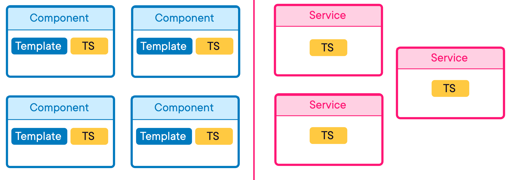
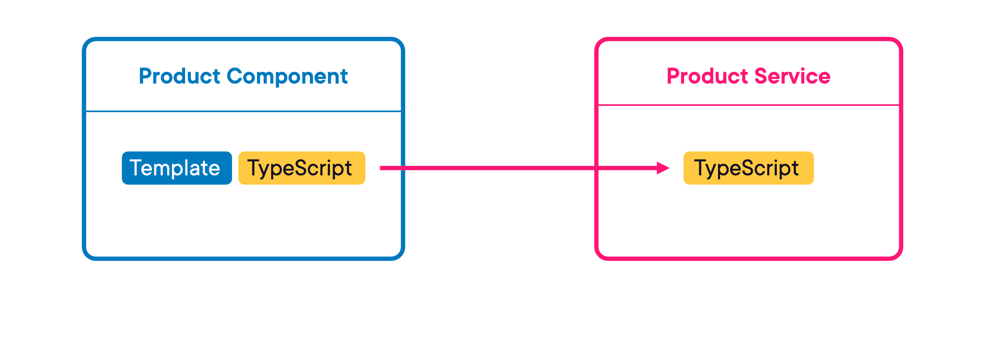
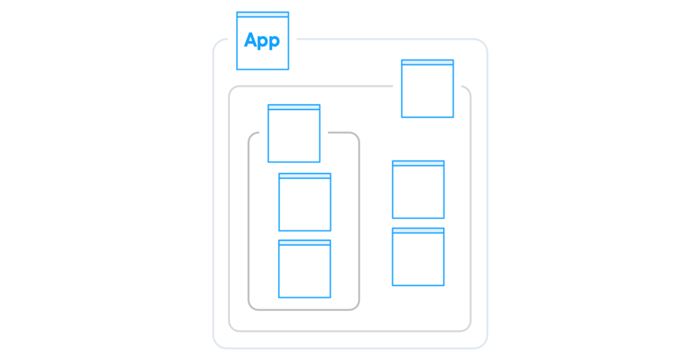
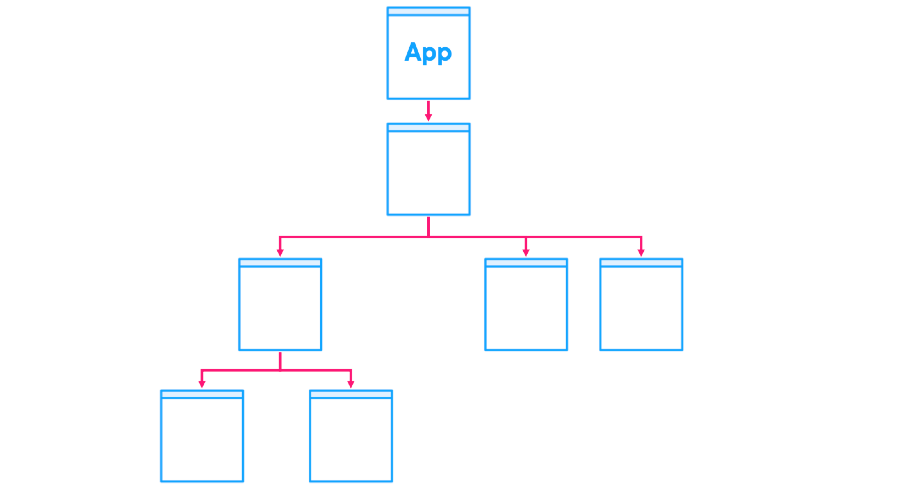
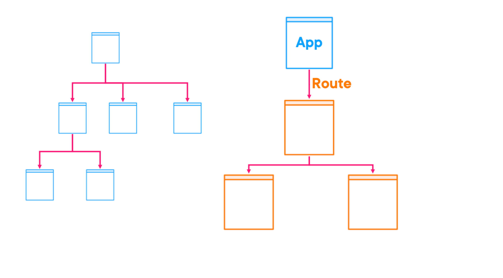

= Angular Fundamentals by Jim Cooper, and Joe Eames
Lars Vogel(c) 2016 vogella GmbH
Version 0.3, 17.05.2021
:sectnums:
:toc:
:toclevels: 4

This is the optional preamble (an untitled section body). Useful for
writing simple sectionless documents consisting only of a preamble.

== First section

NOTE: NOTE

TIP: TIP

IMPORTANT: IMPORTANT

CAUTION: CAUTION

WARNING: WARNING

== ASCII Features

More test

icon:comment[] This is a comment icon

icon:file[] And a file icon

icon:battery-full[] And a battery icon

---

.Name of the menu
[%collapsible]
====
This is the content.
====

---

|===
| One | Two | One | Two

| Foo
a|
- Bar
- Baz
| Foo
a|
- Bar
- Baz
|===

== Getting Started with Angular

NOTE: Code checkout at location: file:///Users/nareshchaurasia/Documents/Pluralsight/Jim-Cooper-Angular/joes-robot-shop/

=== What is Web Framework

In an old traditional website, when you clicked on a link, it would go back to the server and load a completely new web page into the browser. However, that's a problem in modern web applications because as soon as you load a new web page from the server, you'd lose all of your browser state like the items in your cart, for example. And so in a modern web application, when you click a link, typically that doesn't require any conversation at all with the server. Instead, the website uses JavaScript to simply swap out portions of the HTML with other HTML it already has stored in memory without actually changing pages as far as the browser knows. This allows us to maintain state, and swapping pages like this is called *routing in modern web frameworks*

=== A Conceptual Overview of Angular

---

---

---

---

Now let's take a graphical look at an Angular application. When you navigate to the URL of an Angular application, there is always a *root app component that is loaded first*. And then in most Angular applications, which contain multiple pages, you would have multiple routes or URLs, *so the app component would then render a page component* that corresponds to the current URL. Of course, if this page is very complex at all, it is likely to be composed of lots of smaller components, and those components may be composed of other components. And so this kind of ends up creating a tree‑like structure where components load child components that load other components, etc. So this is what a simple application with no routing or just a single route or page would look like.

*But in an app with multiple routes*, when a user navigates to a new URL, then you basically start a new tree, except that your app component remains. *The router then sees a new route and loads the corresponding component and all of its subcomponents, and this repeats for all of your routes in your application*. *As your application gets bigger and bigger, this can become a lot of stuff to organize and load into memory, which is where Angular modules come in*. Don't confuse Angular modules with JavaScript modules. In some ways they're very similar, but *Angular modules are a separate thing that are meant to be containers that group all components and services, etc into modules that can be loaded independently of each other*. That way, if a user ends up only visiting this section of our site, the browser only needs to load these files, and the browser will only load these other files if the user navigates over into this section of the site. This is one of the main purposes behind Angular modules. And I'm only showing components here, but things like services and directives are also grouped into these modules. You don't have to use multiple modules in your app. In fact, you can even have an Angular app without modules at all. But as your app gets larger, you may consider using them to organize your app. And this is the basic anatomy of an Angular application, modules that contain all of your components and their subcomponents and services, etc. Hopefully this will help you understand how all the pieces fit together as we start building out an Angular application in this course.

=== Introduction to TypeScript

*Angular is built with TypeScript, a JavaScript language that adds type safety to JavaScript*. If you're already comfortable with TypeScript, you can feel free to skip ahead to the next clip. But for those who are new to TypeScript, let's review a few TypeScript features we'll be using in this course. *Those features include static typing, interfaces, class properties, and accessibility levels such as public and private*.

---

**Basic Types**:

----

// String
let name: string = 'John';

// Number
let age: number = 30;

// Boolean
let isStudent: boolean = true;

// Array
let hobbies: string[] = ['Reading', 'Coding', 'Cooking'];

// Tuple
let person: [string, number] = ['Alice', 25];
----

**Functions**:

----
function greet(name: string): string {
return `Hello, ${name}!`;
}

console.log(greet('Bob')); // Output: Hello, Bob!
----

**Interfaces**:

----
interface Person {
name: string;
age: number;
}

const user: Person = {
   name: 'Eve',
   age: 28,
};
----

**Classes**:

----

class Animal {
constructor(public name: string) {}

   makeSound() {
       console.log(`${this.name} makes a sound.`);
   }
}

const cat = new Animal('Whiskers');
cat.makeSound(); // Output: Whiskers makes a sound.
----

**Enums**:

----
enum Color {
Red,
Green,
Blue,
}

const selectedColor: Color = Color.Green;
----

=== Installing Node

All modern browsers today include a JavaScript engine for running JavaScript, which is why we can run JavaScript in a web browser. And these browser JavaScript engines allow you to do things like manipulate the html and CSS styles of a page and access data from an API server. But you can also run JavaScript outside of a browser natively on your computer. Node.js is the engine that allows you to run JavaScript on your computer. And unlike a browser's JavaScript engine, node provides access to things like your computer's file system and the Angular cli ships as a node package, node packages are install little JavaScript libraries and they are managed with node package manager or N PM. For short. When you install node, it also installs M PM which will allow us to install and use the Angular cli. We will then continue to use N PM and node to do things like run our Angular project in development and build it for production.

OK. So that's the background about node and why we need it. Now, let's get it installed. You can just go to Node.js dot org and download and install node from here. However, it's fairly common as a developer that you need to work with different versions of node, depending on the project you're currently working with. So I actually prefer to use a tool called node version manager or NVMNVM, makes it easy to install and switch between different versions of node. So on Windows, you can just go to this URL to install NVM on mac or Linux, though you can simply run this command and it will install *NVM* for you.

=== Installing the Angular CLI

All right, so now that we've got Node installed, let's install the Angular CLI. The Angular CLI, or command‑line interface, is used for a host of things like creating and running a new Angular project, adding items like components to an existing project or building an app for production deployment, so let's get it installed.

== Creating Angular Components

----
ng generate component home
----

I just want to point out a couple of things that the angular CLI did for us. Firstly, it named our component files according to best practices. Notice that we have the name of the component followed by the word component and then the appropriate file suffix. And it's nicely organized into a folder matching the component name. This is the nice thing about using the cli it helps you adhere to Angular best practices.

Incidentally, if you want to learn more about Angular best practices, after you finish this course, you can check out my Angular best practices course. OK. And then there's one last thing that the cl IDE did for us that we already touched on. And that's over here in the app module. This app module file was created for us originally when we created our project with the CLI. And if you remember, modules are used to organize and group content into self contained modules. *Well, when we use the cli to create our home component, the cli updated this app module and imported our home component here and declared it down here*. This is a very important step because if you don't add it to the module where you're using it Angular won't know about your component. So notice if I remove this import and declaration here and go back over to my browser, I get an error which you can see down in my terminal was also a compile time error. This is indicating that it doesn't recognize that app home element that we tried to use in our app component. *So you have to declare components in a module before you can use them. And it's nice that the cli takes care of that for us*. All right. So that's the basics of creating components and the key pieces to making them work. But you might be left with one little question how come, we named our components selector app home instead of just home. Let's talk about that next.