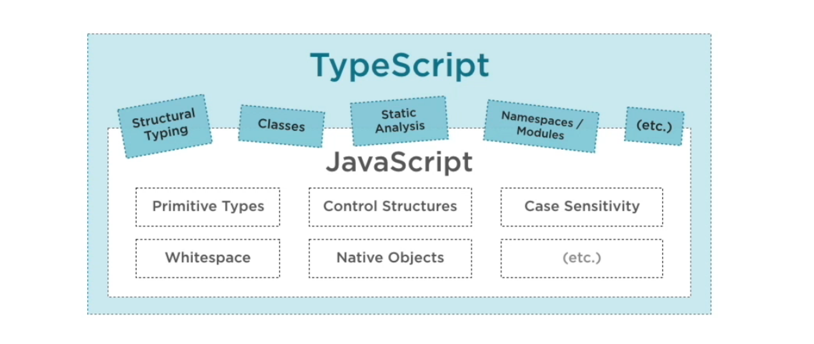
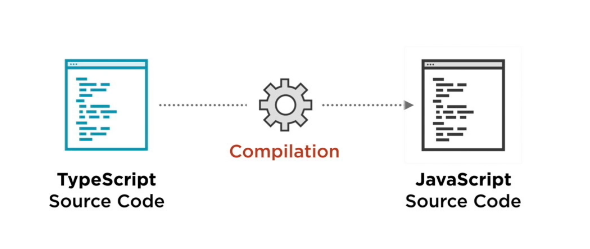
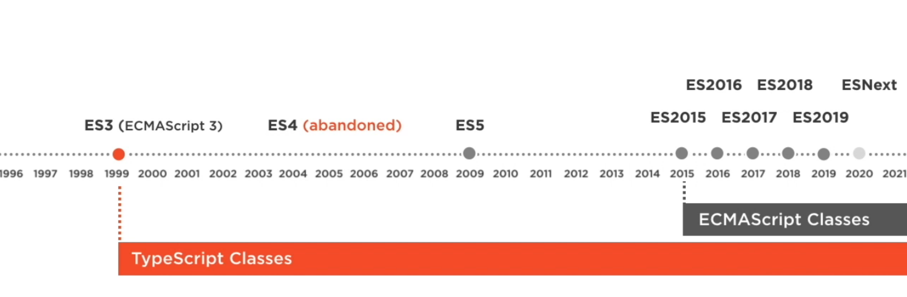

= TypeScript: The Big Picture by Simon Allardice
:toc:
:toclevels: 4

== How TypeScript Can Help

----
npm install -g typescript

tsc --init
----

---

*The Problem with JavaScript*

You don't have to change anything about how the application runs. The benefits of TypeScript are all for us, for developers on our site in writing the applications. And by choosing to write TypeScript, we introduce a little bit of formality, we give ourselves some extra features that will make it easier when writing larger applications. Let's see a few of those features.

---

*How TypeScript Helps: Organization*

