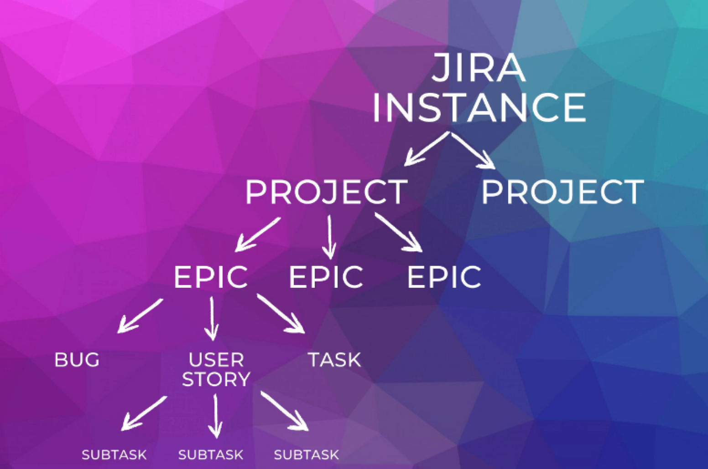

= JIRA
:toc: left
:toclevels: 5
:sectnums:

=== What is JIRA

1. **Project Management Tool:** JIRA is a widely used project management tool developed by Atlassian, designed to help teams plan, track, and manage their work efficiently.

2. **Issue Tracking:** It provides robust issue tracking capabilities, allowing teams to create, prioritize, assign, and track tasks, bugs, and user stories throughout the software development lifecycle.

3. **Customizable Workflows:** JIRA offers customizable workflows that enable teams to tailor their processes according to their specific needs, ensuring smooth collaboration and efficient task progression.

4. **Integration and Extensibility:** It integrates seamlessly with a wide range of development tools and offers numerous plugins and extensions, allowing teams to enhance their workflow and integrate JIRA into their existing toolchains.

5. **Agile and Scrum Support:** JIRA supports agile methodologies like Scrum and Kanban, providing features such as sprint planning, backlog grooming, burndown charts, and velocity tracking, making it a popular choice among agile teams for project management.

=== Using JIRA

* Create Project

########################################################################################################################

---

Certainly! Here's an example backlog for a ticket booking application:

**Epic: User Registration and Authentication**

1. As a user, I want to register for an account with my email and password so that I can access the ticket booking features.

2. As a user, I want to log in to my account using my email and password so that I can access my profile and booking history.

3. As a user, I want the option to reset my password in case I forget it.

**Epic: Event Discovery and Selection**

1. As a user, I want to view a list of upcoming events sorted by date and location.

2. As a user, I want to search for events based on keywords, categories, or dates.

3. As a user, I want to view detailed information about an event, including its description, location, date, time, and ticket prices.

4. As a user, I want to select the number of tickets and seating preferences for an event and add them to my cart.

**Epic: Ticket Booking and Checkout**

1. As a user, I want to review the items in my cart before proceeding to checkout.

2. As a user, I want to provide my payment details securely to purchase the selected tickets.

3. As a user, I want to receive a confirmation email with my booking details after completing the checkout process.

**Epic: User Profile Management**

1. As a user, I want to view and edit my profile information, including my name, contact details, and password.

2. As a user, I want to view my booking history and upcoming events.

3. As a user, I want to manage my email subscriptions for event notifications and newsletters.

**Epic: Admin Dashboard**

1. As an admin, I want to manage event listings, including adding, editing, and deleting events.

2. As an admin, I want to view booking details and generate reports on sales and attendance.

3. As an admin, I want to manage user accounts, including approving registrations and resetting passwords.

This backlog outlines the key features and functionalities of the ticket booking application, organized into epics and corresponding user stories. It provides a roadmap for the development team to prioritize and implement the features incrementally based on user needs and business requirements.

=== Using JIRA

Of course! Breaking down your learning process into a product backlog, epics, and user stories can help you track your progress and organize your learning journey effectively. Here's how we can structure it:

### Agile and Scrum Use Case

#### Product Backlog

1. **Database Basics**:
- Learn about databases, their importance, and common database management systems (DBMS).
- Understand basic concepts such as tables, rows, columns, and relationships.

2. **MySQL Fundamentals**:
- Install MySQL database server on your local machine.
- Learn about MySQL architecture and components.
- Understand how to interact with MySQL using command-line interface (CLI) and graphical user interface (GUI) tools.

3. **Database Design**:
- Learn principles of database design including normalization, denormalization, and data modeling.
- Understand different types of relationships (one-to-one, one-to-many, many-to-many) and how to represent them in database schemas.

4. **Data Manipulation**:
- Learn SQL (Structured Query Language) basics for data manipulation.
- Understand how to perform CRUD operations (Create, Read, Update, Delete) on database tables.
- Practice writing SQL queries for retrieving and modifying data.

5. **Advanced SQL Concepts**:
- Learn about advanced SQL concepts such as joins, subqueries, aggregate functions, and transactions.
- Understand how to optimize SQL queries for performance.

6. **Database Administration**:
- Learn about MySQL database administration tasks including user management, security, backups, and recovery.

#### Epics:

1. **Database Fundamentals**:
- Epic Description: Gain a solid understanding of databases, their purpose, and core principles.
- User Stories:
- As a learner, I want to understand the importance of databases in software development.
- As a learner, I want to learn about different types of databases and their use cases.
- As a learner, I want to understand basic database terminology.

2. **MySQL Mastery**:
- Epic Description: Master MySQL database management system and its features.
- User Stories:
- As a learner, I want to install MySQL database server on my local machine.
- As a learner, I want to learn how to interact with MySQL using command-line interface (CLI).
- As a learner, I want to practice creating and managing MySQL databases and tables.

3. **SQL Proficiency**:
- Epic Description: Become proficient in writing SQL queries for data manipulation and retrieval.
- User Stories:
- As a learner, I want to understand SQL syntax and basic query structure.
- As a learner, I want to practice writing SQL queries to retrieve data from databases.
- As a learner, I want to learn advanced SQL concepts such as joins and subqueries.

4. **Database Design Skills**:
- Epic Description: Develop skills in designing efficient and scalable database schemas.
- User Stories:
- As a learner, I want to understand principles of database normalization and denormalization.
- As a learner, I want to practice designing database schemas for real-world scenarios.
- As a learner, I want to learn techniques for optimizing database performance through effective schema design.

#### User Stories:

1. **As a Learner**:
- I want to complete online courses or tutorials on databases and MySQL.
- I want to practice writing SQL queries in a sandbox environment.
- I want to participate in online forums or communities to ask questions and seek guidance on database-related topics.

2. **As a Student**:
- I want to work on hands-on projects to apply my database knowledge in real-world scenarios.
- I want to create documentation or study notes to reinforce my understanding of database concepts.
- I want to regularly review and assess my progress to track my learning journey.

3. **As a Practitioner**:
- I want to contribute to open-source projects or collaborate with peers on database-related tasks.
- I want to attend workshops or webinars to learn about the latest trends and advancements in database technology.
- I want to pursue certification exams to validate my expertise in databases and MySQL.

By breaking down your learning process into product backlog items, epics, and user stories, you can effectively track your progress, set achievable goals, and stay organized throughout your learning journey using tools like JIRA.