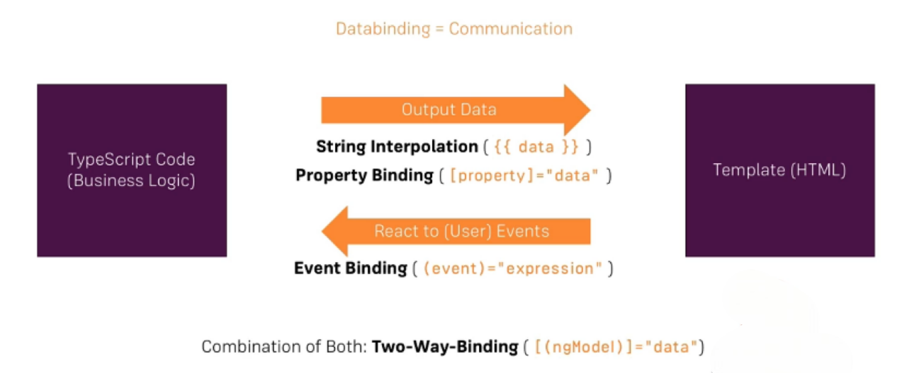
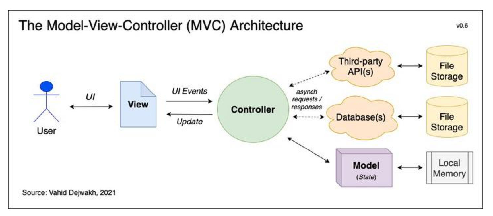
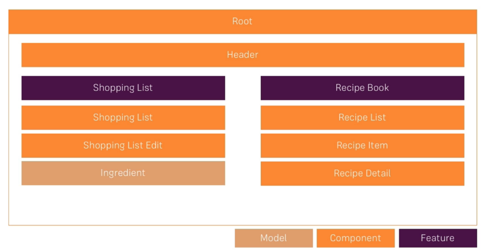
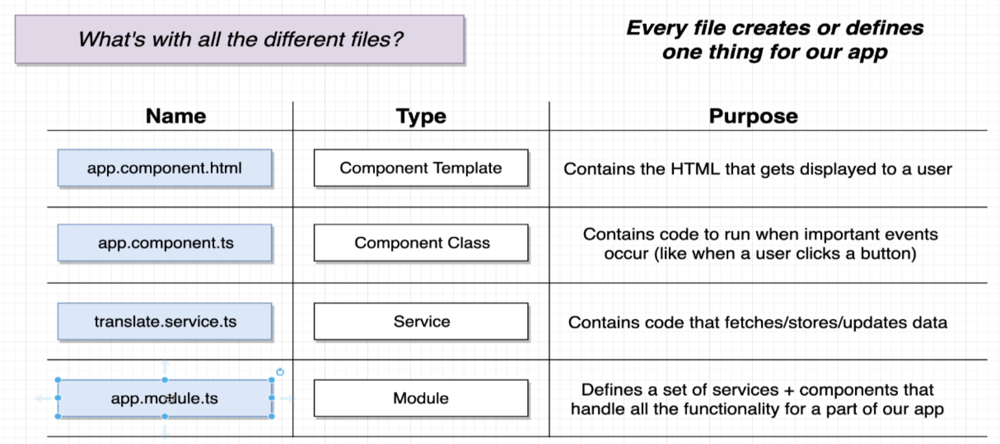
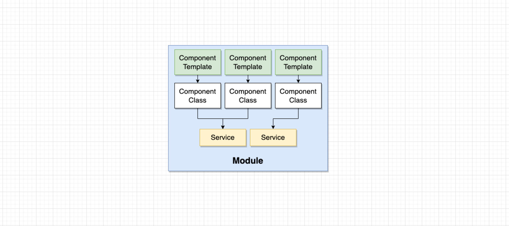
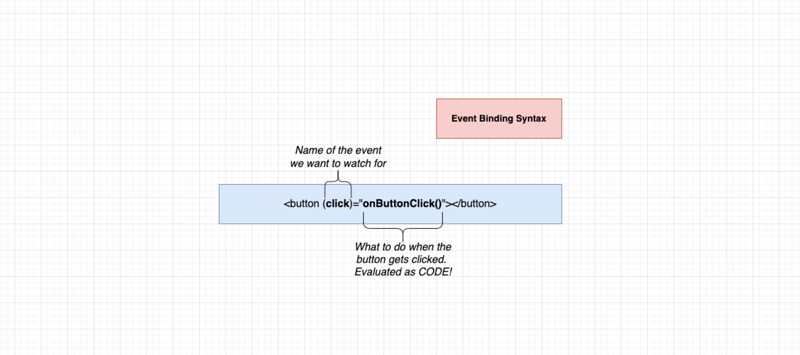
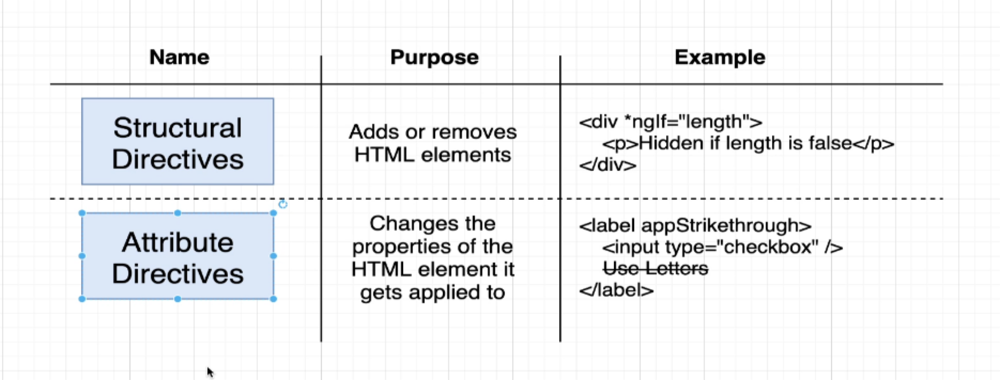
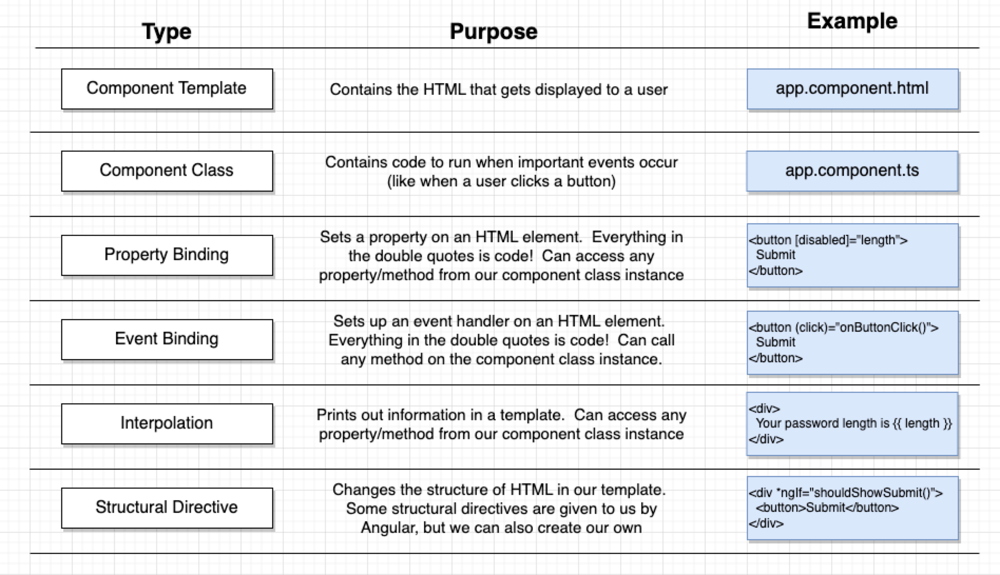
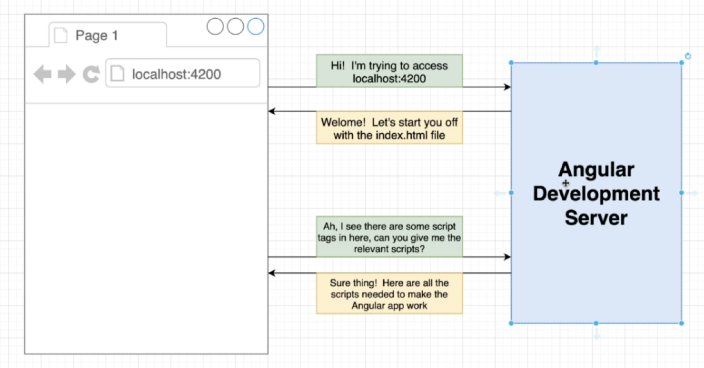
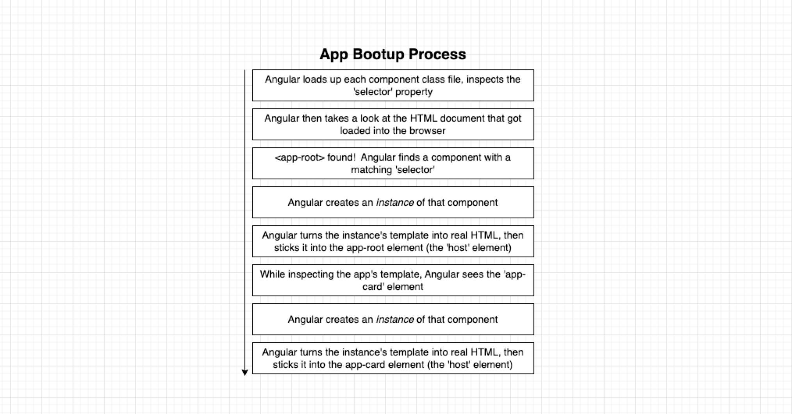

= Angular
:toc: right
:toclevels: 5
:sectnums:


****
* One Course I will complete.
* Others, I will revise.
****


== Creating Angular Project

* [ ] Installing Node
* [ ] Installing Angular
* [ ] Creating Angular Project using ng
* [ ] Final Project


file:///Users/nareshchaurasia/nc/FullStack-Development-1/angular/JC-Angular.adoc[JC Angular]


== Commands

=== How to Install Node on Mac

==== Using Homebrew:

1. **Install Homebrew**: If you haven't already installed Homebrew, open Terminal and run:
```
/bin/bash -c "$(curl -fsSL https://raw.githubusercontent.com/Homebrew/install/HEAD/install.sh)"
```

2. **Install Node.js**: Once Homebrew is installed, installing Node.js is as simple as running:
```
brew install node
```

3. **Verify Installation**: After installation is complete, you can verify Node.js and npm (Node Package Manager) by typing:
```
node -v
npm -v
```

==== Using Official Installer:

1. **Download Node.js**: Go to the official Node.js website (https://nodejs.org/) and download the macOS installer.

2. **Install Node.js**: Double-click the downloaded .pkg file and follow the installation instructions.

3. **Verify Installation**: After installation, open Terminal and verify Node.js and npm by typing:
```
node -v
npm -v
```

==== Using NVM (Node Version Manager):

NVM allows you to manage multiple installations of Node.js. Here's how to install Node.js using NVM:

1. **Install NVM**: Open Terminal and run:
```
curl -o- https://raw.githubusercontent.com/nvm-sh/nvm/v0.39.1/install.sh | bash
```

2. **Close and Reopen Terminal**: After installation, close and reopen Terminal, or run:
```
source ~/.bashrc
```

3. **Install Node.js**: Once NVM is installed, you can install Node.js by running:
```
nvm install node
```

4. **Verify Installation**: After installation, verify Node.js and npm versions:
```
node -v
npm -v
```

=== Common Angular Commands

* NPM

----
npm install -g @angular/cli

npm start

npm install --save bootstrap@3

npm install
----

* NG

----
ng version

# create project with app.module.js
ng new angular3 --no-strict --standalone false --routing false

# Start server on port 4200
ng serve

# This will also update app.module.ts
# add tag to app.component.html
ng generate component home
----

################################################################################

==== Angular Commands

`*ng new angular3 --no-strict --standalone false --routing false*`

The command `ng new angular3 --no-strict --standalone false --routing false` is used to create a new Angular project with specific configuration options. Let's break down each part of the command:

1. `ng new`: This is the Angular CLI command used to create a new Angular project.

2. `angular3`: This is the name of the project. Replace `angular3` with the desired name of your Angular project.

3. `--no-strict`: This option disables strict mode in TypeScript for the newly created project. In strict mode, TypeScript applies stricter type checking rules, which can help catch more errors at compile-time. By using `--no-strict`, you are opting out of strict mode.

4. `--standalone false`: This option configures the project to not use a standalone CSS file for styles. By default, Angular CLI creates a standalone CSS file (`styles.css`) where global styles can be added. Setting `--standalone false` means that the project will use component-specific styles instead of a standalone CSS file.

5. `--routing false`: This option disables routing in the newly created project. Angular applications typically use the Angular Router module for managing navigation and routing between different views or components. By setting `--routing false`, you are opting out of using routing in your project. If you do not need routing functionality in your application, this option can help reduce the complexity of the initial project setup.

Overall, the command `ng new angular3 --no-strict --standalone false --routing false` creates a new Angular project named `angular3` with the specified configuration options: disabling strict mode, not using a standalone CSS file for styles, and disabling routing functionality.
Overall, the command `ng new angular3 --no-strict --standalone false --routing false` creates a new Angular project named `angular3` with the specified configuration options: disabling strict mode, not using a standalone CSS file for styles, and disabling routing functionality.


################################################################################


== Angular Glossary

=== Data Binding



################################################################################

=== String Interpolation V/s Data Binding

.JS and HTML
[source,javascript]
----
import { Component } from '@angular/core';

@Component({
  selector: 'app-servers',
  templateUrl: './servers.component.html',
  styleUrl: './servers.component.css'
})
export class ServersComponent {

  isButtonDisable:boolean = false;
  greet:string = "Hi There. I am from Component";
  textValue:string='';

  fromComponentToHtml(){
      return "fromComponentToHtml Message";
  }

  onButtonClick(){
    this.greet = "Hi There. Button is clicked";
    this.isButtonDisable = !this.isButtonDisable;
  }

  typingInText(e: Event){
    console.log(e);
    this.textValue = (<HTMLInputElement>e.target).value;
  }
}


//---------------------------------

<H1>String Interpolation!!!</H1>
<p>Well Done:: {{ fromComponentToHtml() }}</p>
<p>Eye Opener:: {{ greet }}</p>
<hr/>

<input (input)="typingInText($event)" type="text"/>
<br/>
<label>{{textValue}}</label>

<hr/>
<button [disabled]="isButtonDisable" (click)="onButtonClick()">Click Me</button>
----

################################################################################

=== What is Angular Framework

Angular is a popular open-source front-end web application framework maintained by Google. It is used for building dynamic single-page web applications (SPAs) and provides a comprehensive solution for structuring, building, and deploying web apps.

Here are some key features of Angular:

1. **Component-based architecture**: Angular applications are built using components, which are reusable and encapsulate both the UI and logic of a specific part of the application.

2. **Two-way data binding**: Angular facilitates automatic synchronization of data between the model (business logic) and the view (UI), allowing changes in one to be reflected in the other without the need for manual intervention.

3. **Directives**: Angular comes with a set of built-in directives like ngFor, ngIf, ngSwitch, etc., which extend HTML with additional functionality and allow developers to create dynamic views.

4. **Dependency Injection (DI)**: Angular has a powerful DI system that helps manage dependencies between different components, making the code more modular, reusable, and easier to test.

5. **Routing**: Angular's built-in router allows developers to build single-page applications with multiple views and navigate between them without a full page reload.

6. **HTTP Client**: Angular provides a built-in HTTP client module to make HTTP requests to a server, simplifying the process of fetching and sending data to backend services.

7. **Forms**: Angular offers both template-driven and reactive forms for handling user input and validation in web applications.

8. **Testing**: Angular applications can be easily tested using tools like Jasmine and Karma, which are supported out of the box.

Angular has undergone several major updates since its initial release, with AngularJS being the first version followed by Angular 2, Angular 4, and so forth. The latest version as of my last update is Angular 13, but there might be newer versions since then.


################################################################################

----
import { Component } from '@angular/core';

@Component({
  selector: 'app-example',
  template: '<p>This is an example component with multiple inline styles.</p>',
  styles: ['p { color: blue; }', 'span { font-weight: bold; }']
})
export class ExampleComponent { }
----

=== Angualar Framework Versions

Sure, here's a brief overview of the major releases of Angular:

1. **AngularJS (1.x)**:
- AngularJS, often referred to as Angular 1, was the first version of the Angular framework.
- It introduced concepts like two-way data binding and directives to build dynamic web applications.
- AngularJS was released in 2010 and gained significant popularity in the following years.

2. **Angular 2+**:
- Angular 2 was a complete rewrite of AngularJS and introduced many architectural changes.
- Released in September 2016, Angular 2 brought improved performance, modularity, and features like a component-based architecture.
- Subsequent versions, such as Angular 4, Angular 5, and so on, introduced incremental improvements and features while maintaining backward compatibility.
- Angular 4 was released shortly after Angular 2 and introduced improvements in size reduction and compilation.
- Angular 5 brought improvements in build optimization, HttpClient, and other features.
- Angular 6 introduced the Angular CLI, Angular Elements, and improved tooling.
- Angular 7 focused on performance improvements, CLI prompts, and Angular Material updates.
- Angular 8 introduced features like differential loading, lazy loading of routes, and the Ivy rendering engine (still in preview).
- Angular 9 saw improvements in performance and the introduction of Ivy as the default rendering engine.
- Angular 10 focused on improvements to the Angular CLI, Angular Material, and Ivy.
- Angular 11 introduced features like stricter types and improved component test harnesses.
- Angular 12 brought improvements to the Angular CLI, strict mode by default, and updated dependencies.
- Angular 13 continued the trend of improving developer experience, performance, and tooling.

Each release of Angular brought enhancements, bug fixes, and new features, empowering developers to build robust and scalable web applications. The Angular team has maintained a regular release cadence, providing updates and improvements to the framework.

=== Angular Metadata

In Angular, component metadata is data that defines how a component should be processed, instantiated, and used by the framework. This metadata is typically provided via the `@Component()` decorator, which is applied to a TypeScript class representing the component.

Here are some common properties included in component metadata:

1. **Selector**: Specifies the CSS selector that identifies this component in a template. When the Angular compiler encounters this selector in a template, it knows to render the associated component.

2. **Template/TemplateUrl**: Specifies the inline template or the URL to an external template file for the component. This defines the structure of the component's view.


=== What is Nodejs

In simple terms, Node.js is a runtime environment that allows you to run JavaScript code on the server side. It's built on the Chrome V8 JavaScript engine, which is known for its speed and efficiency.

Node.js enables you to create web servers, build command-line tools, and perform various other server-side tasks using JavaScript. It's particularly popular for building web applications and APIs because it allows developers to use a single language (JavaScript) for both client-side and server-side development, which can simplify the development process and promote code reuse.

In essence, Node.js expands the capabilities of JavaScript beyond the web browser, making it possible to build full-stack applications entirely in JavaScript, from the front end to the back end.

=== What is Angular CLI

Angular CLI, short for Angular Command Line Interface, is a tool that helps you create, develop, and manage Angular applications more efficiently. It provides a set of commands that you can run in your terminal or command prompt to scaffold new Angular projects, generate components, services, modules, and more.

In simple terms, Angular CLI acts as a Swiss Army knife for Angular developers, automating repetitive tasks and providing a streamlined workflow for building Angular applications. With Angular CLI, you can quickly set up a new Angular project, generate code scaffolding, serve your application locally for development, and build optimized production-ready bundles for deployment.

It abstracts away much of the configuration and boilerplate code, allowing you to focus more on writing application logic and less on setting up build tools and project structure. Overall, Angular CLI is an essential tool for Angular developers to increase productivity and maintain consistency across projects.

=== What is bootstrapping

Angular bootstrapping is the process of initializing and starting an Angular application. It involves loading the root module of the application, compiling its components, and rendering the application's view.

=== What are directives

In simple terms, Angular directives are like special instructions that you can add to your HTML elements. These instructions tell Angular how to behave with those elements.

Here's a bit more detail:

1. **What they do**: Directives extend HTML with new behaviors or functionalities.

2. **How they work**: You add directives to your HTML elements using attributes. For example, you might have an attribute like `*ngIf` or `ngFor` in your HTML.

3. **Examples**:
- `*ngIf`: This directive is used to conditionally show or hide elements based on a condition. For instance, you might only want to display an element if a certain variable is true.
- `ngFor`: This directive is used to loop over a collection of items and generate HTML for each item. For example, you might want to display a list of items fetched from an array.

4. **Custom Directives**: Angular also allows you to create your own custom directives. These are like your own set of instructions that you can define and apply to your HTML elements. For example, you might create a directive that highlights certain elements when they are clicked.

Overall, directives are a powerful feature of Angular that allow you to make your HTML more dynamic and interactive by adding special behaviors or functionalities to your elements.

################################################################################

=== MVC Pattern



################################################################################

=== How does Angular Load

Angular applications are typically loaded and initialized in the following sequence:

1. **Index.html**: Angular applications typically start by loading an `index.html` file. This file serves as the entry point for the application and contains the basic HTML structure, including references to CSS stylesheets, JavaScript files, and the Angular application root component.

2. **Angular Application Root Component**: Angular applications are built around a root component. In the `index.html` file, there is usually a custom HTML element (e.g., `<app-root>`) that serves as the placeholder for the root component.

3. **Bootstrap Process**: Angular bootstraps the application by finding the root component specified in the `bootstrap` array of the Angular module (usually `AppModule`). This is typically done in the `main.ts` file using the `platformBrowserDynamic().bootstrapModule()` method.

4. **Module Loading**: Angular modules are loaded as needed. When the application is bootstrapped, Angular loads the root module (`AppModule`) and its dependencies. Additional feature modules may be lazily loaded as the user navigates to different routes.

5. **Component Initialization**: Angular initializes the root component and its child components. During initialization, Angular performs component instantiation, template compilation, and binding of data and events.

6. **Template Rendering**: Angular renders the application UI by compiling the templates of each component into executable JavaScript code. This process involves parsing the component templates, processing directives and bindings, and generating DOM elements.

7. **Change Detection**: Angular performs change detection to detect and propagate changes in the application state. This process involves checking for changes in component properties, detecting UI events, and updating the DOM accordingly.

8. **Event Handling and User Interaction**: Angular handles user interactions and events within the application. This includes responding to user input, triggering component methods, and updating the application state based on user actions.

9. **HTTP Requests and Data Retrieval**: Angular may perform HTTP requests to retrieve data from remote servers or APIs. This data is typically fetched asynchronously and then processed and displayed in the UI.

10. **Lifecycle Hooks**: Angular components may implement lifecycle hooks such as `ngOnInit`, `ngOnChanges`, `ngAfterViewInit`, etc., to perform initialization and cleanup tasks at specific stages of the component lifecycle.

Overall, Angular follows a modular and component-based architecture, where modules and components are loaded and initialized as needed, and the application UI is rendered dynamically based on the application state and user interactions.
Overall, Angular follows a modular and component-based architecture, where modules and components are loaded and initialized as needed, and the application UI is rendered dynamically based on the application state and user interactions.

################################################################################

=== Benefits of using Bootstrap frameworkd

Certainly! Here are some benefits of using the Bootstrap framework:

- **Responsive Design**: Bootstrap provides a responsive grid system and predefined classes for creating responsive layouts that adapt to various screen sizes and devices, ensuring a consistent user experience across different devices.

- **Consistent UI Components**: Bootstrap offers a wide range of reusable UI components such as buttons, forms, navigation bars, modal dialogs, and more. These components are styled and preconfigured to maintain a consistent look and feel throughout the application.

- **Customizable Themes**: Bootstrap allows developers to customize the appearance of their applications using built-in Sass variables and mixins, or by leveraging pre-built themes and templates available from the Bootstrap community.

- **Cross-browser Compatibility**: Bootstrap takes care of cross-browser compatibility issues by providing CSS styles and JavaScript plugins that work consistently across different web browsers, reducing the need for browser-specific fixes and optimizations.

- **Faster Development**: Bootstrap speeds up the development process by providing ready-to-use components and styles, allowing developers to focus more on application logic and less on design and layout concerns. It also offers a robust documentation and examples that help developers get started quickly.

- **Community Support**: Bootstrap has a large and active community of developers, designers, and contributors who continuously improve the framework, provide support, and share resources such as themes, templates, and plugins.

- **Accessibility**: Bootstrap includes features and practices to ensure accessibility, such as keyboard navigation support, ARIA attributes, and semantic HTML markup, making it easier to create accessible web applications that comply with accessibility standards.

- **Integration with Other Libraries**: Bootstrap can be easily integrated with other front-end libraries and frameworks such as jQuery, Angular, React, and Vue.js, allowing developers to leverage the benefits of Bootstrap alongside other tools and technologies in their projects.

- **Scalability**: Bootstrap is scalable and suitable for projects of any size, from small websites to large-scale web applications. Its modular structure and customizable components make it easy to scale and maintain applications as they grow over time.

Overall, Bootstrap provides a robust foundation for building modern, responsive, and visually appealing web applications with less effort and greater efficiency.

################################################################################


== The APP



== Stephen Grider



##############################################################################

---
---



##############################################################################

---
---


image::img/all-components2.png[]

##############################################################################

---
---



##############################################################################

---
---



##############################################################################

---
---



##############################################################################

---
---



##############################################################################

---
---




== Tips and Ticks

[source,javascript]
----
import { Component } from '@angular/core';


@Component({
  selector: 'app-root',
  template: '<app-servers></app-servers>',
  styleUrls: ['./app.component.css']
})
export class AppComponent {
  title = 'angular1';
}
----

################################################################################

*Inline HTML & CSS*

[source,javascript]
----
import { Component } from '@angular/core';

@Component({
  selector: 'app-inline-template',
  template: `
    <div>
      <h1>Hello, {{ name }}</h1>
      <p>This is an example of an inline template in Angular.</p>
    </div>
  `,
  styles: [`
    div {
      background-color: #f0f0f0;
      padding: 20px;
      border-radius: 5px;
      box-shadow: 0 2px 5px rgba(0, 0, 0, 0.1);
    }
    h1 {
      color: #333;
    }
    p {
      color: #666;
    }
  `]
})
export class InlineTemplateComponent {
  name: string = 'John Doe';
}
----