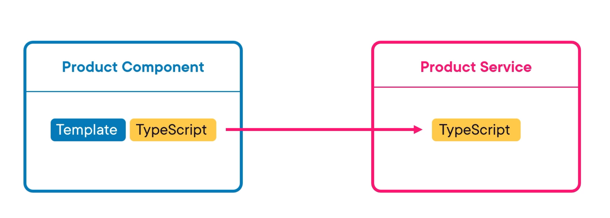
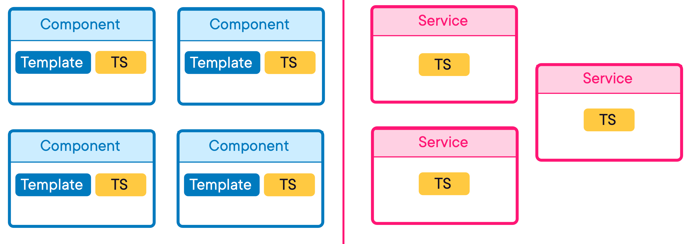
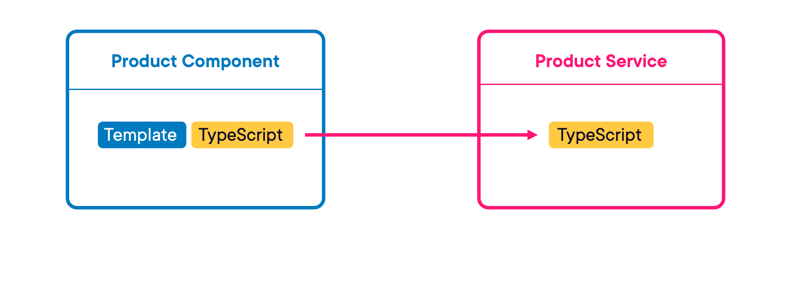
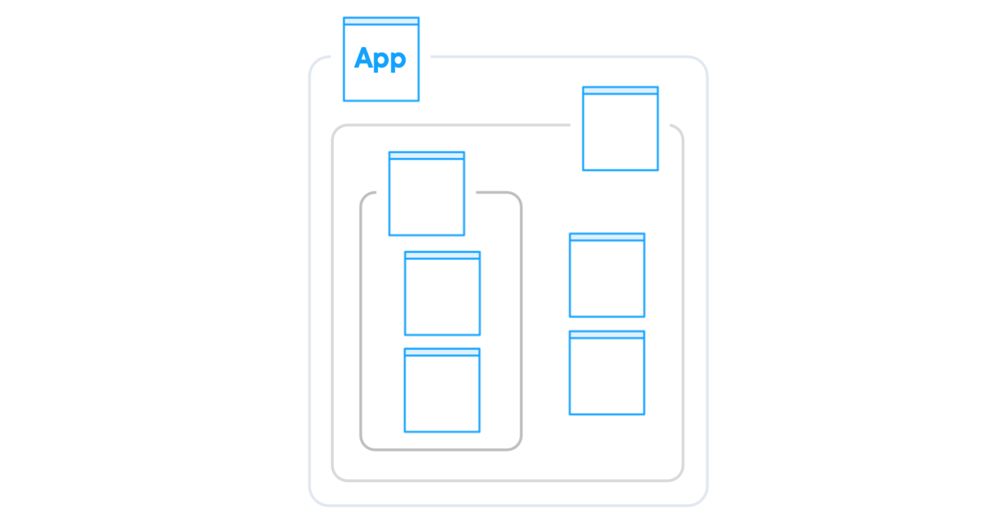
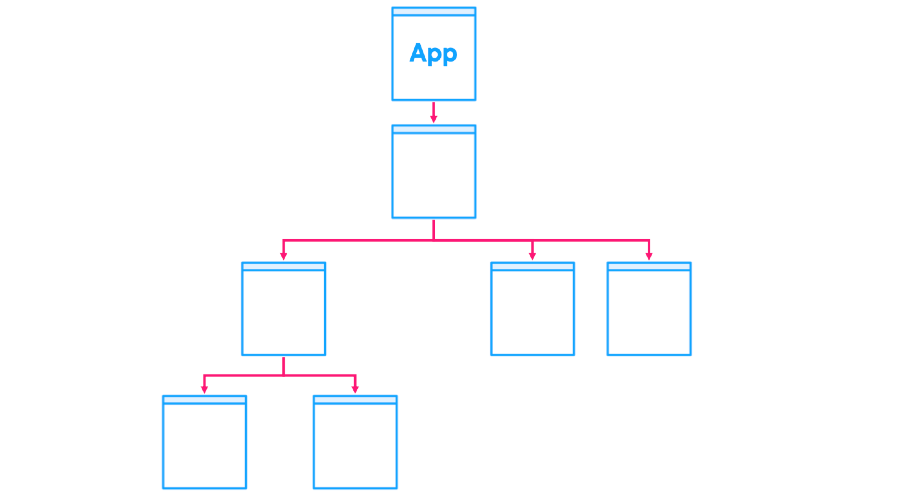
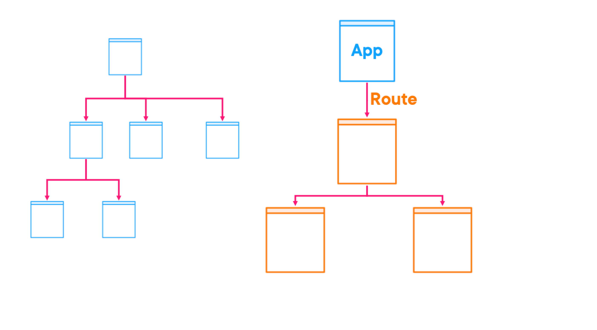
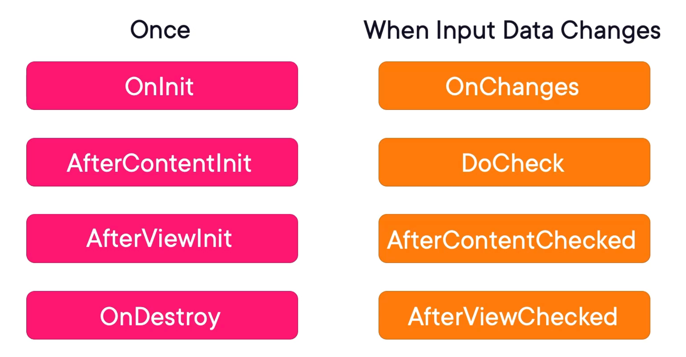
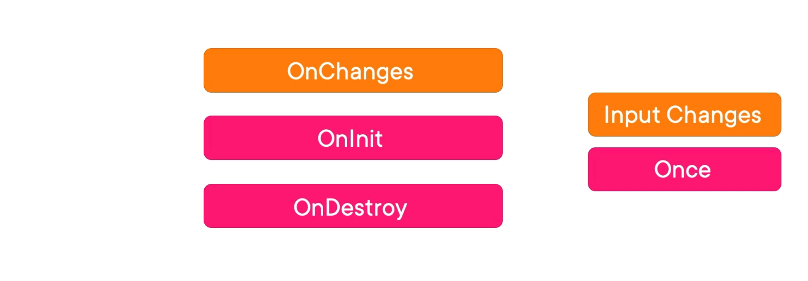

= Angular Fundamentals by Jim Cooper, and Joe Eames
:sectnums:
:toc: right
:toclevels: 5

NOTE: NOTE

TIP: TIP

IMPORTANT: IMPORTANT

CAUTION: CAUTION

WARNING: WARNING

################################################################################

NOTE: https://github.com/jmcooper/joes-robot-shop

== Course Overview

* Done.

== Getting Started with Angular

NOTE: Code checkout at location: file:///Users/nareshchaurasia/Documents/Pluralsight/Jim-Cooper-Angular/joes-robot-shop/

=== What is Web Framework

****
Think of a framework like a set of tools and rules that help you build something quickly and efficiently. Just like a framework for a house provides the structure and guidelines for building walls, floors, and roofs, a software framework provides pre-written code, libraries, and conventions that developers can use to create applications without having to start from scratch. It's like a foundation that supports your project, saving you time and effort by providing a starting point and ready-made solutions for common tasks.
****

Browsers and the web in general weren't initially built to host entire web applications like we use them for today. They were really built for displaying simple articles of information for academic purposes. And if you wanted to dig deeper into something, you might click a link, which then loads an entirely separate page.

That's very different from things like an e‑commerce application, for example, which needs to track state or information across pages. For example, when I click Buy on the catalog page, that item had better be in my cart when I go to the cart page.

In an old traditional website, when you clicked on a link, it would go back to the server and load a completely new web page into the browser. However, that's a problem in modern web applications because as soon as you load a new web page from the server, you'd lose all of your browser state like the items in your cart, for example.

And so in a modern web application, when you click a link, typically that doesn't require any conversation at all with the server. Instead, the website uses JavaScript to simply swap out portions of the HTML with other HTML it already has stored in memory without actually changing pages as far as the browser knows. This allows us to maintain state, and swapping pages like this is called *routing in modern web frameworks*.

Now there's one last major item that web frameworks can help us with and that's the idea of breaking down our website into smaller pieces that are easier to reason about independently.

=== A Conceptual Overview of Angular

An Angular application is built primarily by creating components and services.

################################################################################

---

NOTE: Pending. Come back here after finishing the course.

---

---

* Parent Component is loading child component.

---

---

################################################################################

---

Now let's take a graphical look at an Angular application. When you navigate to the URL of an Angular application, there is always a *root app component that is loaded first*. And then in most Angular applications, which contain multiple pages, you would have multiple routes or URLs, *so the app component would then render a page component* that corresponds to the current URL. Of course, if this page is very complex at all, it is likely to be composed of lots of smaller components, and those components may be composed of other components. And so this kind of ends up creating a tree‑like structure where components load child components that load other components, etc. So this is what a simple application with no routing or just a single route or page would look like.

*But in an app with multiple routes*, when a user navigates to a new URL, then you basically start a new tree, except that your app component remains. *The router then sees a new route and loads the corresponding component and all of its subcomponents, and this repeats for all of your routes in your application*. *As your application gets bigger and bigger, this can become a lot of stuff to organize and load into memory, which is where Angular modules come in*. Don't confuse Angular modules with JavaScript modules. In some ways they're very similar, but *Angular modules are a separate thing that are meant to be containers that group all components and services, etc into modules that can be loaded independently of each other*. That way, if a user ends up only visiting this section of our site, the browser only needs to load these files, and the browser will only load these other files if the user navigates over into this section of the site. This is one of the main purposes behind Angular modules. And I'm only showing components here, but things like services and directives are also grouped into these modules. You don't have to use multiple modules in your app. In fact, you can even have an Angular app without modules at all. But as your app gets larger, you may consider using them to organize your app. And this is the basic anatomy of an Angular application, modules that contain all of your components and their subcomponents and services, etc. Hopefully this will help you understand how all the pieces fit together as we start building out an Angular application in this course.

=== Introduction to TypeScript

NOTE: I need to figure out how I will teach TypeScript

*Angular is built with TypeScript, a JavaScript language that adds type safety to JavaScript*. If you're already comfortable with TypeScript, you can feel free to skip ahead to the next clip. But for those who are new to TypeScript, let's review a few TypeScript features we'll be using in this course. *Those features include static typing, interfaces, class properties, and accessibility levels such as public and private*.

---

**Basic Types**:

----

// String
let name: string = 'John';

// Number
let age: number = 30;

// Boolean
let isStudent: boolean = true;

// Array
let hobbies: string[] = ['Reading', 'Coding', 'Cooking'];

// Tuple
let person: [string, number] = ['Alice', 25];
----

**Functions**:

----
function greet(name: string): string {
return `Hello, ${name}!`;
}

console.log(greet('Bob')); // Output: Hello, Bob!
----

**Interfaces**:

----
interface Person {
name: string;
age: number;
}

const user: Person = {
   name: 'Eve',
   age: 28,
};
----

**Classes**:

----

class Animal {
constructor(public name: string) {}

   makeSound() {
       console.log(`${this.name} makes a sound.`);
   }
}

const cat = new Animal('Whiskers');
cat.makeSound(); // Output: Whiskers makes a sound.
----

**[.line-through]#Enums#**:

----
enum Color {
Red,
Green,
Blue,
}

const selectedColor: Color = Color.Green;
----

=== Installing Node

All modern browsers today include a JavaScript engine for running JavaScript, which is why we can run JavaScript in a web browser. And these browser JavaScript engines allow you to do things like manipulate the html and CSS styles of a page and access data from an API server. But you can also run JavaScript outside of a browser natively on your computer. Node.js is the engine that allows you to run JavaScript on your computer. And unlike a browser's JavaScript engine, node provides access to things like your computer's file system and the Angular cli ships as a node package, node packages are install little JavaScript libraries and they are managed with node package manager or NPM. For short. When you install node, it also installs NPM which will allow us to install and use the Angular cli. We will then continue to use NPM and node to do things like run our Angular project in development and build it for production.

=== Installing the Angular CLI

All right, so now that we've got Node installed, let's install the Angular CLI. The Angular CLI, or command‑line interface, is used for a host of things like creating and running a new Angular project, adding items like components to an existing project or building an app for production deployment, so let's get it installed.

=== Creating a New Angular Application

=== Exploring Our New Angular App

=== Cloning Our Demo App

== Creating Angular Components

----
git clone git@github.com:Naresh-Chaurasia/robot-shop.git

cd robot-shop

npm install

npm start
----

=== Creating Our First Angular Component

----
ng generate component home
----

.app.component.html
[source,html]
----
<h1>Hello World</h1>
<app-home></app-home>
----

NOTE: What is app.module.ts

=== Using Inline Templates and Styles

[source,html]
----
import { Component } from '@angular/core';

@Component({
  selector: 'app-my-component',
  template: `
    

      <h1>Welcome to My Component!</h1>
      
This is a simple example of inline template and styling in Angular.

    

  `,
  styles: [`
    div {
      background-color: #f0f0f0;
      padding: 20px;
      border-radius: 5px;
      box-shadow: 0 2px 4px rgba(0, 0, 0, 0.1);
    }
    h1 {
      color: #333;
    }
    p {
      font-size: 16px;
      line-height: 1.5;
    }
  `]
})
export class MyComponent {
  // Component logic goes here
}

----

=== Accessing and Displaying Images

NOTE: <project>/src/assets

IMPORTANT: Where does images come from?

.angular.json
[source,json]
----
"assets": [
  "src/favicon.ico",
  "src/assets"
]
----

.angular.json
[source,html]
----

----

=== Component Lifecycle Hooks

################################################################################

---

################################################################################

---

----
import { Component, OnInit } from '@angular/core';

@Component({
  selector: 'app-example',
  templateUrl: './example.component.html',
  styleUrls: ['./example.component.css']
})
export class ExampleComponent implements OnInit {

  constructor() { }

  ngOnInit(): void {
    // This method is called when the component is initialized
    console.log('Component initialized');
    // You can put initialization logic here
  }

}
----

=== Creating Additional Components

----
ng generate component catalog
----

IMPORTANT: Using above command updates app.module.ts

== Using Angular Template Syntax

=== Understanding Angular Interpolation

2 + 2 = {{ 2 + 2 }}

