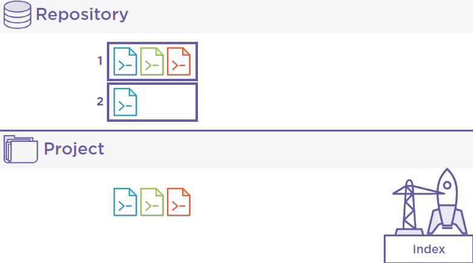
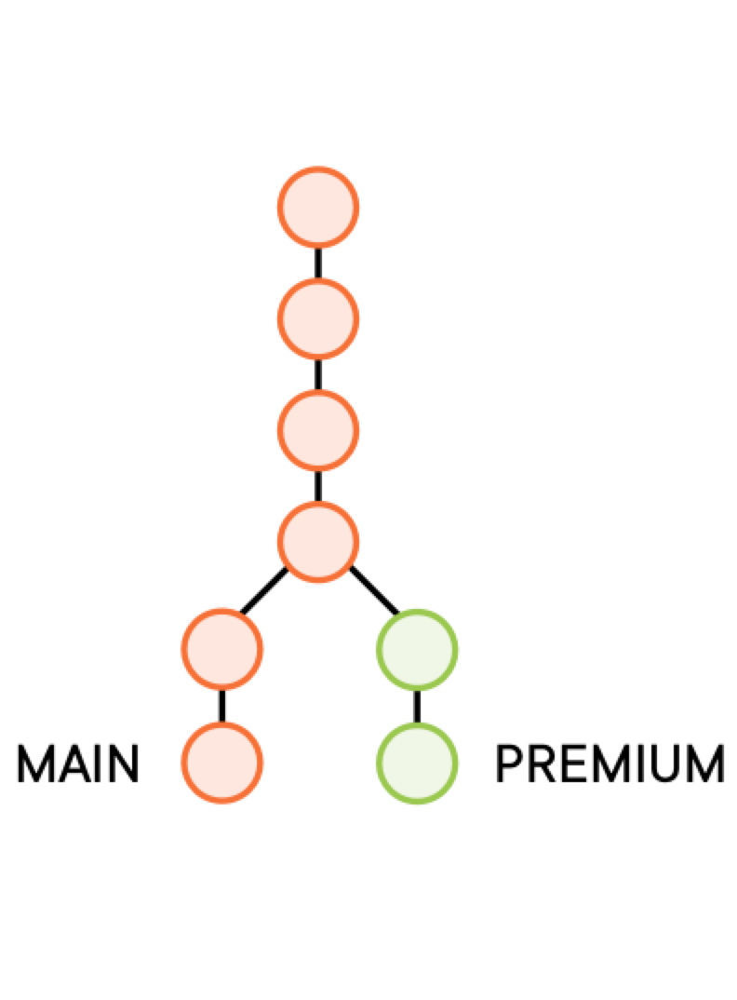
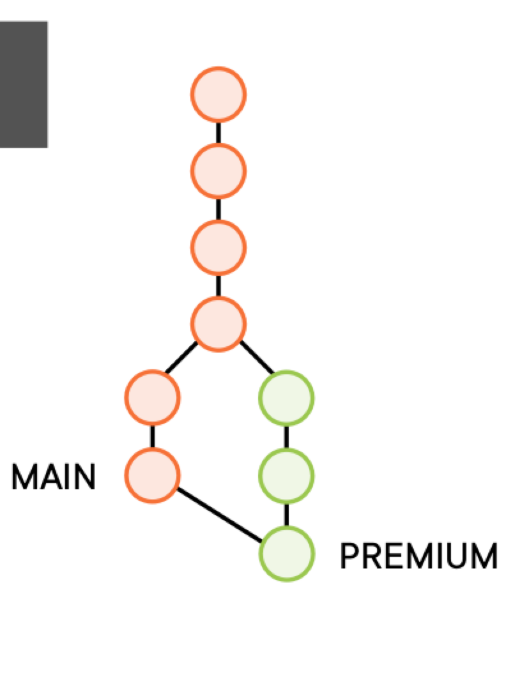
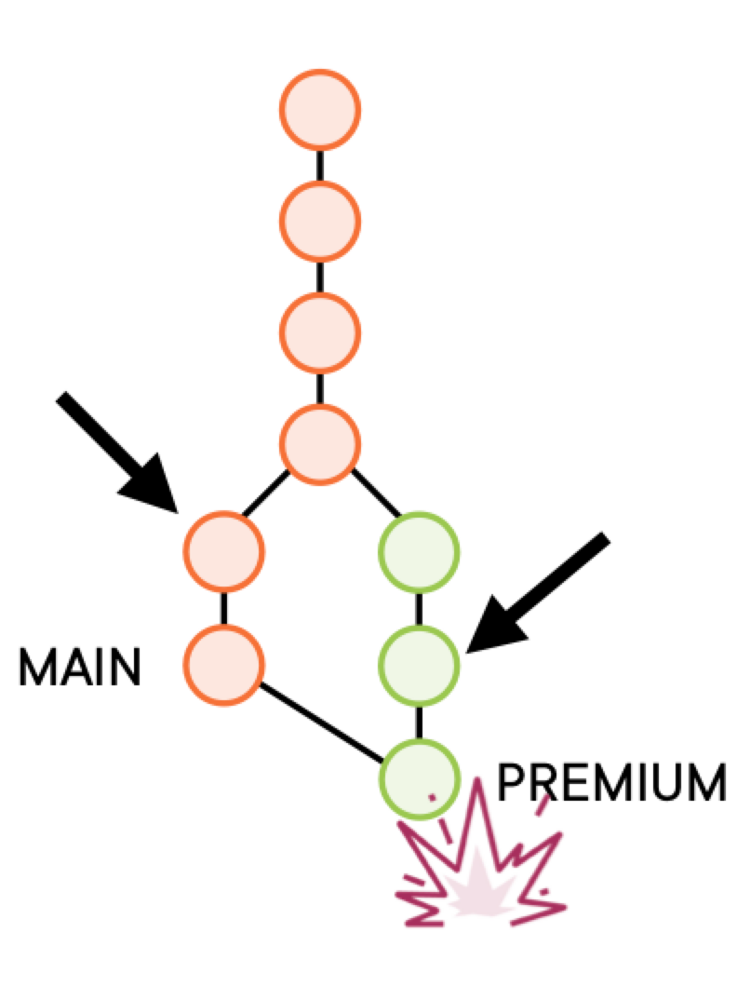
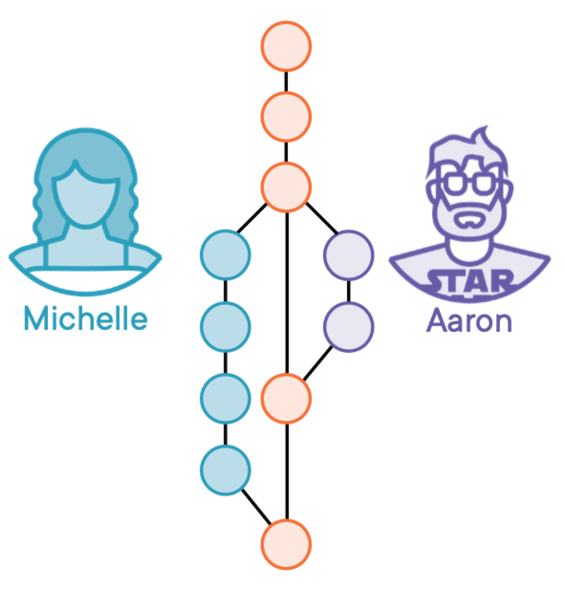
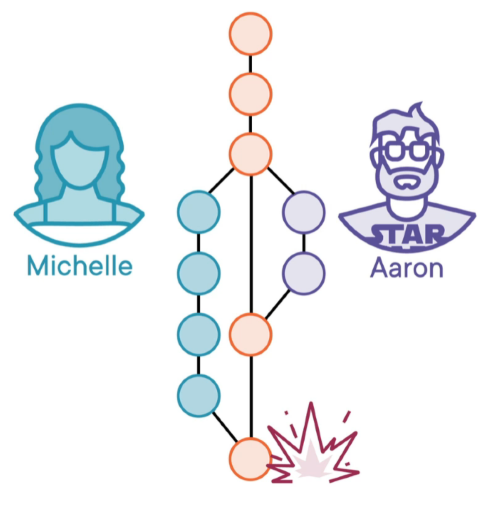
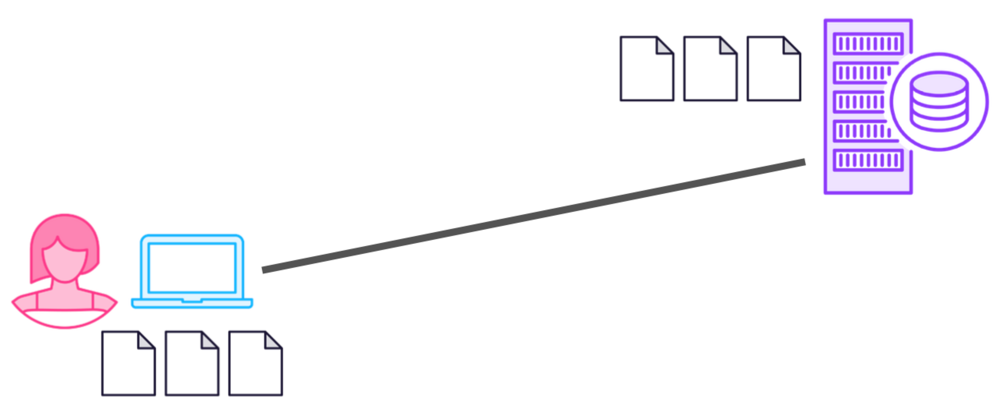
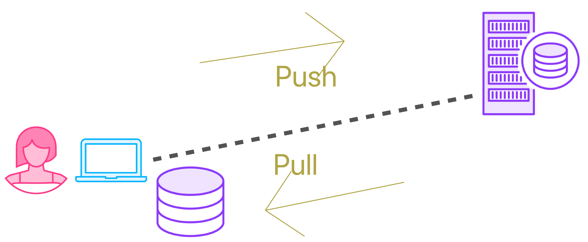
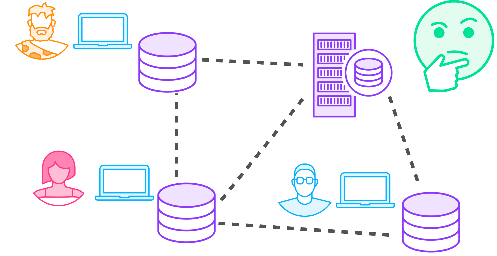

= Git
:toc: right
:toclevels: 5
:sectnums:

== How Git Works - PP

== GIT - JT

image::img/git-workflow.png[]

=== Branching


----
git branch -a

git branch premium

git checkout premium

#moving/renaming branch
git branch -m branch1 branch2

#deleting a branch
git branch -d branch1
----

=== Merging

----
git branch -a
git diff main new_feature_branch
git checkout new_feature_branch
echo "new file entry"> new.txt
cat new.txt
git add .
git commit -m "commiting new file to branch"
git status
git checkout main
git diff main new_feature_branch
git merge new_feature_branch

git log --oneline --graph --decorate
output: f907392 (HEAD -> main, new_feature_branch) commiting new file to branch
----

Fast-forwarding is only really possible when there are no changes being made on the target branch, which is what we just did. We branched away,  we did some work, and then we came back and then merged into master; Lostwe didn't do any additional work on master before doing the merge.

== GIT - PP

=== Getting to Know Git

* Git tracks changes to source code
* `git init` - local repository

*Creating Snapshots*

* Git Tracks changes to source code.



---

----
git init
git add .
git commit -m "comment"
git log
git diff <hash1> <hash2>
git checkout <hash2>
----

Let's say that we have a launch pad to the repository. And what we just did is we put some files on the launch pad. *This launch pad is also called the index in git*. In this case, we put all the files in the project in the index. And now step two, we can send the content of the index straight to the repository with this command called commit. *So get commit means create a snapshot that includes all the files that I put on the launch pad earlier*. And we can give a message to the commit to describe what's in it, say first commit with all the files. *And when I send this command, fire the files, get to the repository and they become the first snapshot of the project inside the repository. So we just created a snapshot of the entire project*. And if I use this command git log, then we see the history of the project so far that right now is *only this single snapshot, this single commit in the language of git*. Now this committee isn't very useful until we have at least another committee. So let's imagine that we have to do something that happens all the time in software development, we have to fix a bug. I'll use my text editor to edit a file in this project. Let's say this file and let's change this line here to fix the bug. Actually, I'm just doing a random change. Most likely I just created a bug instead of fixing it. But let's just pretend that I made this change to fix a bug. Now, this file has been changed. It's been modified since the last time we took a snapshot, a commit of the project. And in fact, if I ask git for the current status of the project, it tells me look, this file has been modified, it shows the modified file in red. This is already a mildly useful thing, right? This fact that GIT tells me which files have been modified since the last commit. So let's create another commit. But this time this commit only includes the changes since the previous commit. That is this file. So once again, two steps, first add the file, let's say it's this blue file in the diagram, put it on the launch pad. And if we do git status again, git shows me this modified file in green to mean this file is ready to go in the next commit. And second, we create the commit with a message 3 to 1, lift off. And now we have a second commit another snapshot that includes this change file. In fact, git status shows nothing because everything in the project is aligned with the latest commit. And if I ask for the log, you can see two commits one from a few seconds ago, that includes the latest changes and an earlier one that includes all the original files in the project. And it also shows us who created these commits. That's me. So we are already tracking the history of the project at this point. For example, we can ask a GIT, okay. So what changed between these two snapshots? That's a command named git diff that shows the difference between two commits. This command needs the names of two commits. And one way we identify commits in it is by using their unique code, their version. If you wish these long extra decimal codes git generates these codes automatically when we create a commit, we actually don't need to use the entire code. We can get away with just the first few digits. Like give me the diff between these, i'll copy, paste it here. And this, and this command shows that the only thing that changed between the two commits is that in this file, this line changed. So now we can find out what changed in the project and who changed it and when exactly. And that's already a very useful concept, right? Especially in a large project, but that's only the beginning it gets better. Let's see.

=== Understanding Version Control

*Branching and Merging*


---



---

*Merging*

* You move to the premium branch and then you say get merge main.
** Example: Bug Fix



---



---



---



=== Making Sense of Git

*Client Server Architecture*



---

*Distributed Architecture*



---



== GIT - F

########################################################################################################################

---

*Git Configuration Hierarchy*


########################################################################################################################

---


image::git-hierarchy2.png[]

########################################################################################################################

---


########################################################################################################################

---

*Sample `.gitconfig`*

----
[user]
    name = Your Name
    email = your.email@example.com

[core]
    editor = nano
    autocrlf = input

[alias]
    co = checkout
    ci = commit
    st = status
    br = branch
    df = diff
----


== Git Glossary

=== Concurrency

Concurrency in the context of version control systems refers to the ability for multiple users or processes to work on the same project or files simultaneously without conflicts. In other words, it's about managing concurrent changes made by multiple developers to the same codebase.

=== Reflection

Reflection in version control systems is essential for understanding the state and history of a project, tracking changes, troubleshooting issues, and collaborating effectively with other developers.

=== Reversibility

Reversibility in version control systems refers to the capability of reverting changes made to files, code, or the entire project back to a previous state or version. It's a fundamental aspect of version control, allowing developers to undo modifications and restore earlier versions of the codebase.


################################################################################

---

=== Distributed version control systems (DVCS)

Distributed version control systems (DVCS) like Git offer several key features that differentiate them from centralized version control systems. Here are some of the main features:

1. **Distributed repositories**: In DVCS, every user has a complete copy of the repository, including its full history. This means developers can work offline and have access to the entire project's history without needing a constant connection to a central server.

2. **Branching and merging**: DVCSs excel at branching and merging, allowing developers to create branches for new features or experiments, work on them independently, and later merge them back into the main codebase. Branching is lightweight and fast, making it easy to manage parallel lines of development.

3. **Peer-to-peer collaboration**: DVCS enables peer-to-peer collaboration, where developers can share changes directly with each other without relying on a central server. This promotes decentralized workflows and fosters collaboration even in distributed or disconnected environments.

4. **Offline support**: Because each user has a complete copy of the repository, DVCSs offer robust support for offline work. Developers can commit changes, create branches, and perform other version control operations without an internet connection, making them ideal for remote or mobile development.

5. **Flexible workflows**: DVCSs support a wide range of workflows, from centralized to fully distributed, allowing teams to choose the workflow that best fits their needs. Common workflows include feature branching, Gitflow, and forking workflows.

6. **Data integrity and redundancy**: With every user having a full copy of the repository, DVCSs provide redundancy and data integrity. Even if one copy of the repository is lost or corrupted, other copies can be used to recover the data.

7. **Scalability**: DVCSs are highly scalable, capable of handling large repositories and thousands of users. Performance remains consistent even as the size of the project and the number of contributors grow.

8. **Community and ecosystem**: DVCSs like Git have vibrant communities and extensive ecosystems of tools, plugins, and integrations. This ecosystem provides support, documentation, and additional functionality to enhance the version control experience.

These features make distributed version control systems like Git powerful tools for managing and collaborating on software projects, especially in distributed or decentralized development environments.

################################################################################

---

=== Centralized version control systems (CVCS)

Centralized version control systems (CVCS) have some drawbacks compared to distributed version control systems (DVCS). Here are some disadvantages of CVCS:

1. **Single point of failure**: In a CVCS, the central server acts as a single point of failure. If the server goes down or becomes inaccessible, developers may not be able to access the repository, retrieve code, or commit changes, disrupting the development process.

2. **Dependency on network connectivity**: CVCSs rely heavily on network connectivity to access the central repository. Developers need a stable internet connection to push changes to the server or retrieve the latest updates. Limited or unreliable internet access can hinder collaboration and productivity.

3. **Limited offline capabilities**: Unlike DVCSs, CVCSs have limited support for offline work. Developers typically need a connection to the central server to perform version control operations, such as committing changes or creating branches. Working offline or in disconnected environments is challenging or impossible with CVCSs.

4. **Slower performance**: CVCSs may experience slower performance, especially for operations that involve communication with the central server, such as pushing or pulling changes. As the size of the repository or the number of users increases, the performance of the central server may degrade, leading to delays in version control operations.

5. **Concurrency issues**: CVCSs may encounter concurrency issues when multiple developers try to work on the same file or branch simultaneously. Locking mechanisms are often used to prevent conflicts, but they can introduce bottlenecks and hinder collaboration. Developers may experience delays or conflicts when trying to commit changes or merge branches.

6. **Less flexibility in workflows**: CVCSs often impose a centralized workflow, where developers must follow strict procedures for branching, merging, and code review. This can limit flexibility and autonomy, making it difficult to accommodate diverse development workflows or agile practices.

7. **Limited branching and merging capabilities**: CVCSs may have limited support for branching and merging compared to DVCSs. Branches are typically heavyweight and long-lived, making it challenging to manage parallel lines of development or implement feature branching effectively.

8. **Less autonomy for developers**: In a CVCS, developers may have less autonomy and control over their local repositories. They must rely on the central server for version control operations and may face restrictions or permissions issues when trying to create branches, commit changes, or access certain parts of the repository.

Overall, while centralized version control systems have been widely used in the past, they have certain limitations compared to distributed version control systems, especially in terms of reliability, flexibility, and support for distributed and collaborative development workflows.

################################################################################

---


=== Linear and Non-Linear workflow


1. **Linear Workflow**:
- In a linear workflow, changes are applied sequentially, one after the other, without any divergent branches.
- This typically involves a simple workflow where developers work on a single branch, such as the main branch (`master` or `main` in Git).
- Changes are made directly on this branch, and each change builds upon the previous one.
- Once changes are made and tested, they are committed directly to the main branch, creating a linear history of commits.

2. **Non-linear Workflow**:
- In a non-linear workflow, developers may work on multiple branches, allowing for parallel development and experimentation.
- This often involves creating feature branches, where developers work on specific features or fixes independently of each other.
- These feature branches can diverge from the main branch and may have their own sub-branches.
- Once a feature is complete and tested, it can be merged back into the main branch, integrating the changes into the project history.

In Git, both linear and non-linear workflows are common and can be used depending on the needs of the project and the development team. Linear workflows are simpler and easier to understand, making them suitable for smaller projects or teams. Non-linear workflows offer more flexibility and scalability, allowing for concurrent development of multiple features or bug fixes, making them suitable for larger projects with multiple developers.


=== Configure Git

Configuring Git involves setting up various parameters and options to customize your Git environment according to your preferences and requirements. Here's a basic overview of how to configure Git:

**Install Git**: First, you need to install Git on your system if you haven't already. You can download and install Git from the official Git website (https://git-scm.com/), or you can use a package manager for your operating system.

**Set up your identity**: The first configuration step is to set your username and email address, which Git will use to associate your commits with your identity. You can set these values globally for all repositories on your system or locally for a specific repository.


[source,bash]
----
git config --global user.name "Your Name"
git config --global user.email "your.email@example.com"
----

**Configure default text editor**: Git uses a text editor for various tasks, such as writing commit messages or resolving merge conflicts. You can configure your preferred text editor using the following command:

```bash
git config --global core.editor "your_text_editor"
```

Replace "your_text_editor" with the command-line invocation of your preferred text editor, such as "vim", "nano", "emacs", or "code" for Visual Studio Code.

**Check your configuration**: You can view your Git configuration settings at any time using the following command:

```bash
git config --list
```

This command will display all the configuration settings, both global and local, set in your Git environment.

These are some of the basic configuration steps to set up Git. Depending on your specific needs and workflow, you may need to customize Git further by exploring additional configuration options and settings.

################################################################################

---

*Sample Commands*

----

# [home directory]/.gitconfig
git config --global user.name "Naresh C"
git config --global user.name


# [repository]/.git/config
git config --local user.email NC@example.com

git config --list

git config --global --list

git config --local --list

git config --list --show-origin --show-scope

git config --local --unset user.name

git config --local --remove-section user
----

################################################################################

---


== Git Commands

----
git init <name-of-project>

# Files being tracked
git ls-files

# Undo changes
git reset HEAD level1-file.txt
git checkout -- level1-file.txt

# Rename file in Git
git mv <file1.txt> <file2.txt>

# Rename file in OS
mv <file1.txt> <file2.txt>
git add -A

git log

# origin refers to the name of the remote repository
# Pull from origin master, before pushing to origin.
git pull origin master
----

################################################################################

---

=== Local Repository, New Repository

*Creating Repository Locally, and Pushing it Remotely on GitHub*

**Step 1: Creating a New Repository:**

[source,bash]
----
echo "# Temp-Del" >> README.md
git init
git add README.md
git commit -m "first commit"
----

**Step 2: Setting Up the Main Branch:**

[source,bash]
----
git branch -M main
----

**Step 3: Linking to GitHub:**

[source,bash]
----
git remote add origin git@github.com:Naresh-Chaurasia/Temp-Del.git
----

**Step 4: Pushing to GitHub:**

[source,bash]
----
git push -u origin main
----

################################################################################

---

=== Connect Git Bash to GitHub using SSH

Connecting Git Bash to GitHub using SSH involves several steps. SSH (Secure Shell) is a cryptographic network protocol that allows secure communication between two systems. Here's a step-by-step guide:

*Step 1: Install Git Bash*

If you haven't already, download and install Git Bash from the official website: [Git](https://git-scm.com/).

*Step 2: Generate SSH Key*

* Open Git Bash.
* Use the following command to generate a new SSH key:

```bash
ssh-keygen -t rsa -b 4096 -C "your_email@example.com"
```
Replace "your_email@example.com" with the email address associated with your GitHub account.

* Press Enter to accept the default file location.
* You may be prompted to enter a passphrase. You can either set one or press Enter to skip.

Here's a sample command and output:

----
Generating public/private rsa key pair.
Enter file in which to save the key (/home/your_username/.ssh/id_rsa):
Enter passphrase (empty for no passphrase):
Enter same passphrase again:
Your identification has been saved in /home/your_username/.ssh/id_rsa.
Your public key has been saved in /home/your_username/.ssh/id_rsa.pub.
----

*Step 3: Add SSH Key to SSH Agent*

* Start the SSH agent by running:

```bash
eval "$(ssh-agent -s)"
```

* Add your SSH private key to the SSH agent:

```bash
ssh-add ~/.ssh/id_rsa
```

*Step 4: Add SSH Key to GitHub*

* Copy the SSH key to your clipboard:

```bash
clip < ~/.ssh/id_rsa.pub   # For Windows
```

or

```bash
cat ~/.ssh/id_rsa.pub     # For Linux/Mac, copy manually
```


* Go to your GitHub account settings.
* Navigate to "SSH and GPG keys."
* Click on "New SSH key" or "Add SSH key."
* Paste your SSH key into the provided field and give it a meaningful title.

*Step 5: Test the Connection*

* In Git Bash, run the following command to test the SSH connection:

```bash
ssh -T git@github.com
```

You might see a warning the first time; type "yes" to continue.

* If successful, you should see a message confirming the authentication.

Now, your Git Bash is connected to GitHub using SSH. When you interact with your repositories, Git will use the SSH key for authentication. This setup is more secure than using passwords and allows for smoother, password-less access to your GitHub repositories.

---

*What is SSH Agent*

The SSH Agent is a program that runs in the background on your local machine and manages SSH keys. Its primary purpose is to securely store and handle private keys, eliminating the need for users to enter passphrases every time they connect to a remote server or perform operations that require authentication.

Here's a breakdown of what `eval "$(ssh-agent -s)"` command does:

* `ssh-agent -s`: This command starts the SSH agent and outputs the necessary environment variables to initialize the agent.
* `eval "$(ssh-agent -s)"`: The `eval` command is used to execute the output of the `ssh-agent -s` command, setting up the environment variables in the current shell session.
* By running this command, you ensure that the SSH agent is running and properly configured in your shell session.
* The agent holds your private SSH key and provides it to Git when needed, eliminating the need to enter your SSH key passphrase repeatedly.
* It enhances security and convenience by managing the SSH key for you.
* This is especially useful when working with multiple repositories and avoiding the need to re-enter your passphrase for each interaction with your remote repositories.

