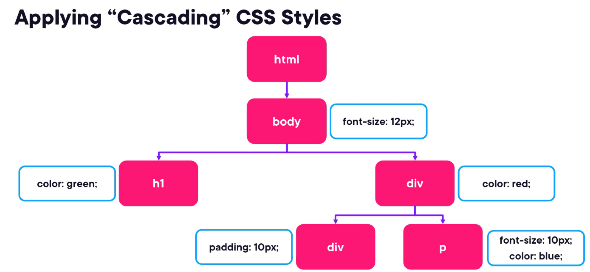
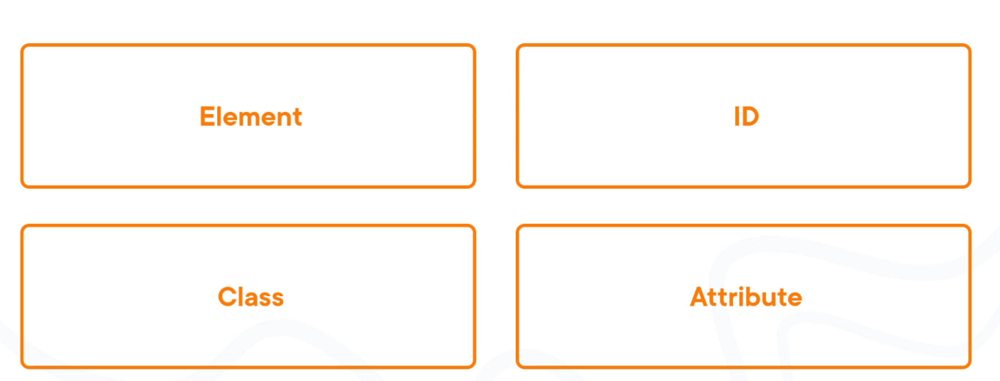
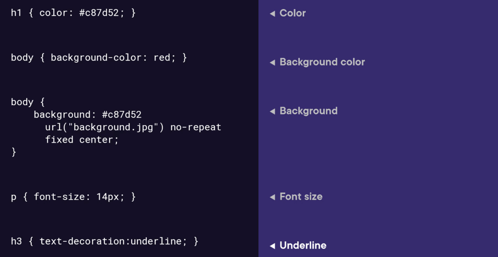

= HTML
:toc: left
:toclevels: 5
:sectnums:


=== Pre-Requisite

* Visual Studio
* Live Server Extension

=== HTML

==== First HTML

----
<!DOCTYPE html>
<html lang="en">
<head>
    <meta charset="UTF-8">
    <meta name="viewport" content="width=device-width, initial-scale=1.0">
    <title>My Simple Webpage</title>
</head>
<body>

<header>
    <h1>Welcome to My Simple Webpage</h1>
</header>

<section>
    <h2>Content Section</h2>
    <p>This is a simple HTML webpage.</p>
</section>

<footer>
    <p>&copy; 2024 My Simple Webpage. All rights reserved.</p>
</footer>

</body>
</html>

----

==== H Tags

----
<!DOCTYPE html>
<html lang="en">
<head>
    <meta charset="UTF-8">
    <meta name="viewport" content="width=device-width, initial-scale=1.0">
    <title>HTML Heading Tags Example</title>
</head>
<body>

    <h1>This is a Level 1 Heading</h1>
    <p>This is some content under the level 1 heading.</p>

    <h2>This is a Level 2 Heading</h2>
    <p>This is some content under the level 2 heading.</p>

    <h3>This is a Level 3 Heading</h3>
    <p>This is some content under the level 3 heading.</p>

    <h4>This is a Level 4 Heading</h4>
    <p>This is some content under the level 4 heading.</p>

    <h5>This is a Level 5 Heading</h5>
    <p>This is some content under the level 5 heading.</p>

    <h6>This is a Level 6 Heading</h6>
    <p>This is some content under the level 6 heading.</p>

</body>
</html>

----

==== Text Formatting

----
<!DOCTYPE>
<html>
<head>
<title>HTMLTextFormatting</title>
</head>
<body>
<p><b>This is bold text</b></p>
<p><strong>This is a</strong> strong text</p>
<p><i>This is a italic text</i></p>
<p><em>This is  a em </em>text</p>
<p>This is a <mark>mark tag</mark></p>
<p>This is a <u>underline text</u></p>
<p><strike>This is a strike text</strike></p>
<p>Hiii<tt>This paragraph in the monospaced font</tt></p>
<p>Hello<sub>This is a superscript text</sub>
<p>Hiii<del>Delete this paragraph</del></p>
<p><del>Hello</del><ins>How are you!</ins></p>
<p>Hello<big>This is a larger font<big></p>
<p>Hiii<small>This is a small font</small></p>
</body>
</html>
----

==== DOCTYPE

The DOCTYPE declaration in HTML stands for "Document Type Declaration." It's an instruction to the web browser about what version of HTML the page is written in and how the browser should render it.

----
<!DOCTYPE html>
----

This declaration tells the browser that the document is an HTML5 document.

==== iFrame

An <iframe> (short for inline frame) in HTML is used to embed another document within the current HTML document. It allows you to display content from another web page or resource within your own web page. Here are some common uses of <iframe>:

Embedding External Content: You can embed content from another website, such as a YouTube video, a Google Map, or a social media post, by specifying the URL of the external content within the <iframe> tag.


==== Anchor link

Sure! The HTML `<a>` (anchor) tag is used to create hyperlinks. It can include various attributes to specify the target URL, link behavior, and appearance. Here are some common attributes of the `<a>` tag:

1. **`href`**: Specifies the URL of the link. This is the most essential attribute of the `<a>` tag.

```html
<a href="https://www.example.com">Visit Example</a>
```

2. **`target`**: Specifies where to open the linked document. Values can include `_self` (default, opens in the same frame), `_blank` (opens in a new window or tab), `_parent` (opens in the parent frame), or `_top` (opens in the full body of the window).

```html
<a href="https://www.example.com" target="_blank">Visit Example</a>
```

3. **`title`**: Provides additional information about the link, typically displayed as a tooltip when the user hovers over the link.

```html
<a href="https://www.example.com" title="Visit Example">Visit Example</a>
```

4. **`download`**: Specifies that the target will be downloaded when the user clicks on the hyperlink. The value should be the name of the file being downloaded.

```html
<a href="example.pdf" download>Download PDF</a>
```

5. **`rel`**: Specifies the relationship between the current document and the linked document. Common values include `nofollow` (suggests to search engines not to follow the link) and `noopener noreferrer` (ensures security when opening in a new window).

```html
<a href="https://www.example.com" rel="noopener noreferrer">Visit Example</a>
```

6. **`aria-label`**: Specifies an accessible label for the link, which is read out by screen readers for visually impaired users.

```html
<a href="https://www.example.com" aria-label="Visit Example">Visit Example</a>
```

7. **`id` and `class`**: Attributes used for styling or scripting purposes. They don't directly affect the behavior of the link, but they can be useful for targeting specific links with CSS or JavaScript.

```html
<a href="https://www.example.com" id="link1" class="external-link">Visit Example</a>
```

These are just a few examples of the attributes that can be used with the HTML `<a>` tag to create hyperlinks with various behaviors and appearances.

==== Tables

===== Table 1

----
<!DOCTYPE html>
<html lang="en">
<head>
    <title>HTML Table Example</title>
</head>
<body>

<table summary="This is an example table" id="example-table" class="highlighted" border="1">
    <caption>Sample Table</caption>
    <thead>
    <tr>
        <th>Header 1</th>
        <th>Header 2</th>
        <th>Header 3</th>
    </tr>
    </thead>
    <tbody>
    <tr>
        <td>Row 1, Cell 1</td>
        <td style="background-color: blue; color: white;">Row 1, Cell 2</td>
        <td>Row 1, Cell 3</td>
    </tr>
    <tr>
        <td>Row 2, Cell 1</td>
        <td style="background-color: blue; color: white;">Row 2, Cell 2</td>
        <td>Row 2, Cell 3</td>
    </tr>
    </tbody>
    <tfoot>
    <tr>
        <td colspan="3">Footer Content</td>
    </tr>
    </tfoot>
</table>

</body>
</html>

----

===== Table 2 - Alignment

----
<!DOCTYPE html>
<html lang="en">
<head>
    <meta charset="UTF-8">
    <meta name="viewport" content="width=device-width, initial-scale=1.0">
    <title>Inline Table with Left and Top Alignment</title>
</head>
<body>

<table width="100%" border="1">
    <tr>
        <td align="left" valign="top">
            Left
        </td>
        <td align="Right" valign="top">
            Right
        </td>
    </tr>

</table>

</body>
</html>
----

==== HTML form

----
<!DOCTYPE html>
<html lang="en">
<head>
<meta charset="UTF-8">
<meta name="viewport" content="width=device-width, initial-scale=1.0">
<title>HTML Form Example</title>
</head>
<body>

<form action="/submit" method="post">
  <!-- Text Fields -->
  <label for="name">Name:</label>
  <input type="text" id="name" name="name" required><br>

  <label for="email">Email:</label>
  <input type="email" id="email" name="email" required><br>

  <!-- Checkboxes -->
  <input type="checkbox" id="subscribe" name="subscribe" value="subscribe">
  <label for="subscribe">Subscribe to our newsletter</label><br>

  <input type="checkbox" id="terms" name="terms" value="accepted" required>
  <label for="terms">I accept the terms and conditions</label><br>

  <!-- Radio Buttons -->
  <label>Gender:</label><br>
  <input type="radio" id="male" name="gender" value="male" required>
  <label for="male">Male</label><br>

  <input type="radio" id="female" name="gender" value="female">
  <label for="female">Female</label><br>

  <!-- Submit Button -->
  <input type="submit" value="Submit">
</form>

</body>
</html>
----

==== HTTP Get

* https://restful-api.dev/

Certainly! Let's delve into each of these points regarding the HTTP GET method:

1. **Remains in the browser history**:
- When a user accesses a web page or resource using a GET request, the URL containing the parameters of the request is typically stored in the browser's history.
- This means that users can revisit pages they accessed via GET requests by using their browser's history navigation features.

2. **Can be bookmarked**:
- GET requests produce URLs that reflect the parameters of the request. Since these URLs are often meaningful and represent specific resources or pages, they can be bookmarked by users for future reference.
- Bookmarking a GET request allows users to quickly access the same resource again without having to navigate through the website.

3. **Is never used when dealing with sensitive data**:
- GET requests transmit data through the URL query string, which is visible in the browser's address bar and may be logged by various systems, including the user's browser, proxies, and servers.
- Because the data transmitted via GET requests is exposed in the URL, it is considered insecure for transmitting sensitive information like passwords or personal details. Such data could be intercepted or logged by malicious actors or inadvertently stored in places where it could be accessed by unauthorized parties.

4. **Has length restrictions**:
- GET requests have limitations on the length of the URL due to browser and server constraints. While the HTTP specification does not impose a specific limit on URL length, practical limits are imposed by browsers and servers.
- Browsers typically have a maximum URL length that they can handle, which varies across different browsers. Servers may also have their own limits on URL length to prevent denial-of-service attacks or to ensure compatibility with other components in the web stack.

5. **Is used only to request data**:
- The primary purpose of the GET method is to retrieve data from a server. It is used to request resources like HTML pages, images, stylesheets, scripts, or API endpoints from a web server.
- GET requests are idempotent, meaning that multiple identical requests produce the same result as a single request. They are safe to be retried without causing unintended side effects on the server or the application state.

Overall, the HTTP GET method is widely used for retrieving resources from web servers and is suitable for scenarios where data transmission is public, non-sensitive, and does not require large payloads.


==== HTTP Post

* https://reqbin.com/post-online

Certainly! Let's break down each of these points regarding the HTTP POST method:

1. **Is never cached**:
- When a POST request is made, it typically includes data that modifies server-side resources. Because of this, caching the response of a POST request could lead to unintended consequences, such as replaying the same modification multiple times.
- Therefore, browsers and intermediaries like proxies generally do not cache responses to POST requests. Each POST request is typically treated as unique and triggers a fresh request/response cycle with the server.

2. **Does not remain in the browser history**:
- Since POST requests are often used for submitting sensitive information like login credentials or form data, browsers typically do not include POST requests in the browsing history.
- This helps to maintain the privacy and security of the user's data. If POST requests were stored in the browser history, it could potentially expose sensitive information to anyone with access to the browsing history.

3. **Cannot be bookmarked**:
- Similar to not being stored in the browsing history, POST requests are also typically not bookmarkable.
- This is because POST requests often involve submitting data that is specific to a particular session or action on the website. Bookmarking a POST request could result in the bookmarked URL being tied to outdated or invalid data.

4. **Has no restrictions on data length**:
- Unlike the HTTP GET method, which has limitations on the length of the URL due to browser and server restrictions, POST requests have no such limitations on the size of the data being transmitted.
- POST requests transmit data in the request body, allowing for larger amounts of data to be sent compared to GET requests, which transmit data in the URL query string. However, servers may still impose their own limits on the size of POST data for practical or security reasons.

Overall, these characteristics of the HTTP POST method help to ensure the security, privacy, and reliability of data transmitted using POST requests in web applications.

==== HTML: select, textarea

----
<!DOCTYPE html>
<html lang="en">
<head>
<meta charset="UTF-8">
<meta name="viewport" content="width=device-width, initial-scale=1.0">
<title>HTML Form Example</title>
</head>
<body>

<form action="/submit" method="post" target="result_frame">
  <!-- Select Menu -->
  <label for="select">Select a fruit:</label>
  <select id="select" name="fruit">
    <option value="apple">Apple</option>
    <option value="banana">Banana</option>
    <option value="orange">Orange</option>
  </select><br>

  <!-- Text Area -->
  <label for="message">Message:</label><br>
  <textarea id="message" name="message" rows="4" cols="50"></textarea><br>

  <!-- Button -->
  <button type="submit">Submit</button><br>

  <!-- Iframe -->
  <iframe name="result_frame" width="300" height="200" frameborder="0"></iframe>
</form>

</body>
</html>

----

==== Buttons: button, submit


----
<!DOCTYPE html>
<html lang="en">
<head>
<meta charset="UTF-8">
<meta name="viewport" content="width=device-width, initial-scale=1.0">
<title>Button Types Example</title>
</head>
<body>

<!-- Button with type "button" -->
<button type="button" onclick="alert('Button clicked!')">Click me (type="button")</button><br>

<!-- Button with type "submit" -->
<form action="/submit" method="post">
  <button type="submit">Submit (type="submit")</button>
</form><br>

</body>
</html>
----

==== Buttons: reset

----
<!DOCTYPE html>
<html lang="en">
<head>
<meta charset="UTF-8">
<meta name="viewport" content="width=device-width, initial-scale=1.0">
<title>Reset Form Content Example</title>
</head>
<body>

<form id="myForm">
  <!-- Text input -->
  <label for="name">Name:</label>
  <input type="text" id="name" name="name"><br>

  <!-- Checkbox -->
  <input type="checkbox" id="subscribe" name="subscribe">
  <label for="subscribe">Subscribe to newsletter</label><br>

  <!-- Radio buttons -->
  <input type="radio" id="male" name="gender" value="male">
  <label for="male">Male</label><br>
  <input type="radio" id="female" name="gender" value="female">
  <label for="female">Female</label><br>

  <!-- Select menu -->
  <label for="fruit">Select a fruit:</label>
  <select id="fruit" name="fruit">
    <option value="apple">Apple</option>
    <option value="banana">Banana</option>
    <option value="orange">Orange</option>
  </select><br>

  <!-- Textarea -->
  <label for="message">Message:</label><br>
  <textarea id="message" name="message" rows="4" cols="50"></textarea><br>

  <!-- Reset button -->
  <button type="reset">Reset</button>
</form>

</body>
</html>

----

==== HTML: Meta


The HTML `<meta>` tag is a metadata element that provides information about the HTML document itself or its content. It is placed in the `<head>` section of an HTML document and does not have a closing tag. Here are some common uses of the `<meta>` tag:

1. **Character Encoding**:
   - The `<meta charset="UTF-8">` tag specifies the character encoding for the HTML document. It tells the browser how to interpret the characters in the document. UTF-8 is the most common character encoding for web documents, as it supports a wide range of characters from various languages and scripts.

2. **Viewport Settings**:
   - The `<meta name="viewport" content="width=device-width, initial-scale=1.0">` tag is commonly used in responsive web design to control the layout and scaling of the web page on different devices. It ensures that the width of the viewport is set to the device's width and that the initial scale is 1.0, which means that the page is initially displayed at its normal size without zooming.

3. **Page Description and Keywords**:
   - The `<meta name="description" content="Page description here">` tag provides a brief description of the HTML document. Search engines often use this description in search results to provide users with an idea of what the page is about.
   - The `<meta name="keywords" content="keyword1, keyword2, ...">` tag specifies keywords or phrases relevant to the content of the page. While search engines may not use this meta tag as a ranking factor, it can still be useful for providing additional context about the page's content.

4. **Author, Publisher, and Copyright**:
   - The `<meta name="author" content="Author Name">` tag specifies the author of the HTML document.
   - The `<meta name="publisher" content="Publisher Name">` tag specifies the publisher of the HTML document.
   - The `<meta name="copyright" content="Copyright Year, Publisher Name">` tag specifies the copyright information for the HTML document.

5. **Viewport Scaling**:
   - The `<meta name="viewport" content="width=device-width, initial-scale=1.0">` tag can also include other attributes such as `user-scalable=no` to prevent users from zooming in or out of the page.

These are just a few examples of how the `<meta>` tag can be used to provide metadata about an HTML document. It's important to include relevant metadata to improve accessibility, search engine optimization (SEO), and the overall user experience of your web pages.

=== CSS

==== CSS Cascading



---

==== CSS Types of Selector



---



---

===== HTML Element Selector:
The HTML element selector selects elements based on their HTML tag name.

```html
<!DOCTYPE html>
<html lang="en">
<head>
<meta charset="UTF-8">
<meta name="viewport" content="width=device-width, initial-scale=1.0">
<title>HTML Element Selector Example</title>
<style>
  /* Selects all <p> elements */
  p {
    color: blue;
  }
</style>
</head>
<body>

<p>This is a paragraph with blue text.</p>
<p>This is another paragraph with blue text.</p>

</body>
</html>
```

===== ID Selector:
The ID selector selects an element based on its unique ID attribute.

```html
<!DOCTYPE html>
<html lang="en">
<head>
<meta charset="UTF-8">
<meta name="viewport" content="width=device-width, initial-scale=1.0">
<title>ID Selector Example</title>
<style>
  /* Selects the element with id="intro" */
  #intro {
    font-weight: bold;
  }
</style>
</head>
<body>

<p id="intro">This paragraph has bold text.</p>
<p>This paragraph does not have bold text.</p>

</body>
</html>
```

===== Class Selector:
The class selector selects elements based on their class attribute.

```html
<!DOCTYPE html>
<html lang="en">
<head>
<meta charset="UTF-8">
<meta name="viewport" content="width=device-width, initial-scale=1.0">
<title>Class Selector Example</title>
<style>
  /* Selects all elements with class="highlight" */
  .highlight {
    background-color: yellow;
  }
</style>
</head>
<body>

<p class="highlight">This paragraph has a yellow background.</p>
<p class="highlight">So does this paragraph.</p>

</body>
</html>
```

===== Attribute Selector:
The attribute selector selects elements based on their attributes.

```html
<!DOCTYPE html>
<html lang="en">
<head>
<meta charset="UTF-8">
<meta name="viewport" content="width=device-width, initial-scale=1.0">
<title>Attribute Selector Example</title>
<style>
  /* Selects all elements with the title attribute */
  [title] {
    color: red;
  }
</style>
</head>
<body>

<p title="Tooltip text">This paragraph has red text.</p>
<p>This paragraph does not have red text.</p>

</body>
</html>
```

---

```
<!DOCTYPE html>
<html lang="en">
<head>
<meta charset="UTF-8">
<meta name="viewport" content="width=device-width, initial-scale=1.0">
<title>Attribute Equals Selector Example</title>
<style>
  /* Selects input elements with type="text" */
  input[type="text"] {
    background-color: #f0f0f0;
    border: 1px solid #ccc;
    padding: 5px;
  }
</style>
</head>
<body>

<label for="username">Username:</label>
<input type="text" id="username" name="username"><br>

<label for="password">Password:</label>
<input type="password" id="password" name="password">

</body>
</html>
```


In each example:

- CSS rules are applied to specific elements based on the selector used.
- You can see how each selector type targets elements differently based on their characteristics, such as tag name, ID, class, or attributes.

==== Universal Selector

Certainly! The universal selector (`*`) selects all elements in an HTML document. It can be useful when you want to apply a style to all elements without specifying each element individually. Here's an example:

```html
<!DOCTYPE html>
<html lang="en">
<head>
<meta charset="UTF-8">
<meta name="viewport" content="width=device-width, initial-scale=1.0">
<title>Universal Selector Example</title>
<style>
  /* Applies red text color to all elements */
  * {
    color: red;
  }
</style>
</head>
<body>

<h1>This is a heading</h1>
<p>This is a paragraph.</p>
<a href="#">This is a link</a>
<div>This is a div</div>
<span>This is a span</span>

</body>
</html>
```

In this example:

- The universal selector `*` selects all elements in the HTML document.
- The CSS rule `color: red;` applies red text color to all elements.

While the universal selector can be useful for applying styles globally, it should be used with caution, as it can potentially override other styles unintentionally. It's generally recommended to use more specific selectors whenever possible to target specific elements or groups of elements.

=== CSS combinators

Sure! CSS combinators are used to specify relationships between different elements in the document tree. There are several types of combinators, including descendant combinator, child combinator, adjacent sibling combinator, and general sibling combinator. Here's a simple example demonstrating each type of combinator:

*Descendant Combinator (space):*

Selects all elements that are descendants of a specified element.

```html
<!DOCTYPE html>
<html lang="en">
<head>
<meta charset="UTF-8">
<meta name="viewport" content="width=device-width, initial-scale=1.0">
<title>Descendant Combinator Example</title>
<style>
  /* Selects all paragraphs inside a div */
  div p {
    color: blue;
  }
</style>
</head>
<body>

<div>
  <p>This paragraph is blue.</p>
</div>

</body>
</html>
```

*Child Combinator (`>`):*

Selects all elements that are direct children of a specified element.

```html
<!DOCTYPE html>
<html lang="en">
<head>
<meta charset="UTF-8">
<meta name="viewport" content="width=device-width, initial-scale=1.0">
<title>Child Combinator Example</title>
<style>
  /* Selects all paragraphs that are direct children of a div */
  div > p {
    color: red;
  }
</style>
</head>
<body>

<div>
  <p>This paragraph is red.</p>
  <div>
    <p>This paragraph is not red.</p>
  </div>
</div>

</body>
</html>
```

*Adjacent Sibling Combinator (`+`):*

Selects an element that is immediately preceded by a specified element.

```html
<!DOCTYPE html>
<html lang="en">
<head>
<meta charset="UTF-8">
<meta name="viewport" content="width=device-width, initial-scale=1.0">
<title>Adjacent Sibling Combinator Example</title>
<style>
  /* Selects the span immediately following a div */
  div + span {
    font-weight: bold;
  }
</style>
</head>
<body>

<div>This div is followed by a bold span</div>
<span>This span is bold</span>

</body>
</html>
```

*General Sibling Combinator (`~`)*

Selects all elements that are siblings of a specified element.

```html
<!DOCTYPE html>
<html lang="en">
<head>
<meta charset="UTF-8">
<meta name="viewport" content="width=device-width, initial-scale=1.0">
<title>General Sibling Combinator Example</title>
<style>
  /* Selects all spans that are siblings of a div */
  div ~ span {
    color: green;
  }
</style>
</head>
<body>

<div>This div is followed by a green span</div>
<span>This span is green</span>
<span>This span is also green</span>

</body>
</html>
```

These examples demonstrate how CSS combinators can be used to target specific elements based on their relationships with other elements in the document tree.

=== Pseudo Classes

----
<!DOCTYPE html>
<html lang="en">
<head>
<meta charset="UTF-8">
<meta name="viewport" content="width=device-width, initial-scale=1.0">
<title>HTML Pseudo-class Examples</title>
<style>
  /* Changes link color on hover */
  a:hover {
    color: red;
  }

  /* Changes link color when clicked */
  a:active {
    color: blue;
  }

  /* Adds outline when link is focused */
  a:focus {
    outline: 2px solid green;
  }

  /* Changes color of visited links */
  a:visited {
    color: purple;
  }
</style>
</head>
<body>

<a href="https://example1.com">Hover over me</a><br><br>

<a href="https://example2.com">Click me</a><br><br>

<a href="https://example3.com">Tab and focus on me</a><br><br>

<a href="https://example4.com">Visited link</a>

</body>
</html>
----


